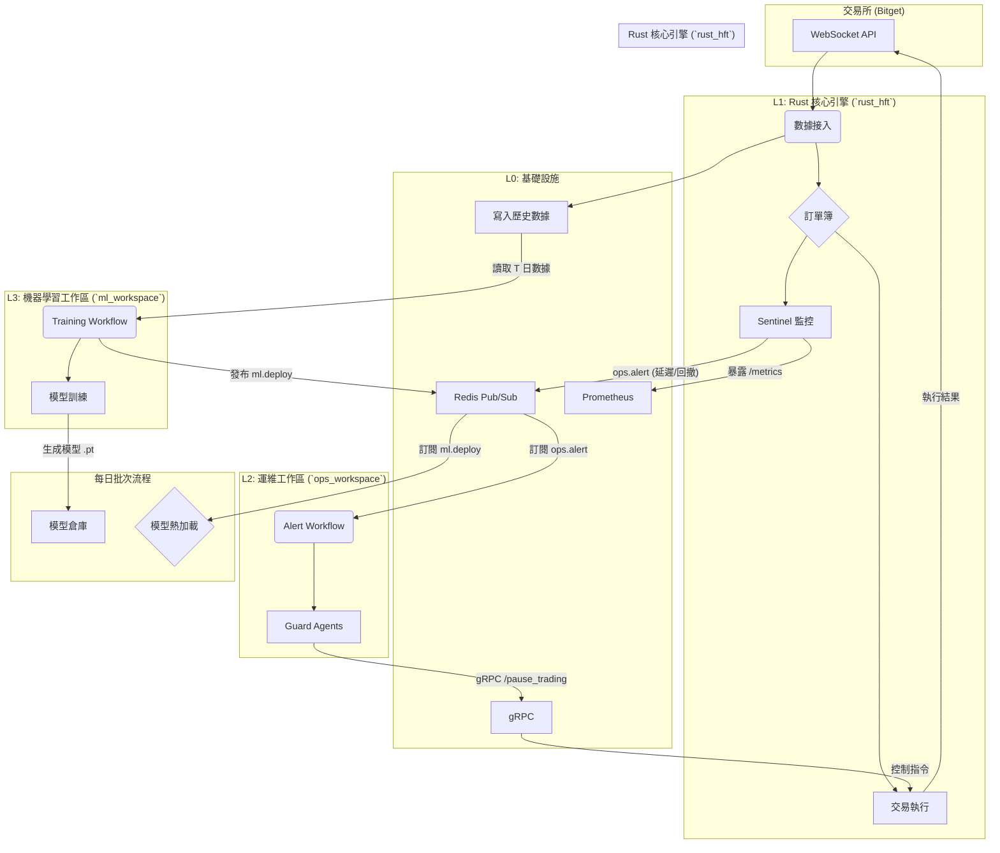

# HFT 系統狀態與設計總覽 (CLAUDE.md)

**版本**: 5.0 (2025-09-16)
**狀態**: 🟢 **代碼清理完成，本地訂單簿特徵訓練就緒**

---

## 1. Executive Summary

本文檔旨在提供 Agent-Driven HFT 系統的最新高層次設計與實施狀態。

經過全面的代碼清理和架構整理，系統現已演進為一個職責清晰、高度模組化的 **三服務（Microservices）架構**，並完成了本地訂單簿特徵工程的核心功能實現。

**核心架構**:
1.  **`rust_hft` (Rust 核心引擎)**: 系統的「熱路徑」。專職於微秒級的市場數據處理、訂單簿維護和交易執行。
2.  **`ml_workspace` (ML 工作區)**: 系統的「智慧大腦」。已完成代碼清理，實現本地訂單簿特徵重構，支持39維特徵工程和LSTM+Attention模型訓練。
3.  **`control_ws` (控制工作區)**: 系統的「神經中樞」。負責實時監控、風險告警處理和系統維運。

**最新進展 (v5.0)**:
- ✅ **代碼庫大清理**: 從126個混亂文件精簡至18個核心文件，清理比例85.7%
- ✅ **本地訂單簿特徵**: 基於BBO+trades數據重構，實現39維特徵工程
- ✅ **特徵一致性**: 修復查詢與回測系統的特徵匹配問題
- ✅ **全量數據支持**: 支持3.5M記錄的完整數據集訓練
- ✅ **清潔架構**: 建立歸檔系統，核心功能與實驗代碼分離

---

## 2. 最終系統架構

系統由三個獨立但協同工作的服務組成，它們通過 Redis 和 gRPC 進行通信。



### 2.1. 服務職責

| 服務 | 職責 | 生命週期 | 核心技術 |
| :--- | :--- | :--- | :--- |
| **`rust_hft`** | 實時數據處理、交易執行、指標暴露 | 7x24 常駐 | Rust, Tokio |
| **`ml_workspace`** | 模型訓練、評估、回測 | 每日批次執行 | Python, Agno, PyTorch |
| **`ops_workspace`**| 實時告警監控、風險管理 | 7x24 常駐 | Python, Agno |

---

## 3. 實施進度報告 (v5.0 代碼清理版)

**整體狀態**: ✅ **代碼清理和功能實現完成**。ML工作區從126個混亂文件精簡至18個核心文件，實現本地訂單簿特徵工程和模型訓練功能。

| 模組 | 狀態 | 關鍵成果 | 下一步 |
| :--- | :--- | :--- | :--- |
| **`rust_hft`** | 🟢 **功能完整** | 核心交易邏輯、數據接入、Sentinel 監控已實現。 | 與ml_workspace的訓練結果集成，支持模型熱加載。 |
| **`ml_workspace`** | 🟢 **功能就緒** | ✅ 代碼清理85.7%<br/>✅ 39維本地訂單簿特徵<br/>✅ LSTM+Attention模型<br/>✅ 3.5M數據集支持<br/>✅ 特徵一致性修復 | 優化模型性能，實現與Rust核心的gRPC集成。 |
| **`control_ws`**| 🟡 **待開發** | 基礎結構已創建，包含 `workflows/` 和 `agents/`。 | 實現告警處理邏輯和風險管理功能。 |
| **`protos`** | 🟢 **契約已定義** | gRPC 的 `.proto` 文件已集中管理。 | 使用 gRPC 工具鏈為 Rust 和 Python 生成客戶端/服務端代碼。 |
| **`deployment`** | 🟡 **待更新** | 舊的部署腳本需要更新。 | 為三個獨立服務分別創建 `Dockerfile` 和 `K8s` 部署配置。 |
| **代碼清理** | ✅ **已完成** | 85.7%的過時文件歸檔，建立清潔的代碼庫結構。 | 維護清潔架構，避免重複實驗代碼累積。 |

### 3.1. ML Workspace 代碼清理詳情

**清理前狀態**: 126個混亂的Python文件，包含大量重複、過時的實驗代碼
**清理後狀態**: 18個核心文件，功能明確分工

**歸檔分類**:
- `_archive/test_scripts/`: 30個測試和調試腳本
- `_archive/obsolete_features/`: 18個過時特徵工程腳本  
- `_archive/duplicate_scripts/`: 14個重複訓練腳本
- `_archive/rebuild_scripts/`: 13個重構相關腳本

**保留的核心文件**:
- `train_local_orderbook_features.py` - 主要訓練腳本（本地訂單簿特徵）
- `main_pipeline.py` - 清潔的主pipeline
- `trading_backtest.py` - 回測系統
- `verify_feature_consistency.py` - 特徵一致性驗證
- `utils/clickhouse_client.py` - 數據庫客戶端
- `utils/ch_queries.py` - 查詢函數（39維特徵）

### 3.2. 接下來的行動計畫

1.  ✅ **代碼清理**: ML工作區代碼清理已完成，從126個文件精簡至18個核心文件。
2.  ✅ **本地訂單簿特徵**: 基於BBO+trades數據實現39維特徵工程。
3.  🔄 **模型性能優化**: 目前相關係數較低，需要優化特徵工程和模型架構。
4.  🔄 **gRPC集成**: 根據 `protos/hft_control.proto` 為 Rust 和 Python 項目生成接口代碼。
5.  🔄 **控制工作區開發**: 在 `control_ws` 中實現告警處理邏輯和風險管理功能。
6.  🔄 **部署配置更新**: 為三個獨立服務創建 `Dockerfile` 和 `K8s` 部署配置。

### 3.3. 當前優先級

**短期目標** (1-2周):
- 優化本地訂單簿特徵工程，提升模型預測性能
- 修復回測系統中的模型維度不匹配問題
- 實現模型與Rust核心的無縫集成

**中期目標** (2-4周):
- 完成控制工作區的告警處理功能
- 建立端到端的測試框架
- 部署配置現代化

---
---

## 附錄：產品需求文件 (Agent-Driven HFT System PRD)

(此處附加 `Agent_Driven_HFT_System_PRD.md` 的完整內容)

# Agent-Driven HFT System PRD

本文件旨在定義一個由智慧代理（Agent）驅動的高頻交易（HFT）系統。系統採用「Rust 微秒級核心 + Python 智慧代理」的雙層架構，旨在實現極致的執行速度、高度自動化的模型迭代與智慧化的風險控制。

---

## Executive Summary

本系統採「**Rust µs-級撮合核心 + Agno Workflows v2 冷路徑**」雙層結構：
- **Rust 層**：專職行情接入、頂層訂單簿（Top-Level Order Book, TLOB）維護與下單，追求極致低延遲。
- **Agno 層**：以 `Step`→`Loop`→`Router` 的聲明式工作流，負責日終深度學習訓練、超參調優、模型部署，以及實時告警處置。

**通訊**以低延遲 Redis Pub/Sub 傳遞事件（p99 < 0.3 ms），模型熱加載則透過 gRPC `/load_model`，Rust 端以 `tch-rs` 直接加載 TorchScript `.pt` 檔案（典型載入 < 50 ms）。

**數據儲存**方面，歷史 TLOB 與回測結果存放於 ClickHouse，其列式引擎可達 7 GB/s 掃描吞吐，足以支撐夜間批次訓練。

**上線過程**遵循 AWS「Strangler Fig」增量模式，避免大規模停機重構。

---

## 1. 產品願景與範圍

### 1.1. 目標關鍵成效指標 (KPIs)

- **極低延遲撮合**：單筆行情從接收到下單，平均延遲 `hft_exec_latency_ms` p99 ≤ 25 µs。
- **自動化模型迭代**：每日 T+1 05:00 前完成深度學習端到端訓練與熱加載 (`training_wallclock_sec`)。
- **實時風控**：當資金回撤 (Drawdown) > 3% 或延遲 > 2 倍歷史 p99 時，在 < 100 ms 內觸發降頻或平倉 (`ops.alert` 響應時間)。
- **無人值守可觀測性**：透過 Prometheus + Grafana 實現全鏈路監控；事件、模型、KPI 持久化，支持快速故障恢復（MTTR）與模型可追溯性。

---

## 2. 總體架構

### 2.1. 宏觀分層

| 層級 | 服務/框架 | 主要任務 |
| :--- | :--- | :--- |
| **L0 Infra** | Dockerised ClickHouse, Redis, Supabase Storage, Prometheus, Grafana | 資料湖、事件匯流、指標收集 |
| **L1 Rust-HFT Core** | Tokio + custom OB + tch-rs | 行情接收、TLOB 更新、撮合、下單、Sentinel 監控 |
| **L2 Ops-Agent** | Python (+Agno Team) | 訂閱 `ops.alert` / `kill-switch`，執行降頻/回滾 |
| **L3 ML-Agent** | Agno Workflows v2 | 批次資料檢查→特徵工程→深度學習訓練→超參 Loop→部署 Router |

*Agno Workflows 2.0 以 `Step` / `Loop` / `Router` 重構管線，支援條件分支、並行與重試。*

### 2.2. 資料與控制流

1.  **實時熱路徑 (Hot Path)**
    - 交易所 WebSocket → Rust OrderBook → 決策 → gRPC 下單 → 交易所。
    - Rust Sentinel 每 100 ms 對 `exec_latency`、`pos_dd` 取樣並發布 `ops.alert`。

2.  **冷路徑 – 日終批次 (Cold Path - Batch)**
    - ClickHouse 匯出 T 日資料 → ML-Workflow 進入 `tuning_loop`（60 trial / 2h 上限）。
    - 成功 ⇒ `ml.deploy` 發布 ⇒ Rust `/load_model` 熱載；失敗 ⇒ `ml.reject`。

3.  **告警路徑 (Alert Path)**
    - `ops.alert` → Alert-Workflow Router → `latency_guard` / `dd_guard` 等 Step。
    - 操作可寫回 Redis `kill-switch` 或直接調用 Rust `/pause_trading` gRPC。

### 2.3. 資料擷取與落庫層 (Bitget)

#### 2.3.1. 來源頻道與頻率

| 類型 | WebSocket Channel | 描述 | 預設推送頻率 |
| :--- | :--- | :--- | :--- |
| **OrderBook-15** | `books15` | 前 15 檔全量快照，每次推 `snapshot` | 100–150 ms |
| **Ticker** | `ticker` | 最新成交價、買一、賣一、24h 量 | 100–300 ms |
| **Trades** | `trade` | 公共成交串流（吃單） | 每筆即推 (10–50 ms) |

- **REST 後援**: `/api/v2/spot/market/orderbook` 可一次抓 100 檔深度，用於 WS 斷線後補資料。

#### 2.3.2. 連線與重連流程

1.  **握手**: `GET wss://ws.bitget.com/spot/v1/stream`。
2.  **訂閱指令**: 發送 JSON 指令訂閱 `books15`, `ticker`, `trade` 頻道。
3.  **心跳**: 每 30s 進行 ping/pong，5s 未回 pong 則斷線重連。
4.  **重放**: 斷線期間使用 REST API 抓取 OrderBook＋Trades 填補缺口。

#### 2.3.3. 訊息結構（精簡）

- **OrderBook-15 (snapshot)**
  ```json
  {
    "action": "snapshot",
    "arg": {"instId": "BTCUSDT"},
    "data": [{
      "asks": [["67189.5", "0.25", 1], ...],
      "bids": [["67188.1", "0.12", 1], ...],
      "ts": "1721810005123"
    }]
  }
  ```
- **Ticker**
  ```json
  {
    "arg": {"instId": "BTCUSDT"},
    "data": [{
      "last": "67188.3",
      "bestBid": "67188.1",
      "bestAsk": "67188.5",
      "ts": "1721810005321"
    }]
  }
  ```
- **Trade**
  ```json
  {
    "arg": {"instId": "BTCUSDT"},
    "data": [{
      "px": "67188.4",
      "sz": "0.02",
      "side": "buy",
      "ts": "1721810005345",
      "tradeId": "1234567890"
    }]
  }
  ```

#### 2.3.4. ClickHouse 表設計 (DDL)

```sql
CREATE TABLE spot_books15 (
  ts         DateTime64(3),
  instId     LowCardinality(String),
  side       Enum8('ask'=1, 'bid'=2),
  price      Decimal64(10),
  qty        Decimal64(10),
  orderCnt   UInt16
) ENGINE = MergeTree()
ORDER BY (instId, ts, side, price);

CREATE TABLE spot_ticker (
  ts         DateTime64(3),
  instId     LowCardinality(String),
  last       Decimal64(10),
  bestBid    Decimal64(10),
  bestAsk    Decimal64(10),
  vol24h     Decimal64(18)
) ENGINE = MergeTree()
ORDER BY (instId, ts);

CREATE TABLE spot_trades (
  ts         DateTime64(3),
  instId     LowCardinality(String),
  tradeId    String,
  side       Enum8('buy'=1, 'sell'=2),
  price      Decimal64(10),
  qty        Decimal64(10)
) ENGINE = MergeTree()
ORDER BY (instId, ts, tradeId);
```

#### 2.3.5. 吞吐與回溯試算

- 單交易對總吞吐約 **185 KB/s**；100 個交易對約 **18 MB/s**，ClickHouse 與 Redis 足以負荷。

#### 2.3.6. 監控與告警規則

| 指標 | 閾值 | 動作 |
| :--- | :--- | :--- |
| `ingest_lag_ms` | > 500 ms | Ops-Agent `latency_alert` |
| `books15_gap_cnt` | > 1 / min | REST 補檔 + 稽核標記 |
| `ws_reconnect_cnt` | > 3 / h | Grafana 詳列，持續升高則 PagerDuty |

#### 2.3.7. 錯誤處理

- **Checksum 驗證**: 對每次快照深度陣列做 XOR 檢查，失敗則用 REST 重抓。
- **REST 回放限流**: 保留 75% 的 REST API 請求配額作為 headroom。
- **資料遺失標記**: 若錯過 > 3s 交易流，插入 `gap_marker` 行供訓練時迴避。

---

## 3. 核心元件規格

### 3.1. Rust-HFT Core

- **TLOB 更新**: 使用 lock-free ring-buffer；維護 Top-10 level。
- **下單 API**: 對 FIX / REST 進行抽象；最終延遲目標 20–30 µs。
- **Sentinel 子任務**:
  - `latency_guard`: 滑動窗口 p99 延遲 × 2 觸發告警。
  - `dd_guard`: 實盤淨值 DD ≥ 3% 發 alert；≥ 5% 觸發 kill-switch。
- **Metrics Exporter**: 使用 `metrics-exporter-prometheus` crate 直接暴露 `/metrics` 端點。

### 3.2. Step & Agent 函式介面

- **`load_dataset(start, end, inst, ch_url) -> pl.DataFrame`**
  - 從 ClickHouse 流式導出 Parquet，轉為 Polars DataFrame。
- **`feature_engineering(df, schema) -> torch.Tensor`**
  - 使用 PyO3 封裝的 Rust SIMD UDF 產生 120 維特徵。
- **`train_model(tensor, hparams) -> Path`**
  - 使用 PyTorch Lightning 訓練，並導出為 TorchScript (`.pt`)。
- **`eval_icir(model_pt, backtest_span) -> dict`**
  - 呼叫 Rust 回測 gRPC，返回 `{ic, ir, mdd, sharpe}`。
- **`latency_guard(value_ms, p99_ms)`**
  - 延遲超標時，調用 gRPC `degrade` 接口降頻。

---

## 4. Workflows

### 4.1. Training-Workflow（夜間批次）

- **觸發條件**: Cron 每日 00:00 (UTC+8) + 資料量檢查。
- **Step 定義**:
  1.  `load_dataset`: 拉取數據。
  2.  `feature_engineering`: 產生特徵。
  3.  `propose_hparam`: 產生超參。
  4.  `train_model`: 訓練模型。
  5.  `eval_icir`: 評估指標。
  6.  `record_history`: 記錄結果至 Supabase。
  7.  `router_deploy`: 根據指標決定是否部署。
- **Loop 策略**:
  - **終止條件**: `IC ≥ 0.03 ∧ IR ≥ 1.2` 或 `trial_count ≥ 60` 或 `elapsed ≥ 2h`。
  - **早停**: 連續 10 trial 改進 < 5% 時中止。
- **Router 準則**:
  - `pass` -> 發布 `ml.deploy` Redis 消息。
  - `fail` -> `retry` 或 `ml.reject`。
- **容錯**: Agno v2 Workflow Session 支持從失敗的 Step 恢復。

### 4.2. Alert-Workflow（常駐實時）

- **事件來源**: Redis `ops.alert` channel (JSON 格式)。
- **Router & Team**:
  - Agno Router 根據 `type` 欄位 (`latency`, `dd`, `infra`) 將事件分派給對應的 Guard Agent。
  - `Ops-Team` 並行處理多個 Guard。
- **Guard Agents**:
  - `latency_guard`: 延遲超標 -> 降頻。
  - `dd_guard`: 回撤超標 -> 平倉 -> kill-switch。
  - `infra_guard`: WS 重連頻繁 -> 重啟模組 -> PagerDuty。
- **回滾流程**: `kill-switch` 觸發後，Rust 核心停單撤單，等待人工介入。

---

## 5. 通訊契約

### 5.1. Redis Channel 定義

| Channel | Producer → Consumer | JSON 結構 (摘要) |
| :--- | :--- | :--- |
| `ml.deploy` | ML-Agent → Rust | `{url, sha256, ic, ir, mdd, ts, version}` |
| `ml.reject` | ML-Agent → Grafana Alert | `{reason, trials, ts}` |
| `ops.alert` | Rust Sentinel → Ops-Agent | `{type, value, ts}` |
| `kill-switch` | Ops-Agent → Rust | `{cause, ts}` |

### 5.2. gRPC Proto (概要)

```protobuf
service HftControl {
  rpc LoadModel(LoadModelReq) returns (Ack);
  rpc PauseTrading(Empty)     returns (Ack);
  rpc ResumeTrading(Empty)    returns (Ack);
}

message LoadModelReq {
  string url     = 1;
  string sha256  = 2;
  string version = 3;
}

message Ack {
  bool ok = 1;
  string msg = 2;
}
```

### 5.3. 安全與 ACL

- **Redis**: 使用 ACL 限制不同角色的讀寫權限。
- **gRPC**: 綁定 mTLS，證書由 Vault 簽發並定期滾動。

### 5.4. 版本控制

- `version` 字段採 SnowflakeID，熱載前檢查版本，避免錯誤回滾。

### 5.5. 通訊事件 JSON Schema（完整字段）

- **`ml.deploy`**
  ```json
  {
    "url": "supabase://models/20250725/model.pt",
    "sha256": "9f5c5e3e...",
    "version": "20250725-ic0031-ir128",
    "ic": 0.031,
    "ir": 1.28,
    "mdd": 0.041,
    "ts": 1721904000,
    "model_type": "sup"
  }
  ```
- **`ops.alert`**
  ```json
  {
    "type": "latency",
    "value": 37.5,
    "p99": 15.2,
    "ts": 1721904021
  }
  ```

---

## 6. 資料層優化

### 6.1. ClickHouse 分區、索引與 TTL

| 表 | Partition BY | Primary KEY | TTL |
| :--- | :--- | :--- | :--- |
| `spot_books15` | `toDate(ts)` | `(instId, ts)` | `ts + INTERVAL 90 DAY DELETE` |
| `spot_trades` | `toDate(ts)` | `(instId, ts, tradeId)` | `ts + INTERVAL 365 DAY MOVE TO vol_slow` |
| `spot_ticker` | `toDate(ts)` | `(instId, ts)` | `ts + INTERVAL 180 DAY DELETE` |

- **策略**: 按日分區加速夜間批次查詢；定期 TTL 自動清理或轉移冷數據。

---

## 7. DevOps & Operations

### 7.1. 冷啟／日常啟動流程

1.  `docker compose up infra` 啟動基礎設施。
2.  `cargo run hft-core` 啟動核心引擎。
3.  `python ops_agent/main.py` 啟動告警代理。
4.  `ag ws schedule training_workflow` 設定每日訓練任務。
5.  手動初始化 ML-Workflow 產出首版模型並熱載。
6.  匯入 Grafana Dashboard 並觀察核心指標。

### 7.2. CI/CD（GitHub Actions 摘要）

```yaml
jobs:
  rust_test_build:
    runs-on: ubuntu-latest
    steps:
      - uses: actions/checkout@v4
      - uses: dtolnay/rust-toolchain@stable
      - run: cargo test --workspace
      - run: cargo build --release -p rust-hft

  python_style_unit:
    uses: ./ci/python.yml   # lint + pytest

  docker_publish:
    needs: [rust_test_build, python_style_unit]
    runs-on: ubuntu-latest
    steps:
      - run: docker build -t hft-core:${{github.sha}} ./rust-hft
      - run: docker build -t ml-agent:${{github.sha}} ./ml-agent
      - run: docker push ...
```
- **部署**: `hft-core` 採用藍綠部署；`ml-agent` 可滾動更新。

### 7.3. Docker-Compose & K8s 部署樣板

- **`docker-compose.yml`**: 定義了 `clickhouse`, `redis`, `hft-core`, `ml-agent` 等服務的配置、依賴和資源限制。
- **K8s Blueprint**:
  - `hft-core`: 作為 Deployment 部署到低延遲專用節點，使用 `hostNetwork:true`。
  - `ml-agent`: 作為 CronJob 每日運行在 GPU 節點上。

### 7.4. 增量上線計畫（Strangler Fig）

| 週次 | 里程碑 | 風險門戶 |
| :--- | :--- | :--- |
| **W1** | 實裝 Redis-gRPC 契約；Rust Sentinel 上線 (觀測模式) | 契約錯誤 |
| **W3** | Alert-Workflow 導入 (只觀測不動作) | 誤報 |
| **W5** | Alert-Workflow 生效 (可降頻/kill-switch) | 回滾失敗 |
| **W7** | Training-Workflow 夜間跑離線模式 (不部署) | 訓練耗時 |
| **W9** | Training-Workflow 正式部署模型 | 模型品質迭代 |

---

## 8. 非功能需求 (NFR)

| 分類 | 指標 | 來源 |
| :--- | :--- | :--- |
| **效能** | 撮合延遲 p99 ≤ 25 µs | 低延遲 HFT 設計實務 |
| **可用性** | 核心 99.99%；ML-Agent 可降至 95% | Redis 與 ClickHouse cluster 自帶複本 |
| **可觀測性** | 指標、事件、日誌三合一 | Prometheus/Redis/ClickHouse 整合 |
| **擴展性** | ML-Agent 可水平擴展 GPU 節點 | Agno Step 可在 Kubernetes 上並行 |

---

## 9. 監控與告警

### 9.1. 關鍵績效指標 (KPIs)

| KPI | 目標 | Prometheus AlertRule |
| :--- | :--- | :--- |
| `hft_exec_latency_ms_p99` | ≤ 25 µs | `histogram_quantile(0.99, rate(exec_latency_bucket[1m])) > 25e-3` |
| `realized_ic` | ≥ 訓練 IC × 0.8 | `avg_over_time(realized_ic[15m]) < ic_thresh*0.8` |
| `pos_dd` | ≤ 5 % | `max_over_time(pos_dd[1m]) > 0.05` → critical |
| `ingest_lag_ms` | < 500 ms | `max_over_time(ingest_lag_ms[30s]) > 500` |

### 9.2. Prometheus 告警規則範例

```yaml
- alert: ExecLatencyP99High
  expr: histogram_quantile(0.99, rate(hft_exec_latency_bucket[1m])) > 25e-3
  for: 30s
  labels: {severity: critical}
  annotations:
    summary: "撮合延遲 p99 過高 (>25µs)"

- alert: DrawdownExceeded
  expr: max_over_time(pos_dd[1m]) > 0.05
  for: 10s
  labels: {severity: critical}
  annotations:
    summary: "實盤 DD > 5% 啟動 kill-switch"
```
