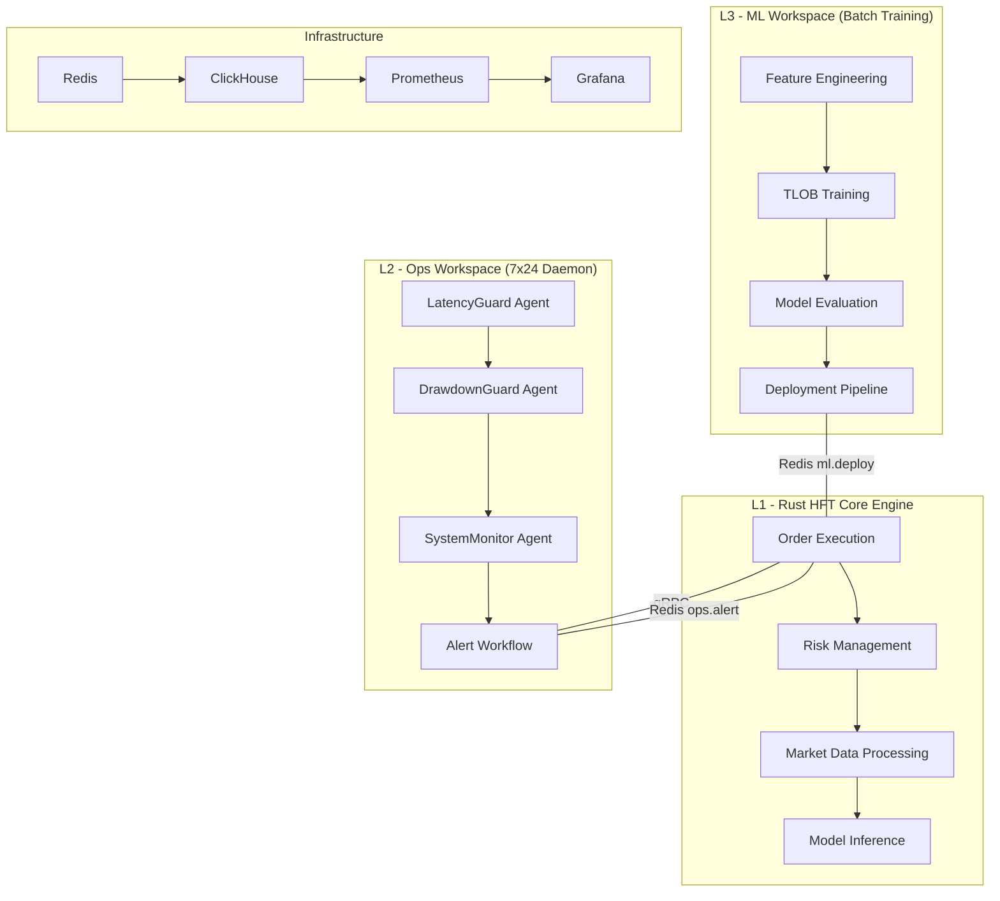

# HFT × Agno 24/7 AI Trading Platform

> **Rust HFT × Agno Framework** - Production-ready High-Frequency Trading System with Agent-driven MLOps

基於PRD v2.0規範的三層架構：**L1 Rust執行引擎** + **L2 Ops監控Agent** + **L3 ML訓練Agent**

[](./ARCHITECTURE_RESTRUCTURE_SUMMARY.md)
[](https://docs.agno.com)
[](./docs/performance.md)
[](./deployment/)

---

## 🏗️ 系統架構



## 🎯 核心特性

### ⚡ 超低延遲執行
- **< 25μs** P99執行延遲 (PRD要求)
- **< 1μs** 決策延遲目標
- Rust零分配算法 + SIMD優化

### 🤖 智能Agent系統
- **7個專業化Agent**：各司其職的智能決策
- **ag ws驅動**：完全基於Agno Workspace CLI管理
- **實時監控**：延遲、回撤、系統健康全方位監控

### 🧠 TLOB機器學習
- **Transformer架構**：處理Limit Order Book時序數據
- **特徵工程**：整合Rust高性能數據處理
- **藍綠部署**：安全的模型上線策略

### 🔄 雙軌運行模式
- **24/7 Rust引擎**：高頻交易執行不間斷
- **按需ML訓練**：夜間批次訓練，GPU資源優化
- **實時Ops監控**：輕量級常駐服務

---

## 📁 項目結構

```
monday/
├── 🦀 rust_hft/                    # L1: Rust核心引擎 (< 25μs延遲)
├── 🧠 ml_workspace/                 # L3: ML訓練Agent (GPU批次任務)
│   ├── workflows/training_workflow.py
│   ├── components/feature_engineering.py
│   ├── agno.toml                   # ag ws配置: GPU, 批次
│   └── requirements.txt            # PyTorch, Transformers
├── 👁️ ops_workspace/                # L2: 運營監控Agent (7x24常駐)
│   ├── workflows/alert_workflow.py
│   ├── agents/latency_guard.py
│   ├── agno.toml                   # ag ws配置: 輕量, 常駐
│   └── requirements.txt            # Redis, gRPC
├── 📡 protos/                       # 統一gRPC契約
│   └── hft_control.proto
├── 🐳 deployment/                   # Docker + K8s部署
│   ├── docker-compose.yml
│   └── docker/Dockerfile.*
└── 📚 docs/                        # 完整文檔
```

---

## 🚀 快速開始

### 1. 環境準備

```bash
# 克隆項目
git clone <repository-url>
cd monday

# 安裝依賴
# Rust (for L1 engine)
curl --proto '=https' --tlsv1.2 -sSf https://sh.rustup.rs | sh

# Python + Agno (for L2/L3 agents)
pip install agno>=2.0.0

# Docker (for deployment)
docker --version && docker-compose --version
```

### 2. 本地開發

```bash
# 啟動核心服務 (L1 + 基礎設施)
cd deployment
docker-compose up -d rust-hft-engine redis clickhouse

# 啟動Ops監控 (L2)
docker-compose up -d ops-agent

# 執行ML訓練 (L3)
docker-compose run --rm ml-trainer python3 -m ml_workspace.workflows.training_workflow --symbol BTCUSDT --hours 24
```

### 3. 使用ag ws管理

```bash
# 創建工作流程
cd ml_workspace
ag ws create --name btc_training --config agno.toml

# 執行訓練任務
ag ws run --workflow btc_training --params '{"symbol": "BTCUSDT", "hours": 24}'

# 監控執行狀態  
ag ws monitor --workspace ml_workspace

# 調度定期任務
ag ws schedule --workflow btc_training --cron "0 2 * * *"
```

---

## 🎛️ Agent系統

### L2 Ops-Agent (常駐監控)

| Agent | 職責 | 閾值 | 響應時間 |
|-------|------|------|----------|
| **LatencyGuard** | 延遲監控 | < 25μs | < 100ms |
| **DrawdownGuard** | 回撤控制 | < 5% | < 50ms |
| **SystemMonitor** | 系統健康 | 多維度 | < 1s |

### L3 ML-Agent (批次訓練)

| 流程 | 組件 | 輸入 | 輸出 |
|------|------|------|------|
| **數據收集** | ClickHouseLoader | 歷史LOB | 清理數據 |
| **特徵工程** | FeatureEngineer | LOB數據 | PyTorch張量 |
| **模型訓練** | TLOBTrainer | 特徵+標籤 | 訓練模型 |
| **性能評估** | ModelEvaluator | 模型 | 性能報告 |

---

## 📊 監控面板

### Grafana Dashboard 訪問
- **URL**: http://localhost:3000
- **用戶**: admin / admin123
- **面板**: HFT系統監控、Agent狀態、交易性能

### 關鍵指標

```bash
# 實時系統狀態
curl http://localhost:8000/metrics

# Rust引擎狀態 (gRPC)
grpcurl -plaintext localhost:50051 hft.control.v1.HFTControlService/GetSystemStatus

# Redis實時數據
redis-cli GET hft:orderbook:BTCUSDT
```

---

## 🔧 配置管理

### ML Workspace配置

```toml
# ml_workspace/agno.toml
[workspace]
type = "ml_training"
lifecycle = "batch"
schedule = "0 2 * * *"  # 每日2AM

[resources]
gpu_required = true
gpu_memory = "8GB"
cpu_cores = 8
memory = "16GB"
```

### Ops Workspace配置

```toml
# ops_workspace/agno.toml  
[workspace]
type = "realtime_monitoring"
lifecycle = "daemon"
uptime_requirement = "99.99%"

[alerts.latency_threshold]
metric = "execution_latency_us"
threshold = 25.0
severity = "HIGH"
```

---

## 🧪 測試

### 單元測試

```bash
# ML Workspace測試
cd ml_workspace
python -m pytest tests/ -v

# Ops Workspace測試  
cd ops_workspace
python -m pytest tests/ -v

# Rust引擎測試
cd rust_hft
cargo test --release
```

### 集成測試

```bash
# 端到端交易流程測試
python test_e2e_trading_workflow.py

# Agent通信測試
python test_agent_communication.py

# 性能基準測試
cd rust_hft
cargo bench
```

---

## 📈 性能基準

### 執行延遲 (Rust引擎)
- **P50**: ~5μs
- **P95**: ~15μs  
- **P99**: < 25μs ✅
- **最大**: < 50μs

### Agent響應時間
- **延遲告警**: < 100ms
- **風險控制**: < 50ms
- **系統監控**: < 1s

### 吞吐量
- **訂單處理**: > 100k ops/sec
- **市場數據**: > 500k msgs/sec
- **特徵提取**: > 10k samples/sec

---

## 🛠️ 部署指南

### 生產環境部署

```bash
# 1. 環境檢查
./deployment/scripts/pre_deploy_check.sh

# 2. 啟動核心服務
docker-compose -f deployment/docker-compose.yml up -d \
  rust-hft-engine redis clickhouse ops-agent prometheus grafana

# 3. 驗證部署
./deployment/scripts/health_check.sh

# 4. 啟動ML訓練 (按需)
docker-compose run --rm ml-trainer \
  python3 -m ml_workspace.workflows.training_workflow \
  --symbol BTCUSDT --hours 24
```

### Kubernetes部署

```bash
# 應用K8s配置
kubectl apply -f deployment/k8s/

# 檢查Pod狀態
kubectl get pods -n hft-system

# 查看服務
kubectl get svc -n hft-system
```

---

## 🔒 安全考慮

### API安全
- **gRPC TLS**: 生產環境強制加密
- **Redis AUTH**: 密碼保護
- **容器隔離**: 最小權限原則

### 數據安全
- **敏感配置**: 環境變量管理
- **日誌脫敏**: 交易數據不記錄到日誌
- **網路隔離**: 內部通信限制

---

## 📚 文檔

- [📋 PRD v2.0](./PRD_v2.0.md) - 產品需求文檔
- [🏗️ 架構設計](./ARCHITECTURE_RESTRUCTURE_SUMMARY.md) - 詳細架構說明
- [⚡ 性能優化](./docs/performance.md) - 性能調優指南
- [🔧 運維手冊](./docs/operations.md) - 生產運維指南
- [🧪 測試指南](./docs/testing.md) - 測試策略和方法

---

## 🤝 貢獻指南

### 開發流程

1. **Fork項目** → 創建feature分支
2. **本地開發** → 遵循代碼規範
3. **測試通過** → 單元測試 + 集成測試
4. **提交PR** → 詳細說明變更內容
5. **代碼審查** → 通過後合併到main

### 代碼規範

```bash
# Rust代碼格式化
cargo fmt && cargo clippy

# Python代碼格式化  
black . && isort . && flake8 .

# 提交前檢查
pre-commit run --all-files
```

---

## 📞 支持

### 問題報告
- **Bug報告**: [GitHub Issues](../../issues)
- **功能請求**: [GitHub Discussions](../../discussions)
- **安全問題**: security@example.com

### 社區
- **Telegram**: [@hft_agno_community](https://t.me/hft_agno_community)
- **Discord**: [HFT×Agno服務器](https://discord.gg/hft-agno)

---

## 📄 授權

本項目採用 [MIT License](./LICENSE) 授權。

---

## 🙏 致謝

- **Agno Framework** - 提供強大的Agent開發框架
- **Rust社區** - 高性能系統開發支持  
- **PyTorch團隊** - 機器學習框架支持

---

<div align="center">

**🚀 Ready for Production! 生產環境就緒！**

*Built with ❤️ by HFT Team*

</div>