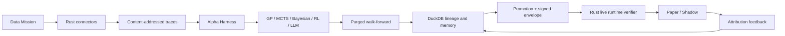

# Agentic Trading System
Rust-first alpha research and execution platform. The research control plane discovers and evaluates candidate factors; the Rust runtime alone owns market connectivity, risk, OMS, and execution.

## Capability Truth

| Capability | State | Owner |
| --- | --- | --- |
| Public Binance OHLCV Data Missions with content-addressed traces | `implemented` | `hft-collector` + `alpha-harness` |
| DuckDB missions, lineage, checkpoints, approvals, memory, and policy revisions | `implemented` | `alpha-store` |
| GP, MCTS, Bayesian search, offline Q-learning, and factor DSL evaluation | `implemented` | `alpha-engine` |
| OpenAI-compatible hypothesis and failure critic | `implemented` | `alpha-engine`; live calls require `ALPHA_LLM_*` |
| Purged walk-forward, trading costs, and one-time sealed holdout | `implemented` | `alpha-engine` |
| Signed paper/shadow deployment handoff and durable nonce replay protection | `implemented` | `alpha-domain` + `hft-live` |
| Runtime attribution, follow-up missions, and validator-gated search policy learning | `implemented` | `hft-live` + `alpha-store` + `alpha-engine` |
| Live-small activation from an Agent envelope | `deferred` | Fails closed until universal order-size and slippage gates consume envelope limits |
| Full Python prototype replacement | `deferred` | Python remains only where Rust parity is not proven |
| Real alpha profitability | `not claimed` | Requires statistically valid data and evaluation evidence |

## Architecture


```mermaid
flowchart LR
    S["Data Mission"] --> C["Rust connectors"]
    C --> A["Content-addressed traces"]
    A --> H["Alpha Harness"]
    H --> E["GP / MCTS / Bayesian / RL / LLM"]
    E --> V["Purged walk-forward"]
    V --> D["DuckDB lineage and memory"]
    D --> P["Promotion + signed envelope"]
    P --> R["Rust live runtime verifier"]
    R --> X["Paper / Shadow"]
    X --> F["Attribution feedback"]
    F --> D
```

The research plane cannot submit orders or broadcast transactions. It emits signed, bounded deployment envelopes. `apps/live` verifies current config, risk hashes, account, venue, instruments, limits, approval class, validity, signature, and nonce before changing startup configuration.

## Focused Validation

Run package-scoped checks from `rust_hft/`:

```bash
cargo test -p alpha-domain --locked
cargo test -p alpha-store --locked
cargo test -p alpha-engine --locked
cargo test -p alpha-harness --locked
cargo test -p hft-live --no-default-features --test deployment_envelope --locked
cargo check -p hft-collector -p hft-live --locked
```

Do not use full-workspace compilation for ordinary changes. Run `cargo metadata --locked --no-deps` after changing workspace members.

## Entry Points

- Research CLI: [rust_hft/alpha-harness/README.md](rust_hft/alpha-harness/README.md)
- Runtime architecture: [rust_hft/ARCHITECTURE.md](rust_hft/ARCHITECTURE.md)
- Approved design: [docs/superpowers/specs/2026-07-10-agentic-trading-system-v2-design.md](docs/superpowers/specs/2026-07-10-agentic-trading-system-v2-design.md)
- Implementation plan: [docs/superpowers/plans/2026-07-10-agentic-trading-system-v2.md](docs/superpowers/plans/2026-07-10-agentic-trading-system-v2.md)

Raw market data remains in trace/Parquet artifacts or analytics stores. DuckDB is the local research control-plane source of truth; it is not the hot market-data database.
