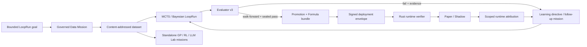

# Rust Loop Engineer Trading System

Rust-first, bounded alpha discovery and paper/shadow execution platform. The research plane may acquire governed data, propose and evaluate candidates, learn from failures, and prepare signed deployments. Deterministic Rust runtime code alone owns market connectivity, risk, OMS, reconciliation, cancellation, and execution.

## Production Boundary

This repository is locally production-gated for governed research plus signed **Paper** and **Shadow** activation. It is not approved for real-money autonomous trading. `LiveSmall` runtime activation remains fail-closed until real-venue reconciliation, reduce-only exit, order-size, and slippage acceptance tests are complete.

## Loop Engineer Contract

The implemented loop is goal-based and evidence-driven:

1. A `LoopRun` declares a target stage, bounded mission budget, and explicit completion policy.
2. Continuous-contract Formula `LoopRun` execution uses MCTS or Bayesian engines with exact engine-state checkpoints. GP, offline RL, and free-form LLM formula search remain standalone Lab missions. PLOY's separate binary-settlement lane may run its bounded, typed probability-blend LLM loop under the event-disjoint Rust evaluator; it has no promotion or execution authority outside that lane.
3. The versioned evaluator applies point-in-time data, purged walk-forward folds, costs, drawdown limits, minimum evidence, and a pre-registered multiple-testing haircut.
4. Failures remain queryable and may create one bounded follow-up mission with a validator-gated learning directive.
5. Promotion binds candidate, dataset, evaluator config/metrics, sealed result, approval, and bundle hashes.
6. `hft-live` verifies the signed envelope and loads that exact bundle for Paper or Shadow.
7. Runtime attribution is signed by a runtime-only key, verified before ingestion, appended to the same lineage, and may influence only a future lab search policy.

The repository provides the durable goal loop and CLI. Time-based or event-based invocation is an external scheduler responsibility. LLMs never receive order, credential, wallet, risk-increase, resume, or artifact-loading authority.

## Capability Truth

| Capability | State | Boundary |
| --- | --- | --- |
| Binance closed-candle OHLCV v2 Data Missions | `governed` | Content-addressed trace, immutable DuckDB registry, point-in-time and quality checks |
| Binance W3W Prediction order adapter | `implemented, activation disabled` | Official SDK wallet verification, quote/place/cancel, balance, and open-order reconciliation; fill/settlement promotion still requires a dedicated acceptance gate |
| Tick/LOB and multi-venue streaming connectors | `runtime-only` | Connector availability is not a governed research-dataset claim |
| Formula search with GP, MCTS, and Bayesian optimization | `governed` | Eligible for evaluator v3 and Formula-only promotion |
| Offline Q-learning | `lab-only` | Search-policy experiment; blocked from holdout, promotion, allocation, and runtime authority |
| OpenAI-compatible hypothesis/failure critic | `lab-only` | Optional `ALPHA_LLM_*` calls; outputs remain evidence/proposals |
| PLOY typed probability-blend LoopRun | `governed-research` | BTC/SOL five-minute event lane only; Rust schema, budget, event-disjoint evaluator, and content-addressed ledger; no order authority |
| Purged walk-forward and one-time sealed holdout v3 | `governed` | Typed predictive/trading metrics and config hashes are recomputed before promotion |
| Native Rust contract-model training | `governed-lab` | Burn 0.20.1, point-in-time rows, immutable dataset binding, deterministic seed, Burnpack artifact; never self-promotes |
| ONNX loading | `runtime-compatibility` | Read-only compatibility for already governed artifacts; native training uses Burnpack |
| Signed Formula Paper/Shadow handoff | `implemented` | Ed25519 verification, runtime-owned approval evidence, policy binding, durable nonce and audit records |
| Runtime attribution and follow-up learning | `implemented` | Signed deployment/strategy-scoped events; validator-gated lab policy adoption |
| Live-small runtime activation | `disabled` | Human eligibility evidence does not bypass the runtime fail-closed gate |
| Repository language boundary | `rust-only` | No tracked Python source, PyTorch, libtorch, `tch`, synthetic trainer fallback, or Python CI/deployment path |
| PLOY product workspace | `integrated-product` | `products/ploy` owns prediction-market product, operator UI, sidecar, and research capabilities; Monday risk, OMS, and execution remain authoritative |
| Real alpha profitability | `not claimed` | Requires real point-in-time data, valid evaluation, and venue soak evidence |

## Architecture


```mermaid
flowchart LR
    G["Bounded LoopRun goal"] --> D["Governed Data Mission"]
    D --> C["Content-addressed dataset"]
    C --> S["MCTS / Bayesian LoopRun"]
    C --> Q["Standalone GP / RL / LLM Lab missions"]
    S --> E["Evaluator v3"]
    E -->|"fail + evidence"| L["Learning directive / follow-up mission"]
    L --> S
    E -->|"walk-forward + sealed pass"| P["Promotion + Formula bundle"]
    P --> H["Signed deployment envelope"]
    H --> R["Rust runtime verifier"]
    R --> X["Paper / Shadow"]
    X --> A["Scoped runtime attribution"]
    A --> L
```

The research plane exposes no order or trade command and has no execution-adapter dependency. Runtime hard limits always clamp proposed limits; unknown account or reconciliation state halts live execution.

## Focused Validation

Run from `rust_hft/` unless noted:

```bash
cargo test --locked -p hft-collector -p alpha-domain -p alpha-store -p alpha-engine -p alpha-harness
cargo test --locked -p hft-research-ml
cargo clippy --locked -p alpha-domain -p alpha-store -p alpha-engine -p alpha-harness --all-targets --no-deps -- -D warnings
cargo clippy --locked -p hft-collector --all-targets --features collector-binance --no-deps -- -D warnings
cargo test --locked -p hft-live --features dl-strategy
cargo test --locked -p hft-live --no-default-features --features formula-strategy,binance --test deployment_envelope
cargo test --locked -p hft-execution-adapter-binance-prediction
cargo test --locked -p hft-runtime --features binance-prediction
cargo test --locked -p hft-live --no-default-features --features formula-strategy,bitget --test deployment_artifacts
cargo audit --no-fetch
```

From the repository root:

```bash
cargo test --manifest-path rust_hft/Cargo.toml -p hft-infra-secrets --test tracked_secrets_contract --locked -- --nocapture
cargo test --manifest-path rust_hft/Cargo.toml -p hft-live --no-default-features --test deployment_artifacts --locked
```

Ordinary changes should use package-scoped checks. Run a release graph, container build, and Kubernetes dry-run once at a production gate, not after every edit.

## Entry Points

- [Canonical architecture](rust_hft/ARCHITECTURE.md)
- [Alpha Harness CLI](rust_hft/alpha-harness/README.md)
- [Production deployment](rust_hft/deployment/PRODUCTION_DEPLOYMENT.md)
- [Current approved design](docs/superpowers/specs/2026-07-11-loop-engineer-production-hardening-design.md)
- [Current implementation plan](docs/superpowers/plans/2026-07-11-loop-engineer-production-hardening.md)
- [Design document status](docs/superpowers/README.md)
- [PLOY integration boundary](docs/architecture/PLOY_INTEGRATION.md)
- [Rust-only research and model boundary](docs/architecture/RUST_ONLY_RESEARCH.md)
- [PLOY product workspace](products/ploy/README.md)

DuckDB is the local research control-plane source of truth. Raw and large derived market data belongs in content-addressed trace/Parquet artifacts; ClickHouse is optional analytics storage, not control-plane authority.
