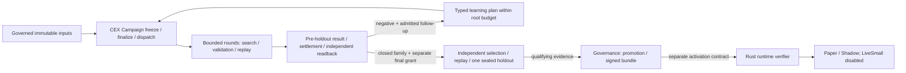

# Monday — Governed Quant Research & Trading System

Rust-first, multi-venue system for governed market-data acquisition, immutable replay, quantitative research, strategy governance, and deterministic Paper/Shadow execution. The research plane may acquire governed data, propose and evaluate candidates, learn from failures, and prepare signed deployments. Deterministic Rust runtime code alone owns market connectivity, risk, OMS, reconciliation, cancellation, and execution.

## Production Boundary

This repository is locally production-gated for governed research plus signed **Paper** and **Shadow** activation. It is not approved for real-money autonomous trading. `LiveSmall` runtime activation remains fail-closed until real-venue reconciliation, reduce-only exit, order-size, and slippage acceptance tests are complete.

## Research Entry Contract

CEX cloud research uses `mission campaign-freeze` → `mission campaign-finalize`
→ `mission dispatch submit` → the generated `mission campaign-execute` Job.
The Campaign binds immutable inputs, source/image identities, admitted plans,
and a finite trial budget. Each round produces a pre-holdout result; the
Campaign selects one deterministic winner or records a negative outcome.
Settlement and independent artifact readback complete that research attempt.
The [Campaign workflow](docs/research/CAMPAIGN_WORKFLOW.md) coordinates bounded
comparisons and recovery through this same entrypoint.

A supervised Campaign does not open the sealed holdout. The separate
[closed-family final evaluation](deployment/aliyun/research/README.md#final-evaluation-of-a-closed-family)
requires its own grant, independent selection/replay and a single-use holdout
claim. Its native worker and ledger/dispatch checks do not establish a real
cloud final-evaluation run or runtime cutover. Promotion and signed runtime
intake remain separate evidence and authority boundaries.

Legacy CEX Mission/`LoopRun` commands remain diagnostic implementation surfaces,
not alternate production completion paths. Prediction-market research uses
`prediction execute` and its bounded probability-blend `LoopRun` with an
event-disjoint evaluator; it grants no order authority. See the
[Alpha Harness entrypoints](rust_hft/alpha-harness/README.md) for each lane.

The repository provides durable research coordinators and CLIs. External event
routing is a separate responsibility. LLMs never receive order, credential,
wallet, risk-increase, resume, or artifact-loading authority.

## Capability Truth

| Capability | State | Boundary |
| --- | --- | --- |
| Binance closed-candle OHLCV v2 Data Missions | `governed` | Content-addressed trace, immutable DuckDB registry, point-in-time and quality checks |
| Binance W3W Prediction order adapter | `implemented, activation disabled` | Official SDK wallet verification, quote/place/cancel, balance, and open-order reconciliation; fill/settlement promotion still requires a dedicated acceptance gate |
| Tick/LOB and multi-venue streaming connectors | `runtime-only` | Connector availability is not a governed research-dataset claim |
| CEX Campaign factor/model search | `governed-research` | Continuous GP and native Ridge/CART/Burn MLP; per-round selection and replay stop pre-holdout, with immutable results and charged trial limits |
| Legacy Formula search with GP, MCTS, and Bayesian optimization | `diagnostic / legacy` | Retained evaluator and Formula promotion contracts do not replace the CEX Campaign entrypoint |
| Offline Q-learning | `lab-only` | Search-policy experiment; blocked from holdout, promotion, allocation, and runtime authority |
| OpenAI-compatible hypothesis/failure critic | `lab-only` | Optional `ALPHA_LLM_*` calls; outputs remain evidence/proposals |
| Prediction-market probability-blend LoopRun | `governed-research` | BTC/SOL five-minute event lane only; Rust schema, budget, event-disjoint evaluator, and content-addressed ledger; no order authority |
| Purged walk-forward and sealed evaluation | `governed` | Legacy Formula and separate supervised closed-family contracts; search results alone cannot open holdout or authorize runtime |
| Native Rust contract-model training | `governed-lab` | Burn 0.20.1, point-in-time rows, immutable dataset binding, deterministic seed, Burnpack artifact; never self-promotes |
| ONNX loading | `runtime-compatibility` | Read-only compatibility for already governed artifacts; native training uses Burnpack |
| Signed Formula Paper/Shadow handoff | `implemented` | Ed25519 verification, runtime-owned approval evidence, policy binding, durable nonce and audit records |
| Runtime attribution and follow-up learning | `implemented` | Signed deployment/strategy-scoped events; validator-gated lab policy adoption |
| Live-small runtime activation | `disabled` | Human eligibility evidence does not bypass the runtime fail-closed gate |
| Repository language boundary | `rust-only` | No tracked Python source, PyTorch, libtorch, `tch`, synthetic trainer fallback, or Python CI/deployment path |
| Prediction-market module | `integrated-market-family` | `rust_hft/prediction-markets` owns event-settlement research and operator tooling; venue connectivity, risk, OMS, and execution use Monday's canonical seams |
| Real alpha profitability | `not claimed` | Requires real point-in-time data, valid evaluation, and venue soak evidence |

## Architecture

The CEX research path crosses these separate evidence and authority boundaries:


```mermaid
flowchart LR
    D["Governed immutable inputs"] --> C["CEX Campaign freeze / finalize / dispatch"]
    C --> S["Bounded rounds: search / validation / replay"]
    S --> E["Pre-holdout result / settlement / independent readback"]
    E -->|"negative + admitted follow-up"| L["Typed learning plan within root budget"]
    L --> C
    E -->|"closed family + separate final grant"| F["Independent selection / replay / one sealed holdout"]
    F -->|"qualifying evidence"| P["Governance: promotion / signed bundle"]
    P -->|"separate activation contract"| R["Rust runtime verifier"]
    R --> X["Paper / Shadow; LiveSmall disabled"]
```

The research plane exposes no order or trade command and has no execution-adapter dependency. Runtime hard limits always clamp proposed limits; unknown account or reconciliation state halts live execution.

## Focused Validation

Run from `rust_hft/` unless noted:

```bash
cargo test --locked -p hft-collector -p alpha-domain -p alpha-store -p alpha-engine -p alpha-harness
cargo test --locked -p hft-research-ml
cargo clippy --locked -p alpha-domain -p alpha-store -p alpha-engine -p alpha-harness --all-targets --no-deps -- -D warnings
cargo clippy --locked -p hft-collector --all-targets --features collector-binance --no-deps -- -D warnings
cargo test --locked -p hft-live --features dl-strategy
cargo test --locked -p hft-live --no-default-features --features formula-strategy,binance --test deployment_envelope
cargo test --locked -p hft-execution-adapter-binance-prediction
cargo test --locked -p hft-runtime --features binance-prediction
cargo test --locked -p hft-live --no-default-features --features formula-strategy,bitget --test deployment_artifacts
cargo audit --no-fetch
```

From the repository root:

```bash
cargo test --manifest-path rust_hft/Cargo.toml -p hft-infra-secrets --test tracked_secrets_contract --locked -- --nocapture
cargo test --manifest-path rust_hft/Cargo.toml -p hft-live --no-default-features --test deployment_artifacts --locked
```

Ordinary changes should use package-scoped checks. Run a release graph, container build, and Kubernetes dry-run once at a production gate, not after every edit.

## Entry Points

- [Task and symptom navigation](docs/agents/scenarios.md)
- [Canonical architecture](rust_hft/ARCHITECTURE.md)
- [Monday V2 system-boundary ADR](docs/architecture/ADR-0001-monday-v2-system-boundaries.md)
- [Monday V2 architecture migration plan](docs/superpowers/plans/2026-08-21-monday-v2-architecture-migration.md)
- [Alpha Harness CLI](rust_hft/alpha-harness/README.md)
- [Production deployment](rust_hft/deployment/PRODUCTION_DEPLOYMENT.md)
- [Historical Loop Engineer design](docs/superpowers/specs/2026-07-11-loop-engineer-production-hardening-design.md)
- [Historical Loop Engineer implementation plan](docs/superpowers/plans/2026-07-11-loop-engineer-production-hardening.md)
- [Design document status](docs/superpowers/README.md)
- [Repository layout](docs/architecture/REPOSITORY_LAYOUT.md)
- [Prediction-market integration](docs/architecture/PREDICTION_MARKETS.md)
- [Rust-only research and model boundary](docs/architecture/RUST_ONLY_RESEARCH.md)
- [Prediction-market module](rust_hft/prediction-markets/README.md)

DuckDB is the local research control-plane source of truth. Raw and large derived market data belongs in content-addressed trace/Parquet artifacts; ClickHouse is optional analytics storage, not control-plane authority.
