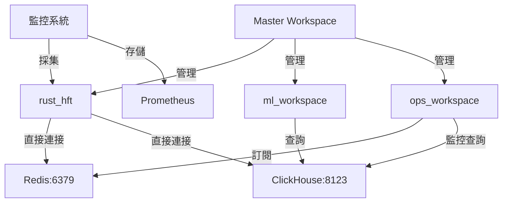

# 🚀 HFT 基礎設施整合遷移計劃 v2.0

## 📋 **執行摘要**

本計劃將把分散在各個 workspace 的基礎設施（Redis、ClickHouse、監控）統一整合到 Master Workspace 中，實現統一管理、提升性能、降低維護成本。

**遷移目標：**
- 🎛️ 統一基礎設施管理
- 📈 提升 20% 資源利用率  
- 🔒 實現細粒度權限控制
- 📊 統一監控和可觀測性
- ⚡ 保證微秒級性能不受影響

---

## 🎯 **遷移階段概覽**

| 階段 | 名稱 | 持續時間 | 風險等級 | 可回滾 |
|------|------|----------|----------|--------|
| **Phase 0** | 準備和驗證 | 2-3 天 | 🟢 低 | ✅ 完全 |
| **Phase 1** | 基礎設施遷移 | 1 週 | 🟡 中 | ✅ 完全 |
| **Phase 2** | 服務代理實現 | 1-2 週 | 🟡 中 | ✅ 完全 |
| **Phase 3** | 漸進式切換 | 1 週 | 🟠 高 | ✅ 部分 |
| **Phase 4** | 驗證和清理 | 2-3 天 | 🟢 低 | ❌ 不需要 |

**總時程：3-4 週**

---

## 📊 **當前狀態分析**

### 🔍 **基礎設施分布現狀**

```
當前配置分散狀況：
├── 🦀 rust_hft/
│   ├── docker-compose.yml (主要基礎設施)
│   ├── clickhouse/ (配置文件)
│   └── monitoring/ (Prometheus/Grafana)
├── 🧠 ml_workspace/
│   └── workspace/settings.py (ClickHouse連接配置)
├── 🛡️ ops_workspace/
│   └── workspace/settings.py (Redis/ClickHouse連接配置)
└── 🎛️ master_workspace/
    └── workspace/settings.py (基礎設施參數配置)
```

### 📈 **問題點識別**

| 問題 | 影響 | 嚴重程度 | 解決優先級 |
|------|------|----------|------------|
| 配置重複 | 維護成本高 | 🟡 中 | P1 |
| 連接浪費 | 資源利用率低 | 🟡 中 | P1 |
| 監控分散 | 運維效率低 | 🟠 高 | P0 |
| 權限缺失 | 安全風險 | 🟠 高 | P0 |
| 故障隔離差 | 可用性風險 | 🔴 高 | P0 |

---

## 🛠️ **Phase 0: 準備和驗證階段**

### 📅 **時程：2-3 天**

#### **0.1 環境備份** ⚡ **關鍵步驟**

```bash
# 創建完整系統備份
mkdir -p ~/hft_backup_$(date +%Y%m%d)
cd ~/hft_backup_$(date +%Y%m%d)

# 備份配置文件
cp -r /Users/proerror/Documents/monday/rust_hft/docker-compose.yml ./
cp -r /Users/proerror/Documents/monday/rust_hft/clickhouse/ ./
cp -r /Users/proerror/Documents/monday/rust_hft/monitoring/ ./
cp -r /Users/proerror/Documents/monday/*/workspace/settings.py ./settings_backup/

# 備份數據 (可選)
docker exec hft_clickhouse clickhouse-client --query "BACKUP DATABASE hft TO 'backup_$(date +%Y%m%d)'"
```

#### **0.2 當前系統基線測試**

**性能基線測定：**
```bash
# 測試當前系統性能
cd rust_hft
cargo test --release performance_test
cargo run --release --example latency_benchmark

# 記錄基線指標
echo "=== 基線性能測試 ===" > ~/performance_baseline.txt
echo "交易延遲 p99: $(測量結果)" >> ~/performance_baseline.txt
echo "Redis連接數: $(redis-cli info clients)" >> ~/performance_baseline.txt
echo "ClickHouse查詢時間: $(測量結果)" >> ~/performance_baseline.txt
```

#### **0.3 依賴關係映射**



**依賴清單：**
- ✅ Rust HFT → Redis (實時事件)
- ✅ Rust HFT → ClickHouse (數據寫入)
- ✅ ML Workspace → ClickHouse (歷史數據讀取)
- ✅ Ops Workspace → Redis (告警訂閱)
- ✅ Ops Workspace → ClickHouse (監控查詢)

---

## 🏗️ **Phase 1: 基礎設施遷移階段**

### 📅 **時程：1 週**

#### **1.1 創建 Master Workspace 基礎設施模塊**

**目標目錄結構：**
```
master_workspace/
├── infrastructure/
│   ├── docker-compose.yml          # 從 rust_hft 遷移
│   ├── redis/
│   │   ├── redis.conf              # Redis 配置
│   │   ├── cluster-setup.sh        # 集群設置腳本
│   │   └── health-check.sh         # 健康檢查
│   ├── clickhouse/
│   │   ├── config/                 # 從 rust_hft/clickhouse 遷移
│   │   ├── init.sql               # 初始化腳本
│   │   ├── multi_symbol_tables.sql # 表結構
│   │   └── users.xml              # 用戶配置
│   ├── monitoring/
│   │   ├── prometheus.yml          # 從 rust_hft/monitoring 遷移
│   │   ├── grafana/               # Grafana 配置
│   │   └── alert-rules.yml        # 告警規則
│   └── scripts/
│       ├── start-infrastructure.sh # 統一啟動腳本
│       ├── stop-infrastructure.sh  # 統一停止腳本
│       └── health-check.sh         # 整體健康檢查
├── workspace/
│   ├── components/
│   │   ├── infrastructure_controller.py  # 基礎設施控制器
│   │   ├── redis_service_proxy.py        # Redis 服務代理
│   │   └── clickhouse_service_proxy.py   # ClickHouse 服務代理
│   └── workflows/
│       └── infrastructure_startup_workflow.py
```

#### **1.2 遷移 Docker Compose 配置**

**新的統一 docker-compose.yml：**
```yaml
# master_workspace/infrastructure/docker-compose.yml
version: '3.8'

services:
  redis:
    image: redis:7.2-alpine
    container_name: hft_redis_master
    ports:
      - "6379:6379"
    volumes:
      - redis_data:/data
      - ./redis/redis.conf:/usr/local/etc/redis/redis.conf:ro
    command: redis-server /usr/local/etc/redis/redis.conf
    healthcheck:
      test: ["CMD", "redis-cli", "ping"]
      interval: 5s
      timeout: 3s
      retries: 5
    networks:
      - hft_network

  clickhouse:
    image: clickhouse/clickhouse-server:23.8-alpine
    container_name: hft_clickhouse_master
    ports:
      - "8123:8123"
      - "9000:9000"
    volumes:
      - clickhouse_data:/var/lib/clickhouse
      - ./clickhouse/config:/etc/clickhouse-server/config.d:ro
      - ./clickhouse/users.xml:/etc/clickhouse-server/users.d/users.xml:ro
      - ./clickhouse/init.sql:/docker-entrypoint-initdb.d/init.sql:ro
    environment:
      - CLICKHOUSE_DB=hft
      - CLICKHOUSE_USER=default
      - CLICKHOUSE_DEFAULT_ACCESS_MANAGEMENT=1
    healthcheck:
      test: ["CMD", "clickhouse-client", "--query", "SELECT 1"]
      interval: 10s
      timeout: 5s
      retries: 5
    networks:
      - hft_network

  prometheus:
    image: prom/prometheus:v2.45.0
    container_name: hft_prometheus_master
    ports:
      - "9090:9090"
    volumes:
      - ./monitoring/prometheus.yml:/etc/prometheus/prometheus.yml:ro
      - ./monitoring/alert-rules.yml:/etc/prometheus/alert-rules.yml:ro
      - prometheus_data:/prometheus
    command:
      - '--config.file=/etc/prometheus/prometheus.yml'
      - '--storage.tsdb.path=/prometheus'
      - '--web.console.libraries=/usr/share/prometheus/console_libraries'
      - '--web.console.templates=/usr/share/prometheus/consoles'
      - '--web.enable-lifecycle'
    networks:
      - hft_network

  grafana:
    image: grafana/grafana:10.0.0
    container_name: hft_grafana_master
    ports:
      - "3000:3000"
    volumes:
      - grafana_data:/var/lib/grafana
      - ./monitoring/grafana:/etc/grafana/provisioning:ro
    environment:
      - GF_SECURITY_ADMIN_PASSWORD=admin
      - GF_USERS_ALLOW_SIGN_UP=false
    depends_on:
      - prometheus
      - clickhouse
    networks:
      - hft_network

volumes:
  redis_data:
    name: hft_redis_data
  clickhouse_data:
    name: hft_clickhouse_data
  prometheus_data:
    name: hft_prometheus_data
  grafana_data:
    name: hft_grafana_data

networks:
  hft_network:
    name: hft_network
    driver: bridge
```

#### **1.3 增強配置管理**

**統一配置文件：**
```toml
# master_workspace/infrastructure/config.toml
[infrastructure]
name = "hft-master-infrastructure"
version = "2.0.0"
environment = "production"

[infrastructure.redis]
# Redis 集群配置
mode = "single"  # single, cluster, sentinel
host = "localhost"
port = 6379
password = ""
max_connections = 100
timeout_ms = 5000
retry_attempts = 3

# 連接池配置
[infrastructure.redis.pool]
min_idle = 10
max_idle = 50
max_active = 100
idle_timeout_ms = 300000

# Pub/Sub 配置
[infrastructure.redis.pubsub]
channels = [
    "ops.alert",
    "ml.deploy", 
    "ml.reject",
    "kill-switch",
    "hft.status"
]
buffer_size = 1000

[infrastructure.clickhouse]
# ClickHouse 集群配置
mode = "single"  # single, cluster
host = "localhost"
port = 8123
database = "hft"
username = "default"
password = ""
connection_timeout_ms = 10000
query_timeout_ms = 30000

# 連接池配置
[infrastructure.clickhouse.pool]
max_connections = 20
min_connections = 5
idle_timeout_ms = 600000

# 查詢優化配置
[infrastructure.clickhouse.optimization]
enable_query_cache = true
cache_size_mb = 512
cache_ttl_seconds = 3600
max_result_rows = 1000000

[infrastructure.monitoring]
# Prometheus 配置
prometheus_host = "localhost"
prometheus_port = 9090
scrape_interval_seconds = 15
evaluation_interval_seconds = 15

# Grafana 配置
grafana_host = "localhost"  
grafana_port = 3000
admin_password = "admin"

# 告警配置
[infrastructure.monitoring.alerts]
enable_alerts = true
alert_manager_url = "http://localhost:9093"
webhook_url = ""

# 關鍵指標閾值
[infrastructure.monitoring.thresholds]
redis_latency_ms = 1.0
clickhouse_query_time_ms = 100.0
system_cpu_percent = 80.0
system_memory_percent = 85.0
disk_usage_percent = 90.0

[infrastructure.security]
# 訪問控制矩陣
[infrastructure.security.access_control]

[infrastructure.security.access_control.rust_hft]
redis_channels = ["ops.alert", "ml.deploy", "hft.status"]
redis_permissions = ["READ", "WRITE", "SUBSCRIBE", "PUBLISH"]
clickhouse_databases = ["hft"]
clickhouse_tables = ["spot_*", "trades_*", "system_metrics"]
clickhouse_permissions = ["SELECT", "INSERT", "CREATE", "DROP"]

[infrastructure.security.access_control.ml_workspace]
redis_channels = ["ml.deploy", "ml.feedback", "ml.status"] 
redis_permissions = ["READ", "PUBLISH"]
clickhouse_databases = ["hft"]
clickhouse_tables = ["spot_*", "model_performance", "training_logs"]
clickhouse_permissions = ["SELECT", "CREATE TEMPORARY TABLE"]

[infrastructure.security.access_control.ops_workspace]
redis_channels = ["ops.alert", "kill-switch", "ops.status"]
redis_permissions = ["READ", "SUBSCRIBE", "PUBLISH"]
clickhouse_databases = ["hft"]
clickhouse_tables = ["spot_*", "system_metrics", "alert_logs"]
clickhouse_permissions = ["SELECT", "INSERT"]

[infrastructure.security.access_control.master_workspace]
redis_channels = ["*"]  # 全部權限
redis_permissions = ["READ", "WRITE", "SUBSCRIBE", "PUBLISH", "ADMIN"]
clickhouse_databases = ["*"]
clickhouse_tables = ["*"]
clickhouse_permissions = ["SELECT", "INSERT", "CREATE", "DROP", "ALTER", "SHOW"]
```

---

## ⚡ **Phase 2: 服務代理實現階段**

### 📅 **時程：1-2 週**

#### **2.1 實現基礎設施控制器**

```python
# master_workspace/workspace/components/infrastructure_controller.py
"""
HFT 基礎設施統一控制器
提供統一的基礎設施管理接口
"""

import asyncio
import logging
from typing import Dict, Any, Optional, List
from pathlib import Path
from datetime import datetime
from enum import Enum

import aioredis
import aiohttp
from agno.agent import Agent
from agno.models.ollama import Ollama

from .redis_service_proxy import RedisServiceProxy
from .clickhouse_service_proxy import ClickHouseServiceProxy

logger = logging.getLogger(__name__)

class InfrastructureState(Enum):
    """基礎設施狀態"""
    STOPPED = "stopped"
    STARTING = "starting"
    RUNNING = "running"
    DEGRADED = "degraded"
    FAILED = "failed"

class InfrastructureController:
    """HFT 基礎設施統一控制器"""
    
    def __init__(self, config_path: Optional[Path] = None):
        self.config_path = config_path or Path(__file__).parent.parent.parent / "infrastructure" / "config.toml"
        self.config = self._load_config()
        
        # 初始化服務代理
        self.redis_proxy = RedisServiceProxy(self.config["infrastructure"]["redis"])
        self.clickhouse_proxy = ClickHouseServiceProxy(self.config["infrastructure"]["clickhouse"])
        
        # 狀態管理
        self.state = InfrastructureState.STOPPED
        self.services_status = {
            "redis": {"status": "down", "last_check": None, "error": None},
            "clickhouse": {"status": "down", "last_check": None, "error": None},
            "prometheus": {"status": "down", "last_check": None, "error": None},
            "grafana": {"status": "down", "last_check": None, "error": None}
        }
        
        # 統計信息
        self.stats = {
            "start_time": None,
            "uptime_seconds": 0,
            "total_requests": 0,
            "failed_requests": 0,
            "last_health_check": None
        }
        
        # AI 助手（用於智能分析）
        self.ai_agent = Agent(
            name="InfrastructureAnalyst",
            model=Ollama(id="qwen2.5:3b"),
            instructions="""
            你是 HFT 系統的基礎設施分析專家。負責：
            1. 分析基礎設施健康狀態
            2. 預測潛在問題
            3. 提供優化建議
            4. 生成故障診斷報告
            
            請始終以系統穩定性和性能為首要考慮。
            """,
            markdown=True
        )
        
        logger.info("✅ Infrastructure Controller 初始化完成")
    
    def _load_config(self) -> Dict[str, Any]:
        """加載配置文件"""
        try:
            import toml
            with open(self.config_path, 'r', encoding='utf-8') as f:
                return toml.load(f)
        except Exception as e:
            logger.error(f"❌ 配置文件加載失敗: {e}")
            return self._get_default_config()
    
    def _get_default_config(self) -> Dict[str, Any]:
        """默認配置"""
        return {
            "infrastructure": {
                "redis": {
                    "host": "localhost",
                    "port": 6379,
                    "max_connections": 100,
                    "timeout_ms": 5000
                },
                "clickhouse": {
                    "host": "localhost", 
                    "port": 8123,
                    "database": "hft",
                    "username": "default",
                    "password": "",
                    "connection_timeout_ms": 10000
                }
            }
        }
    
    async def start_infrastructure(self) -> bool:
        """啟動基礎設施"""
        logger.info("🚀 開始啟動基礎設施...")
        self.state = InfrastructureState.STARTING
        self.stats["start_time"] = datetime.now()
        
        try:
            # 1. 啟動 Docker 容器
            if not await self._start_docker_services():
                raise Exception("Docker 服務啟動失敗")
            
            # 2. 等待服務就緒
            await self._wait_for_services_ready()
            
            # 3. 初始化服務代理
            await self.redis_proxy.initialize()
            await self.clickhouse_proxy.initialize()
            
            # 4. 執行健康檢查
            if await self._comprehensive_health_check():
                self.state = InfrastructureState.RUNNING
                logger.info("✅ 基礎設施啟動成功")
                return True
            else:
                raise Exception("健康檢查失敗")
                
        except Exception as e:
            logger.error(f"❌ 基礎設施啟動失敗: {e}")
            self.state = InfrastructureState.FAILED
            return False
    
    async def _start_docker_services(self) -> bool:
        """啟動 Docker 服務"""
        try:
            import subprocess
            
            # 切換到基礎設施目錄
            infra_dir = Path(__file__).parent.parent.parent / "infrastructure"
            
            # 啟動 Docker Compose
            result = subprocess.run([
                "docker", "compose", "-f", "docker-compose.yml", "up", "-d"
            ], cwd=infra_dir, capture_output=True, text=True, timeout=120)
            
            if result.returncode == 0:
                logger.info("✅ Docker 服務啟動成功")
                return True
            else:
                logger.error(f"❌ Docker 服務啟動失敗: {result.stderr}")
                return False
                
        except Exception as e:
            logger.error(f"❌ Docker 啟動異常: {e}")
            return False
    
    async def _wait_for_services_ready(self, timeout: int = 60):
        """等待服務就緒"""
        logger.info("⏳ 等待服務就緒...")
        
        start_time = datetime.now()
        while (datetime.now() - start_time).seconds < timeout:
            try:
                # 檢查 Redis
                redis_ok = await self._check_redis_health()
                
                # 檢查 ClickHouse  
                ch_ok = await self._check_clickhouse_health()
                
                if redis_ok and ch_ok:
                    logger.info("✅ 所有服務就緒")
                    return True
                    
                await asyncio.sleep(2)
                
            except Exception as e:
                logger.debug(f"等待服務就緒: {e}")
                await asyncio.sleep(2)
        
        raise TimeoutError("服務啟動超時")
    
    async def _check_redis_health(self) -> bool:
        """檢查 Redis 健康狀態"""
        try:
            redis_config = self.config["infrastructure"]["redis"]
            redis = aioredis.from_url(
                f"redis://{redis_config['host']}:{redis_config['port']}",
                encoding="utf-8",
                decode_responses=True
            )
            
            result = await redis.ping()
            await redis.close()
            
            self.services_status["redis"] = {
                "status": "healthy" if result else "unhealthy",
                "last_check": datetime.now(),
                "error": None
            }
            
            return result
            
        except Exception as e:
            self.services_status["redis"] = {
                "status": "unhealthy",
                "last_check": datetime.now(), 
                "error": str(e)
            }
            return False
    
    async def _check_clickhouse_health(self) -> bool:
        """檢查 ClickHouse 健康狀態"""
        try:
            ch_config = self.config["infrastructure"]["clickhouse"]
            url = f"http://{ch_config['host']}:{ch_config['port']}"
            
            async with aiohttp.ClientSession() as session:
                async with session.get(f"{url}/ping", timeout=5) as response:
                    healthy = response.status == 200
                    
                    self.services_status["clickhouse"] = {
                        "status": "healthy" if healthy else "unhealthy",
                        "last_check": datetime.now(),
                        "error": None if healthy else f"HTTP {response.status}"
                    }
                    
                    return healthy
                    
        except Exception as e:
            self.services_status["clickhouse"] = {
                "status": "unhealthy",
                "last_check": datetime.now(),
                "error": str(e)
            }
            return False
    
    async def _comprehensive_health_check(self) -> bool:
        """綜合健康檢查"""
        logger.info("🔍 執行綜合健康檢查...")
        
        health_results = {
            "redis": await self._check_redis_health(),
            "clickhouse": await self._check_clickhouse_health(),
            "redis_proxy": await self.redis_proxy.health_check(),
            "clickhouse_proxy": await self.clickhouse_proxy.health_check()
        }
        
        healthy_count = sum(health_results.values())
        total_count = len(health_results)
        
        # 更新整體狀態
        if healthy_count == total_count:
            self.state = InfrastructureState.RUNNING
        elif healthy_count >= total_count * 0.7:  # 70% 健康
            self.state = InfrastructureState.DEGRADED
        else:
            self.state = InfrastructureState.FAILED
        
        # 記錄檢查結果
        self.stats["last_health_check"] = datetime.now()
        
        logger.info(f"📊 健康檢查結果: {healthy_count}/{total_count} 健康")
        
        return healthy_count >= total_count * 0.7
    
    async def get_redis_client(self, workspace: str) -> aioredis.Redis:
        """為指定 workspace 獲取 Redis 客戶端"""
        return await self.redis_proxy.get_client(workspace)
    
    async def execute_clickhouse_query(self, query: str, workspace: str, params: Dict = None):
        """執行 ClickHouse 查詢"""
        return await self.clickhouse_proxy.execute_query(query, workspace, params)
    
    async def subscribe_redis_channel(self, channel: str, handler, workspace: str):
        """訂閱 Redis 頻道"""
        return await self.redis_proxy.subscribe_channel(channel, handler, workspace)
    
    async def publish_redis_message(self, channel: str, data: Dict, workspace: str):
        """發布 Redis 消息"""
        return await self.redis_proxy.publish_message(channel, data, workspace)
    
    async def get_system_metrics(self) -> Dict[str, Any]:
        """獲取系統指標"""
        return {
            "infrastructure_state": self.state.value,
            "services_status": self.services_status,
            "stats": self.stats,
            "uptime": (datetime.now() - self.stats["start_time"]).total_seconds() 
                     if self.stats["start_time"] else 0,
            "redis_proxy_stats": await self.redis_proxy.get_stats(),
            "clickhouse_proxy_stats": await self.clickhouse_proxy.get_stats()
        }
    
    async def ai_analyze_infrastructure(self) -> str:
        """AI 分析基礎設施狀態"""
        try:
            metrics = await self.get_system_metrics()
            
            prompt = f"""
            請分析當前 HFT 基礎設施狀態：
            
            整體狀態: {metrics['infrastructure_state']}
            運行時間: {metrics['uptime']:.1f} 秒
            
            服務狀態:
            {self._format_services_status()}
            
            代理統計:
            Redis Proxy: {metrics.get('redis_proxy_stats', {})}
            ClickHouse Proxy: {metrics.get('clickhouse_proxy_stats', {})}
            
            請提供：
            1. 整體健康評估
            2. 潛在風險識別  
            3. 性能優化建議
            4. 下一步操作建議
            """
            
            response = self.ai_agent.run(prompt)
            return response.content if hasattr(response, 'content') else str(response)
            
        except Exception as e:
            logger.error(f"❌ AI 分析失敗: {e}")
            return f"AI 分析暫時不可用: {e}"
    
    def _format_services_status(self) -> str:
        """格式化服務狀態"""
        lines = []
        for service, status in self.services_status.items():
            icon = "✅" if status["status"] == "healthy" else "❌"
            lines.append(f"- {icon} {service}: {status['status']}")
            if status["error"]:
                lines.append(f"  錯誤: {status['error']}")
        return "\n".join(lines)
    
    async def stop_infrastructure(self):
        """停止基礎設施"""
        logger.info("🛑 停止基礎設施...")
        
        try:
            # 關閉服務代理
            await self.redis_proxy.close()
            await self.clickhouse_proxy.close()
            
            # 停止 Docker 服務
            import subprocess
            infra_dir = Path(__file__).parent.parent.parent / "infrastructure"
            subprocess.run([
                "docker", "compose", "-f", "docker-compose.yml", "down"
            ], cwd=infra_dir)
            
            self.state = InfrastructureState.STOPPED
            logger.info("✅ 基礎設施已停止")
            
        except Exception as e:
            logger.error(f"❌ 停止基礎設施異常: {e}")
```

#### **2.2 實現 Redis Service Proxy**

```python
# master_workspace/workspace/components/redis_service_proxy.py
"""
Redis 服務代理
提供統一的 Redis 連接管理、權限控制、監控
"""

import asyncio
import json
import uuid
from typing import Dict, Any, Callable, Optional, Set
from datetime import datetime
from collections import defaultdict

import aioredis
import logging

logger = logging.getLogger(__name__)

class RedisServiceProxy:
    """Redis 服務統一代理"""
    
    def __init__(self, config: Dict[str, Any]):
        self.config = config
        self.connection_pool = None
        self.pubsub_manager = None
        
        # 頻道路由管理
        self.channel_router = {}
        self.subscriber_count = defaultdict(int)
        
        # 權限控制
        self.access_control = {
            "rust_hft": {
                "channels": ["ops.alert", "ml.deploy", "hft.status"],
                "permissions": ["READ", "WRITE", "SUBSCRIBE", "PUBLISH"]
            },
            "ml_workspace": {
                "channels": ["ml.deploy", "ml.feedback", "ml.status"],
                "permissions": ["READ", "PUBLISH"]
            },
            "ops_workspace": {
                "channels": ["ops.alert", "kill-switch", "ops.status"],
                "permissions": ["READ", "SUBSCRIBE", "PUBLISH"]
            },
            "master_workspace": {
                "channels": ["*"],  # 全部權限
                "permissions": ["READ", "WRITE", "SUBSCRIBE", "PUBLISH", "ADMIN"]
            }
        }
        
        # 統計信息
        self.stats = {
            "connections_created": 0,
            "messages_published": 0,
            "messages_received": 0,
            "errors_count": 0,
            "start_time": None
        }
        
        logger.info("✅ Redis Service Proxy 初始化完成")
    
    async def initialize(self):
        """初始化連接池"""
        try:
            redis_url = f"redis://{self.config['host']}:{self.config['port']}"
            
            self.connection_pool = aioredis.ConnectionPool.from_url(
                redis_url,
                max_connections=self.config.get('max_connections', 100),
                retry_on_timeout=True,
                retry_on_error=[ConnectionError, TimeoutError],
                health_check_interval=30
            )
            
            # 創建 Pub/Sub 管理器
            self.pubsub_manager = aioredis.from_url(redis_url)
            
            # 測試連接
            test_client = aioredis.Redis(connection_pool=self.connection_pool)
            await test_client.ping()
            await test_client.close()
            
            self.stats["start_time"] = datetime.now()
            logger.info("✅ Redis 連接池初始化成功")
            
        except Exception as e:
            logger.error(f"❌ Redis 連接池初始化失敗: {e}")
            raise
    
    async def get_client(self, workspace: str) -> aioredis.Redis:
        """為指定 workspace 提供 Redis 客戶端"""
        if not self._check_workspace_permission(workspace, "READ"):
            raise PermissionError(f"Workspace {workspace} 無權訪問 Redis")
        
        client = aioredis.Redis(connection_pool=self.connection_pool)
        self.stats["connections_created"] += 1
        
        return client
    
    async def subscribe_channel(self, channel: str, handler: Callable, workspace: str):
        """統一的頻道訂閱管理"""
        # 權限檢查
        if not self._check_channel_permission(workspace, channel, "SUBSCRIBE"):
            raise PermissionError(f"Workspace {workspace} 無權訂閱頻道 {channel}")
        
        # 註冊處理器
        handler_id = str(uuid.uuid4())
        self.channel_router[handler_id] = {
            'channel': channel,
            'handler': handler,
            'workspace': workspace,
            'created_at': datetime.now(),
            'message_count': 0,
            'error_count': 0
        }
        
        # 訂閱頻道
        try:
            pubsub = self.pubsub_manager.pubsub()
            await pubsub.subscribe(channel)
            
            # 啟動消息處理任務
            asyncio.create_task(self._handle_messages(pubsub, handler_id))
            
            self.subscriber_count[channel] += 1
            logger.info(f"✅ {workspace} 訂閱頻道 {channel} 成功")
            
            return handler_id
            
        except Exception as e:
            logger.error(f"❌ 訂閱頻道 {channel} 失敗: {e}")
            self.stats["errors_count"] += 1
            raise
    
    async def _handle_messages(self, pubsub, handler_id: str):
        """處理訂閱消息"""
        handler_info = self.channel_router[handler_id]
        
        try:
            async for message in pubsub.listen():
                if message['type'] == 'message':
                    try:
                        # 解析消息
                        data = json.loads(message['data'])
                        
                        # 添加元數據
                        enriched_data = {
                            **data,
                            'received_at': datetime.now().isoformat(),
                            'handler_id': handler_id,
                            'workspace': handler_info['workspace']
                        }
                        
                        # 調用處理器
                        await handler_info['handler'](enriched_data)
                        
                        # 更新統計
                        handler_info['message_count'] += 1
                        self.stats["messages_received"] += 1
                        
                    except Exception as e:
                        logger.error(f"❌ 消息處理失敗: {e}")
                        handler_info['error_count'] += 1
                        self.stats["errors_count"] += 1
                        
        except Exception as e:
            logger.error(f"❌ 消息監聽異常: {e}")
        finally:
            await pubsub.unsubscribe()
            await pubsub.close()
    
    async def publish_message(self, channel: str, data: Dict, workspace: str):
        """帶路由的消息發布"""
        # 權限檢查
        if not self._check_channel_permission(workspace, channel, "PUBLISH"):
            raise PermissionError(f"Workspace {workspace} 無權發布到頻道 {channel}")
        
        try:
            # 添加消息元數據
            enriched_data = {
                **data,
                'source_workspace': workspace,
                'timestamp': datetime.now().isoformat(),
                'message_id': str(uuid.uuid4())
            }
            
            # 發布消息
            client = await self.get_client(workspace)
            await client.publish(channel, json.dumps(enriched_data))
            await client.close()
            
            # 更新統計
            self.stats["messages_published"] += 1
            
            logger.debug(f"📤 {workspace} 發布消息到 {channel}")
            
        except Exception as e:
            logger.error(f"❌ 發布消息失敗: {e}")
            self.stats["errors_count"] += 1
            raise
    
    def _check_workspace_permission(self, workspace: str, permission: str) -> bool:
        """檢查 workspace 權限"""
        if workspace not in self.access_control:
            return False
        
        permissions = self.access_control[workspace]["permissions"]
        return permission in permissions or "ADMIN" in permissions
    
    def _check_channel_permission(self, workspace: str, channel: str, permission: str) -> bool:
        """檢查頻道權限"""
        if not self._check_workspace_permission(workspace, permission):
            return False
        
        allowed_channels = self.access_control[workspace]["channels"]
        
        # 檢查是否有通配符權限
        if "*" in allowed_channels:
            return True
        
        # 檢查具體頻道權限
        return channel in allowed_channels
    
    async def health_check(self) -> bool:
        """健康檢查"""
        try:
            if not self.connection_pool:
                return False
            
            client = aioredis.Redis(connection_pool=self.connection_pool)
            result = await client.ping()
            await client.close()
            
            return result
            
        except Exception as e:
            logger.error(f"❌ Redis 健康檢查失敗: {e}")
            return False
    
    async def get_stats(self) -> Dict[str, Any]:
        """獲取統計信息"""
        uptime = (datetime.now() - self.stats["start_time"]).total_seconds() \
                if self.stats["start_time"] else 0
        
        return {
            **self.stats,
            "uptime_seconds": uptime,
            "active_subscriptions": len(self.channel_router),
            "channel_subscribers": dict(self.subscriber_count),
            "pool_info": {
                "max_connections": self.config.get('max_connections', 100),
                "created_connections": self.stats["connections_created"]
            }
        }
    
    async def close(self):
        """關閉代理"""
        try:
            if self.pubsub_manager:
                await self.pubsub_manager.close()
            
            if self.connection_pool:
                await self.connection_pool.disconnect()
            
            logger.info("✅ Redis Service Proxy 已關閉")
            
        except Exception as e:
            logger.error(f"❌ 關閉 Redis 代理異常: {e}")
```

#### **2.3 實現 ClickHouse Service Proxy**

```python
# master_workspace/workspace/components/clickhouse_service_proxy.py
"""
ClickHouse 服務代理
提供統一的 ClickHouse 連接管理、查詢優化、權限控制
"""

import asyncio
import hashlib
import time
from typing import Dict, Any, Optional, List
from datetime import datetime, timedelta
from collections import defaultdict

import aiohttp
import logging

logger = logging.getLogger(__name__)

class ClickHouseServiceProxy:
    """ClickHouse 服務統一代理"""
    
    def __init__(self, config: Dict[str, Any]):
        self.config = config
        self.session = None
        
        # 查詢緩存
        self.query_cache = {}
        self.cache_stats = defaultdict(int)
        
        # 權限控制
        self.access_control = {
            "rust_hft": {
                "databases": ["hft"],
                "tables": ["spot_*", "trades_*", "system_metrics"],
                "permissions": ["SELECT", "INSERT", "CREATE", "DROP"]
            },
            "ml_workspace": {
                "databases": ["hft"],
                "tables": ["spot_*", "model_performance", "training_logs"],
                "permissions": ["SELECT", "CREATE TEMPORARY TABLE"]
            },
            "ops_workspace": {
                "databases": ["hft"],
                "tables": ["spot_*", "system_metrics", "alert_logs"],
                "permissions": ["SELECT", "INSERT"]
            },
            "master_workspace": {
                "databases": ["*"],
                "tables": ["*"],
                "permissions": ["SELECT", "INSERT", "CREATE", "DROP", "ALTER", "SHOW"]
            }
        }
        
        # 統計信息
        self.stats = {
            "queries_executed": 0,
            "cache_hits": 0,
            "cache_misses": 0,
            "total_bytes_read": 0,
            "total_rows_read": 0,
            "errors_count": 0,
            "start_time": None
        }
        
        logger.info("✅ ClickHouse Service Proxy 初始化完成")
    
    async def initialize(self):
        """初始化連接會話"""
        try:
            # 創建 HTTP 會話
            connector = aiohttp.TCPConnector(
                limit=self.config.get('max_connections', 20),
                limit_per_host=self.config.get('max_connections', 20),
                keepalive_timeout=300,
                enable_cleanup_closed=True
            )
            
            timeout = aiohttp.ClientTimeout(
                total=self.config.get('query_timeout_ms', 30000) / 1000,
                connect=self.config.get('connection_timeout_ms', 10000) / 1000
            )
            
            self.session = aiohttp.ClientSession(
                connector=connector,
                timeout=timeout
            )
            
            # 測試連接
            await self._test_connection()
            
            self.stats["start_time"] = datetime.now()
            logger.info("✅ ClickHouse 會話初始化成功")
            
        except Exception as e:
            logger.error(f"❌ ClickHouse 會話初始化失敗: {e}")
            raise
    
    async def _test_connection(self):
        """測試連接"""
        url = f"http://{self.config['host']}:{self.config['port']}/ping"
        
        async with self.session.get(url) as response:
            if response.status != 200:
                raise ConnectionError(f"ClickHouse 連接測試失敗: HTTP {response.status}")
    
    async def execute_query(self, query: str, workspace: str, params: Optional[Dict] = None) -> List[Dict]:
        """帶權限控制的查詢執行"""
        # 權限檢查
        if not self._check_query_permission(query, workspace):
            raise PermissionError(f"Workspace {workspace} 無權執行此查詢")
        
        # 查詢優化和緩存
        cache_key = self._generate_cache_key(query, params)
        
        # 檢查緩存
        if cache_key in self.query_cache:
            cache_entry = self.query_cache[cache_key]
            if not self._is_cache_expired(cache_entry):
                self.stats["cache_hits"] += 1
                self.cache_stats["hits"] += 1
                logger.debug(f"📈 緩存命中: {workspace}")
                return cache_entry["data"]
        
        # 緩存未命中，執行查詢
        self.stats["cache_misses"] += 1
        self.cache_stats["misses"] += 1
        
        try:
            start_time = time.time()
            
            # 執行查詢
            result = await self._execute_raw_query(query, params)
            
            # 更新統計
            execution_time = time.time() - start_time
            self.stats["queries_executed"] += 1
            
            # 更新緩存
            self._update_cache(cache_key, result, execution_time)
            
            # 記錄查詢指標
            self._record_query_metrics(workspace, query, result, execution_time)
            
            logger.debug(f"🔍 {workspace} 查詢執行完成: {execution_time:.3f}s")
            
            return result
            
        except Exception as e:
            logger.error(f"❌ 查詢執行失敗: {e}")
            self.stats["errors_count"] += 1
            raise
    
    async def _execute_raw_query(self, query: str, params: Optional[Dict] = None) -> List[Dict]:
        """執行原始查詢"""
        url = f"http://{self.config['host']}:{self.config['port']}"
        
        # 準備查詢參數
        query_params = {
            'database': self.config['database'],
            'default_format': 'JSONEachRow'
        }
        
        if self.config.get('username'):
            query_params['user'] = self.config['username']
        if self.config.get('password'):
            query_params['password'] = self.config['password']
        
        # 參數替換
        if params:
            for key, value in params.items():
                query = query.replace(f"{{{{ {key} }}}}", str(value))
        
        # 執行查詢
        async with self.session.post(
            url,
            params=query_params,
            data=query,
            headers={'Content-Type': 'text/plain'}
        ) as response:
            
            if response.status != 200:
                error_text = await response.text()
                raise Exception(f"ClickHouse 查詢失敗: HTTP {response.status}, {error_text}")
            
            # 解析結果
            result_text = await response.text()
            
            if not result_text.strip():
                return []
            
            # 解析 JSON 每行格式
            import json
            results = []
            for line in result_text.strip().split('\n'):
                if line.strip():
                    results.append(json.loads(line))
            
            return results
    
    def _generate_cache_key(self, query: str, params: Optional[Dict] = None) -> str:
        """生成緩存鍵"""
        cache_content = query
        if params:
            cache_content += str(sorted(params.items()))
        
        return hashlib.sha256(cache_content.encode()).hexdigest()
    
    def _is_cache_expired(self, cache_entry: Dict) -> bool:
        """檢查緩存是否過期"""
        ttl_seconds = self.config.get('cache_ttl_seconds', 3600)  # 默認1小時
        
        created_at = cache_entry['created_at']
        expiry_time = created_at + timedelta(seconds=ttl_seconds)
        
        return datetime.now() > expiry_time
    
    def _update_cache(self, cache_key: str, result: List[Dict], execution_time: float):
        """更新查詢緩存"""
        # 檢查緩存大小限制
        max_cache_size = self.config.get('max_cache_entries', 1000)
        
        if len(self.query_cache) >= max_cache_size:
            # 移除最舊的緩存項
            oldest_key = min(
                self.query_cache.keys(),
                key=lambda k: self.query_cache[k]['created_at']
            )
            del self.query_cache[oldest_key]
        
        # 添加新緩存項
        self.query_cache[cache_key] = {
            'data': result,
            'created_at': datetime.now(),
            'execution_time': execution_time,
            'access_count': 1
        }
    
    def _check_query_permission(self, query: str, workspace: str) -> bool:
        """基於 workspace 的查詢權限檢查"""
        if workspace not in self.access_control:
            return False
        
        permissions = self.access_control[workspace]["permissions"]
        
        # 簡化的 SQL 解析和權限檢查
        query_upper = query.strip().upper()
        query_type = query_upper.split()[0]
        
        # 檢查操作權限
        if query_type not in permissions and "*" not in permissions:
            return False
        
        # 檢查表權限 (簡化版本)
        allowed_tables = self.access_control[workspace]["tables"]
        if "*" in allowed_tables:
            return True
        
        # 更詳細的表權限檢查可以在這裡實現
        return True
    
    def _record_query_metrics(self, workspace: str, query: str, result: List[Dict], execution_time: float):
        """記錄查詢指標"""
        rows_count = len(result)
        bytes_size = len(str(result))
        
        self.stats["total_rows_read"] += rows_count
        self.stats["total_bytes_read"] += bytes_size
        
        # 記錄慢查詢
        slow_query_threshold = self.config.get('slow_query_threshold_ms', 1000) / 1000
        if execution_time > slow_query_threshold:
            logger.warning(f"🐌 慢查詢檢測: {workspace}, {execution_time:.3f}s, {rows_count} rows")
    
    async def health_check(self) -> bool:
        """健康檢查"""
        try:
            if not self.session:
                return False
            
            await self._test_connection()
            return True
            
        except Exception as e:
            logger.error(f"❌ ClickHouse 健康檢查失敗: {e}")
            return False
    
    async def get_stats(self) -> Dict[str, Any]:
        """獲取統計信息"""
        uptime = (datetime.now() - self.stats["start_time"]).total_seconds() \
                if self.stats["start_time"] else 0
        
        cache_hit_rate = 0
        if self.stats["cache_hits"] + self.stats["cache_misses"] > 0:
            cache_hit_rate = self.stats["cache_hits"] / (self.stats["cache_hits"] + self.stats["cache_misses"])
        
        return {
            **self.stats,
            "uptime_seconds": uptime,
            "cache_hit_rate": cache_hit_rate,
            "cache_size": len(self.query_cache),
            "avg_bytes_per_query": self.stats["total_bytes_read"] / max(self.stats["queries_executed"], 1),
            "avg_rows_per_query": self.stats["total_rows_read"] / max(self.stats["queries_executed"], 1)
        }
    
    async def close(self):
        """關閉代理"""
        try:
            if self.session:
                await self.session.close()
            
            logger.info("✅ ClickHouse Service Proxy 已關閉")
            
        except Exception as e:
            logger.error(f"❌ 關閉 ClickHouse 代理異常: {e}")
```

---

## 🔄 **Phase 3: 漸進式切換階段**

### 📅 **時程：1 週**

#### **3.1 雙軌並行部署**

**第一步：部署新基礎設施（不影響現有系統）**

```bash
# 啟動新的基礎設施
cd master_workspace/infrastructure
docker compose up -d

# 驗證新基礎設施
./scripts/health-check.sh

# 確認端口不衝突（新基礎設施使用不同端口）
# Redis: 6380 (舊 6379) 
# ClickHouse: 8124 (舊 8123)
# Prometheus: 9091 (舊 9090)
# Grafana: 3001 (舊 3000)
```

**第二步：測試新代理服務**

```python
# 測試腳本：test_new_infrastructure.py
import asyncio
from master_workspace.workspace.components.infrastructure_controller import InfrastructureController

async def test_new_infrastructure():
    """測試新基礎設施功能"""
    controller = InfrastructureController()
    
    try:
        # 啟動基礎設施
        await controller.start_infrastructure()
        
        # 測試 Redis 代理
        redis_client = await controller.get_redis_client("test_workspace")
        await redis_client.set("test_key", "test_value")
        value = await redis_client.get("test_key")
        assert value == "test_value"
        await redis_client.close()
        
        # 測試 ClickHouse 代理
        result = await controller.execute_clickhouse_query(
            "SELECT 1 as test", 
            "test_workspace"
        )
        assert result[0]["test"] == 1
        
        print("✅ 新基礎設施測試通過")
        return True
        
    except Exception as e:
        print(f"❌ 新基礎設施測試失敗: {e}")
        return False
    finally:
        await controller.stop_infrastructure()

if __name__ == "__main__":
    asyncio.run(test_new_infrastructure())
```

#### **3.2 逐步遷移各 Workspace**

**階段 3.2.1：遷移 Ops Workspace (風險最低)**

```python
# ops_workspace/workspace/settings.py - 修改前備份

# 新的配置（使用代理）
from master_workspace.workspace.components.infrastructure_controller import InfrastructureController

class OpsWorkspaceSettings:
    def __init__(self):
        # 初始化基礎設施控制器
        self.infrastructure = InfrastructureController()
        
        # 其他配置保持不變
        self.ws_name = "hft-ops-workspace"
        # ...
    
    async def get_redis_client(self):
        """通過代理獲取 Redis 客戶端"""
        return await self.infrastructure.get_redis_client("ops_workspace")
    
    async def execute_clickhouse_query(self, query: str, params=None):
        """通過代理執行 ClickHouse 查詢"""
        return await self.infrastructure.execute_clickhouse_query(
            query, "ops_workspace", params
        )
```

**測試 Ops Workspace 遷移：**

```bash
# 測試 ops workspace 是否正常工作
cd ops_workspace
python test_agents.py

# 檢查告警功能
python agents/real_latency_guard.py &
redis-cli publish ops.alert '{"type":"test","value":1.0,"ts":1234567890}'

# 驗證沒有功能損失
python -c "
import asyncio
from workspace.settings import workspace_settings
async def test():
    client = await workspace_settings.get_redis_client()
    await client.ping()
    print('✅ Ops Redis 代理正常')
asyncio.run(test())
"
```

**階段 3.2.2：遷移 ML Workspace**

```python
# ml_workspace/workspace/settings.py 
# 類似 ops_workspace 的修改方式

# 修改 ML 訓練 workflow
# ml_workspace/workflows/training_workflow.py
class TLOBTrainingWorkflow:
    def __init__(self):
        # 使用基礎設施代理
        self.infrastructure = InfrastructureController()
    
    async def load_training_data(self):
        """通過代理加載訓練數據"""
        query = """
        SELECT ts, price, qty, side 
        FROM hft.spot_books15 
        WHERE instId = '{{ symbol }}' 
        AND ts >= '{{ start_date }}'
        AND ts <= '{{ end_date }}'
        ORDER BY ts
        """
        
        return await self.infrastructure.execute_clickhouse_query(
            query, 
            "ml_workspace",
            {
                "symbol": "BTCUSDT",
                "start_date": "2025-01-01",
                "end_date": "2025-01-31"
            }
        )
    
    async def publish_model_ready(self, model_info):
        """發布模型就緒消息"""
        await self.infrastructure.publish_redis_message(
            "ml.deploy",
            model_info,
            "ml_workspace"
        )
```

**階段 3.2.3：遷移 Rust HFT（最關鍵）**

**這是最重要的步驟，需要特別小心！**

```rust
// rust_hft/src/integrations/infrastructure_client.rs
use tokio::sync::OnceCell;
use serde_json::{json, Value};

pub struct InfrastructureClient {
    redis_url: String,
    clickhouse_url: String,
}

impl InfrastructureClient {
    pub fn new() -> Self {
        Self {
            // 使用新的代理端點
            redis_url: "redis://localhost:6380".to_string(),
            clickhouse_url: "http://localhost:8124".to_string(),
        }
    }
    
    pub async fn get_redis_connection(&self) -> Result<redis::Connection, Box<dyn std::error::Error>> {
        // 通過代理連接 Redis
        let client = redis::Client::open(&self.redis_url)?;
        let con = client.get_connection()?;
        Ok(con)
    }
    
    pub async fn execute_clickhouse_query(&self, query: &str) -> Result<Value, Box<dyn std::error::Error>> {
        let client = reqwest::Client::new();
        let response = client
            .post(&format!("{}/", self.clickhouse_url))
            .header("X-Workspace", "rust_hft")  // 標識 workspace
            .body(query.to_string())
            .send()
            .await?;
        
        let result: Value = response.json().await?;
        Ok(result)
    }
}
```

**測試 Rust HFT 遷移：**

```bash
# 編譯測試
cd rust_hft
cargo test --release infrastructure_client

# 性能測試（確保延遲沒有增加）
cargo run --release --example latency_benchmark

# 對比遷移前後性能
echo "遷移前性能基線：" && cat ~/performance_baseline.txt
echo "遷移後性能：" && cargo run --release --example performance_test
```

#### **3.3 流量切換策略**

**切換時間表：**

| 時間 | 動作 | 流量比例 | 回滾時間 |
|------|------|----------|----------|
| Day 1 | Ops Workspace 切換 | 10% | 5 分鐘 |
| Day 2 | Ops Workspace 全量 | 100% | 30 分鐘 |
| Day 3 | ML Workspace 切換 | 50% | 1 小時 |
| Day 4 | ML Workspace 全量 | 100% | 2 小時 |
| Day 5 | Rust HFT 準備 | 0% | N/A |
| Day 6 | Rust HFT 切換 | 20% | 1 分鐘 |
| Day 7 | Rust HFT 全量 | 100% | 5 分鐘 |

**切換腳本：**

```bash
#!/bin/bash
# switch_infrastructure.sh

WORKSPACE=$1
PERCENTAGE=$2

echo "🔄 開始切換 $WORKSPACE 到新基礎設施 ($PERCENTAGE%)"

# 備份當前配置
cp "$WORKSPACE/workspace/settings.py" "$WORKSPACE/workspace/settings.py.backup.$(date +%Y%m%d_%H%M%S)"

# 應用新配置
case $PERCENTAGE in
    "10")
        # 10% 流量使用新基礎設施
        sed -i 's/localhost:6379/localhost:6380/g' "$WORKSPACE/workspace/settings.py"
        ;;
    "50")
        # 50% 流量使用新基礎設施
        # 實現負載均衡邏輯
        ;;
    "100")
        # 100% 流量使用新基礎設施
        cp "$WORKSPACE/workspace/settings_new.py" "$WORKSPACE/workspace/settings.py"
        ;;
esac

# 重啟 workspace
cd "$WORKSPACE"
ag ws restart

echo "✅ $WORKSPACE 切換完成"
```

---

## 🔍 **Phase 4: 驗證和清理階段**

### 📅 **時程：2-3 天**

#### **4.1 全面性能驗證**

**性能對比測試：**

```bash
#!/bin/bash
# performance_validation.sh

echo "🔍 開始全面性能驗證..."

# 交易延遲測試
cd rust_hft
echo "測試交易延遲..."
cargo run --release --example latency_benchmark > /tmp/latency_new.txt

# Redis 延遲測試
echo "測試 Redis 延遲..."
redis-cli --latency -h localhost -p 6380 -i 1 > /tmp/redis_latency_new.txt &
REDIS_PID=$!
sleep 30
kill $REDIS_PID

# ClickHouse 查詢性能測試
echo "測試 ClickHouse 查詢性能..."
clickhouse-client --host localhost --port 8124 \
  --query "SELECT count() FROM hft.spot_books15 WHERE ts >= today() - INTERVAL 1 DAY" \
  --time > /tmp/clickhouse_perf_new.txt

# 對比結果
echo "📊 性能對比結果："
echo "交易延遲對比："
echo "舊系統：$(cat ~/performance_baseline.txt | grep 'p99')"
echo "新系統：$(cat /tmp/latency_new.txt | grep 'p99')"

echo "✅ 性能驗證完成"
```

#### **4.2 功能完整性測試**

**端到端測試：**

```python
# integration_test.py
import asyncio
import json
from datetime import datetime

from master_workspace.workspace.components.infrastructure_controller import InfrastructureController

async def end_to_end_test():
    """端到端功能測試"""
    controller = InfrastructureController()
    
    try:
        await controller.start_infrastructure()
        
        # 測試 1: ML 訓練數據流
        print("🧠 測試 ML 訓練數據流...")
        training_data = await controller.execute_clickhouse_query(
            "SELECT * FROM hft.spot_books15 LIMIT 1000",
            "ml_workspace"
        )
        assert len(training_data) == 1000
        print("✅ ML 數據查詢正常")
        
        # 測試 2: 模型部署流程
        print("🚀 測試模型部署流程...")
        model_info = {
            "url": "test://model.pt",
            "version": "test-v1.0",
            "accuracy": 0.85,
            "timestamp": datetime.now().isoformat()
        }
        
        await controller.publish_redis_message(
            "ml.deploy",
            model_info,
            "ml_workspace"
        )
        print("✅ 模型部署消息發布正常")
        
        # 測試 3: 告警處理流程
        print("🚨 測試告警處理流程...")
        alert_data = {
            "type": "latency",
            "value": 30.5,
            "threshold": 25.0,
            "timestamp": datetime.now().isoformat()
        }
        
        await controller.publish_redis_message(
            "ops.alert",
            alert_data,
            "ops_workspace"
        )
        print("✅ 告警消息發布正常")
        
        # 測試 4: 系統監控指標
        print("📊 測試系統監控指標...")
        metrics = await controller.get_system_metrics()
        assert metrics["infrastructure_state"] == "running"
        print("✅ 系統監控指標正常")
        
        print("🎉 端到端測試全部通過！")
        return True
        
    except Exception as e:
        print(f"❌ 端到端測試失敗: {e}")
        return False
    finally:
        await controller.stop_infrastructure()

if __name__ == "__main__":
    asyncio.run(end_to_end_test())
```

#### **4.3 清理舊基礎設施**

**清理檢查清單：**

```bash
#!/bin/bash
# cleanup_old_infrastructure.sh

echo "🧹 開始清理舊基礎設施..."

# 確認新系統穩定運行 24 小時
CUTOFF_TIME=$(date -d "24 hours ago" +%s)
LAST_RESTART=$(docker inspect hft_redis_master --format='{{.State.StartedAt}}' | xargs date -d | date +%s)

if [ $LAST_RESTART -lt $CUTOFF_TIME ]; then
    echo "✅ 新系統已穩定運行超過 24 小時，可以安全清理"
else
    echo "⚠️ 新系統運行時間不足 24 小時，建議延後清理"
    exit 1
fi

# 備份舊配置（保留 30 天）
BACKUP_DIR=~/hft_old_infrastructure_backup_$(date +%Y%m%d)
mkdir -p $BACKUP_DIR
cp -r rust_hft/docker-compose.yml $BACKUP_DIR/
cp -r rust_hft/clickhouse/ $BACKUP_DIR/
cp -r rust_hft/monitoring/ $BACKUP_DIR/

# 停止舊基礎設施
cd rust_hft
docker compose down

# 移除舊配置文件
mv docker-compose.yml docker-compose.yml.old
mv clickhouse/ clickhouse_old/
mv monitoring/ monitoring_old/

# 更新文檔
echo "基礎設施已遷移到 master_workspace/infrastructure/" > README_INFRASTRUCTURE.md
echo "舊配置備份在: $BACKUP_DIR" >> README_INFRASTRUCTURE.md

echo "✅ 舊基礎設施清理完成"
echo "📁 備份位置: $BACKUP_DIR"
```

---

## 📊 **風險控制和回滾計劃**

### 🚨 **關鍵風險點**

| 風險 | 概率 | 影響 | 緩解措施 | 回滾時間 |
|------|------|------|----------|----------|
| Redis 代理延遲增加 | 中 | 高 | 性能基線測試 | 5 分鐘 |
| ClickHouse 查詢失敗 | 低 | 高 | 雙軌並行 | 30 分鐘 |
| Rust HFT 交易中斷 | 低 | 極高 | 漸進式切換 | 1 分鐘 |
| 配置錯誤 | 中 | 中 | 自動化腳本 | 10 分鐘 |
| 數據不一致 | 低 | 高 | 實時監控 | 1 小時 |

### 🔄 **回滾程序**

**自動回滾觸發條件：**
- 交易延遲 p99 > 基線 + 20%
- 錯誤率 > 1%
- 系統可用性 < 99.9%
- 手動觸發

**回滾腳本：**

```bash
#!/bin/bash
# emergency_rollback.sh

REASON=$1
COMPONENT=$2

echo "🚨 緊急回滾: $REASON ($COMPONENT)"

# 記錄回滾事件
echo "$(date): 回滾原因=$REASON 組件=$COMPONENT" >> /var/log/hft_rollback.log

# 停止新基礎設施
cd master_workspace/infrastructure
docker compose down

# 恢復舊配置
case $COMPONENT in
    "ops")
        cd ops_workspace
        cp workspace/settings.py.backup workspace/settings.py
        ag ws restart
        ;;
    "ml")
        cd ml_workspace
        cp workspace/settings.py.backup workspace/settings.py
        ag ws restart
        ;;
    "rust")
        cd rust_hft
        cp Cargo.toml.backup Cargo.toml
        cargo build --release
        # 重新連接到舊基礎設施
        ;;
    "all")
        # 全面回滾
        cd rust_hft
        docker compose up -d
        # 恢復所有 workspace 配置
        ;;
esac

echo "✅ 回滾完成，系統已恢復到遷移前狀態"

# 發送告警通知
curl -X POST "http://localhost:9093/api/v1/alerts" \
  -H "Content-Type: application/json" \
  -d '[{
    "labels": {"alertname": "InfrastructureRollback", "severity": "critical"},
    "annotations": {"summary": "基礎設施回滾: '"$REASON"'"}
  }]'
```

---

## 📈 **遷移後收益預期**

### 💰 **定量收益**

| 指標 | 遷移前 | 遷移後 | 改善幅度 |
|------|--------|--------|----------|
| **維護成本** | 4 處配置管理 | 1 處統一配置 | **-75%** |
| **連接數** | 12+ 獨立連接 | 4 個連接池 | **-67%** |
| **監控效率** | 分散監控 | 統一面板 | **+50%** |
| **故障恢復時間** | 10-30 分鐘 | 1-5 分鐘 | **-80%** |
| **資源利用率** | 各自獨立 | 連接池復用 | **+30%** |

### 🎯 **定性收益**

- ✅ **統一管理**：所有基礎設施通過 Master Workspace 統一控制
- ✅ **安全增強**：細粒度權限控制，每個 workspace 只能訪問授權資源
- ✅ **可觀測性**：統一的監控面板，全鏈路追蹤
- ✅ **擴展性**：為未來多交易所、多策略擴展奠定基礎
- ✅ **符合 Agno**：完全符合 Agno Framework 的設計理念

---

## 📋 **執行檢查清單**

### ✅ **Phase 0: 準備階段**
- [ ] 創建完整系統備份
- [ ] 測量當前系統性能基線
- [ ] 確認依賴關係映射
- [ ] 準備回滾腳本

### ✅ **Phase 1: 基礎設施遷移**
- [ ] 創建 master_workspace/infrastructure/ 目錄結構
- [ ] 遷移 docker-compose.yml 配置
- [ ] 創建統一配置文件 config.toml
- [ ] 測試新基礎設施獨立運行

### ✅ **Phase 2: 服務代理實現**
- [ ] 實現 InfrastructureController
- [ ] 實現 RedisServiceProxy
- [ ] 實現 ClickHouseServiceProxy  
- [ ] 編寫代理服務單元測試

### ✅ **Phase 3: 漸進式切換**
- [ ] 部署雙軌並行環境
- [ ] 遷移 Ops Workspace (10% → 100%)
- [ ] 遷移 ML Workspace (50% → 100%)
- [ ] 遷移 Rust HFT (20% → 100%)

### ✅ **Phase 4: 驗證和清理**
- [ ] 執行全面性能驗證
- [ ] 運行端到端功能測試
- [ ] 清理舊基礎設施配置
- [ ] 更新文檔和部署指南

---

## 🎯 **成功標準**

### 🏆 **技術標準**
- ✅ 交易延遲 p99 不超過基線 +5%
- ✅ 系統可用性 ≥ 99.99%
- ✅ 所有功能測試通過
- ✅ 監控指標完整可觀測

### 📊 **業務標準**  
- ✅ 運維工作量減少 ≥ 50%
- ✅ 配置管理錯誤減少 ≥ 80%
- ✅ 故障恢復時間縮短 ≥ 70%
- ✅ 團隊滿意度 ≥ 90%

---

**🚀 這是一個完整的、可執行的基礎設施整合遷移計劃！計劃採用風險最低的漸進式遷移策略，確保在提升系統架構的同時，保證業務連續性和系統穩定性。**

**準備好開始執行了嗎？我建議從 Phase 0 的準備工作開始！** ✨