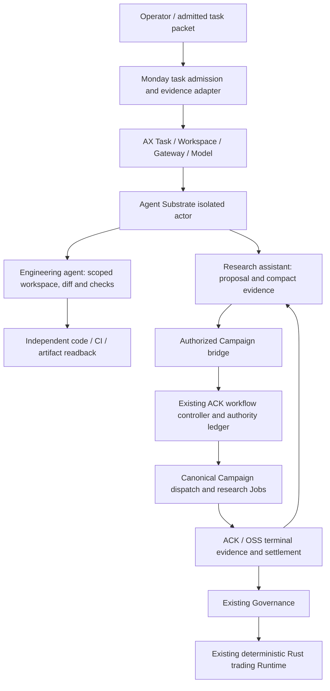

# ADR-0003: AX execution for Monday agents

- **Status:** Closed on 2026-09-25 without adoption. Monday keeps task
  admission and parallel slices on `task-batch`. AX is not an execution
  backend. The staged evaluation below is historical.
- **Date:** 2026-09-23.
- **Scope:** Engineering and research-assistance agent execution. Existing
  Research, Governance and deterministic Runtime authority stays with Monday.
- **Evidence:** [Pinned upstream research](../reports/2026-09-23-ax-adoption-research.md),
  Monday baseline `16a8bd252b7a7d8bda15e7ec2222ee874f1dcb0b`.

## Problem

Monday can lease a worktree and launch a local coding agent. Its newer shell task
path declares resources, prepares files, runs a command and copies a workspace
checkpoint. Those facilities do not establish cluster scheduling, a portable
isolation boundary, atomic task ownership, or reliable external-effect recovery.
The locally installed helper can also lag the repository implementation.

AX supplies a declarative Task/Workspace/Gateway/Model control plane backed by
Agent Substrate. Its default file persistence and fresh-process recovery can fit
restartable coding and analysis agents. It does not supply Monday's experiment
admission, signed accounting, business completion or trading authority. Upstream
is evolving and its production readiness must be evaluated, not inferred from
its advertised scale. Specific source findings and limitations live in the
linked research report.

The four AX objects are its own Redis-backed gRPC resources, not Kubernetes
CRDs. Kubernetes hosts the infrastructure and substrate workers. Monday must
therefore verify AX identity, authorization and durability independently of
Kubernetes namespace/RBAC settings.

## Decision

Historical record, not a current instruction. On 2026-09-25 Monday stopped
this migration. Parallel agent slices use `task-batch`. The paragraph below
is the 2026-09-23 evaluation decision and does not authorize more AX work.

Adopt AX as the candidate execution platform for agent workloads through a
bounded lab evaluation. Keep Monday's domain control planes and put a narrow
Rust task adapter / runner between admitted work and AX. Reuse upstream runtime
capabilities where verified rather than extending the local shell prototype into
a second distributed scheduler.

The Campaign bridge is a proposed typed interface to the existing controller,
not another scheduler. Its first integration is read-only status/receipts. Any
later dispatch capability must validate the original signed authority and
reconcile existing requests before emitting a side effect. It must not offer an
arbitrary shell, signing key or general Kubernetes credential to the agent.

This is conditional adoption, not direct deployment of the upstream defaults.
The pinned research identifies missing or permissive resource, gateway,
authorization and reconciliation behavior. Client-side validation alone cannot
repair a runtime that ignores limits or resumes after policy failure. Mandatory
capabilities must be enforced at the owning control-plane/runtime boundary and
proved before an actor can start. Record any required upstream/integration fix
and its exact revision as a platform prerequisite.

## Ownership and truth

| Concern | Owner and invariant |
| --- | --- |
| Task intention and authority | Monday packet/admission record: immutable spec hash, allowed capabilities, writer, budget, deadline and expected evidence. An AX manifest does not grant authority. |
| Actor lifecycle | AX and Substrate: placement, isolation and acknowledged lifecycle operations. The adapter records immutable provider identities and verifies their effects. |
| Workspace ownership | Monday admission: one writer per contract/workspace/branch/PR across both leases and tasks. Provider task naming alone is insufficient. |
| Engineering completion | Exact diff/check/PR/artifact readback at the requested endpoint. Provider readiness and process exit zero are insufficient. |
| Research execution | Existing ACK Campaign workflow/controller, signed grant and single-owner ledger. AX owns the assistant, not its child research Jobs or accounting. |
| Data and research evidence | Existing content-addressed ACK/OSS artifacts and native receipts. Agent workspaces receive only authorized views or compact references. |
| Promotion and trading | Existing Governance and Runtime contracts. No venue execution credentials, signing keys, risk changes, runtime resume or sealed-holdout authority enter the agent actor. |

AX operational state must not become a second research database. Retain Monday's
existing ledger and point-in-time evidence as their domain sources of truth.
Controller replica count must respect existing single-writer constraints; adding
replicas does not provide fencing for the authority ledger.

Baseline implementation evidence:

- [Lease admission](https://github.com/proerror77/monday/blob/16a8bd252b7a7d8bda15e7ec2222ee874f1dcb0b/.github/scripts/agent-worktree-preflight.sh#L353)
  and [task invocation](https://github.com/proerror77/monday/blob/16a8bd252b7a7d8bda15e7ec2222ee874f1dcb0b/.github/scripts/agent-worktree-preflight.sh#L1207)
  currently have different ownership paths. They must converge before accepting
  overlapping work through a new backend.
- [Campaign workflow locking](https://github.com/proerror77/monday/blob/16a8bd252b7a7d8bda15e7ec2222ee874f1dcb0b/rust_hft/alpha-harness/app/src/mission_campaign/workflow.rs#L144)
  and [dispatch claims](https://github.com/proerror77/monday/blob/16a8bd252b7a7d8bda15e7ec2222ee874f1dcb0b/rust_hft/alpha-harness/app/src/mission_dispatch.rs#L409)
  already protect native execution; the agent adapter must preserve their owner
  and recorded Job identity rather than implementing another desired-state Job.
- [Typed Campaign checkpoints](https://github.com/proerror77/monday/blob/16a8bd252b7a7d8bda15e7ec2222ee874f1dcb0b/rust_hft/alpha-harness/domain/src/campaign_checkpoint.rs)
  and the [ACK authority/evidence boundary](../../deployment/aliyun/research/README.md#data-flow-review-and-host-lifetime)
  retain their original bytes, hashes and authority. An actor snapshot does not
  replace these domain records.

## Execution and recovery contract

Use a stable logical task identity and spec digest, and distinct recorded
execution attempts/provider operations. Admit and occupy ownership atomically
before starting. A lost create response is reconciled against the recorded
identity; unknown remote state blocks resubmission and ownership release.

For the initial workload, choose file-persistent, fresh-process recovery. This
matches the inspected default AX runner rather than promising memory restore.
Make task progress explicit and restartable. A future full-memory checkpoint
mode would require its own demonstrated need and compatibility evidence.

Pause succeeds only after the old execution is quiescent and its checkpoint is
durable. Recovery verifies the task/spec, source/image, checkpoint identity,
deadline, current authority and exclusive ownership. It reconciles external
effects, including a previously dispatched Campaign, before taking another
action. A resumed agent cannot undo consumed trials, replay signing or create a
replacement Job because its local workspace predates a submission.

Accumulated model/compute consumption and unresolved reservations must have one
authoritative record outside the restorable workspace. Restoring a checkpoint
or starting another attempt cannot lower consumed or reserved amounts. Unknown
consumption blocks further spending until reconciled; never refund it from a
missing receipt. Research consumption continues to use the existing Campaign
ledger, without copying it into the new agent contract store.

Keep provider lifecycle separate from Monday outcome: running, pause requested,
checkpoint confirmed and process exited are observations; accepted output,
verified negative result, failed or unresolved outcome require domain evidence.
Do not reinterpret upstream phases or add them to an existing schema without a
versioned implementation contract.

The Rust runner must emit a terminal receipt binding task/spec, invocation,
source/image, timestamps, actual command exit status, output/log digests and
checkpoint lineage where applicable. An independent verifier validates the
requested output. Secrets are references, never command arguments or receipt
payloads. Snapshot and restore must revalidate secret lifetime and revocation.

## Capability and resource boundary

Treat code under execution as untrusted for the selected platform evaluation.
Prove filesystem/workspace isolation, allowed and refused egress, access to the
model/tool endpoints, secret containment, CPU/memory enforcement and cancellation
of descendants. Host-command wrappers, DNS hooks and declared numbers alone do
not establish those guarantees. Limits must state their units and enforcement
semantics; CPU time is different from CPU capacity.

The first deployment uses a named dedicated lab environment with explicit
resource and model-spend bounds, pinned AX/Substrate/runner identities and a
rollback/cleanup owner. Establish substrate/runtime prerequisites before choosing
the host type. Do not schedule development builds on an `ack-system` node or
reinterpret research GPU grants to accommodate an agent platform.

Use an upstream AX/Substrate build as external platform infrastructure. Monday
domain admission, evidence and any production research integration remain Rust.
Upstream Go or C++ dependencies are not a reason to port Monday's research,
evaluation or trading implementation to those languages.

## Incremental migration and retirement

1. Deliver the source-backed decision and [workflow](../agents/ax-workflow.md).
2. Implement `hft-agent-control` as a small library under
   `rust_hft/apps/agent-control`, outside default workspace members. It owns typed
   task/attempt transitions and receipt/checkpoint validation, consumed later by
   the operator adapter/runner. Initially it has no daemon, database, network,
   real execution or alpha-engine/store/execution-adapter dependencies. Model
   tests prove its invariants and failure states, not actual runtime exclusion.
   A subsequent single-writer change integrates one shared lease/task admission
   path and proves exclusion and uncertain-effect reconciliation end to end.
3. Prove platform prerequisites and one isolated development workload, with
   pause/restart, limits and independent result readback.
4. Connect a research assistant to read-only ACK receipts; add bounded Campaign
   delegation only after identity and budget-preservation tests pass.
5. Retire the superseded shell task path after its approved replacement meets
   acceptance. Keep historical receipts readable. Do not preserve an unrestricted
   execution fallback. Lease inventory may remain until its callers migrate.

The [migration plan](../plans/2026-09-23-ax-adoption.md) records the first concrete
contract and exit criteria. Existing uncommitted `cursor/agent-ax-enforce` work is
another writer's input for review; this ADR neither absorbs it nor marks it done.

## Alternatives and consequences

- **Extend the shell helper into the cluster controller:** duplicates scheduling,
  isolation and recovery machinery, while retaining ambiguous task ownership.
  Keep it bounded during migration instead.
- **Move all Campaign execution into AX actors:** creates competing Job/ledger
  owners and conflates actor restoration with experimental recovery. Retain the
  existing native controller and expose a narrow authorized seam.
- **Put trading Runtime in an agent workspace:** crosses deterministic execution
  and credential boundaries without a benefit for this goal. Retain the current
  runtime and governance architecture.
- **Deploy upstream directly and accept `Running` as completion:** omits business
  outcome, exit status and independent readback. The Monday runner/adapter is
  necessary even if platform isolation passes.

This direction adds a platform dependency and an adapter to maintain. Adoption
remains contingent on a pinned integration proving the required behavior. A
failed feasibility result is a valid research outcome; it must revise the next
slice rather than silently weaken a boundary or claim the migration complete.
