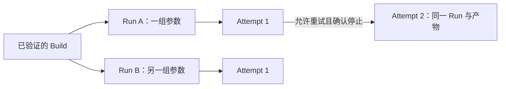

# Monday research foundation：代码能力与启用边界

本分支在现有 monorepo 内增加 `hft-research-platform`，将通用数据、研究谱系和计算生命周期与 CI 分离。它是可评审的基础代码，尚未完成生产切换。既有 Campaign、治理、采集和交易代码继续保留；本分支没有安装迁移、启用 backend、创建云资源或运行真实研究。

## 现状和职责

现有 CEX 科学入口仍是 `mission campaign-freeze → campaign-finalize → dispatch submit → campaign-execute`（`alpha-harness`）。Prediction Markets 保留独立的事件结算 evaluator；两者共享 Monday 的行情、风险和执行边界。`apps/live`、`tools/collector`、数据库和持续控制服务不能整体迁入临时 Sandbox。原生模型训练现为 CPU Burn ndarray，不能假设 AgentSandbox 支持 GPU、内存恢复或长期行情连接。

```mermaid
flowchart LR
  CI[CI: 源码验证 / scoped build / Clippy / 镜像 / release admission]
  BUILD[不可变 BuildArtifact: 二进制摘要 + OCI digest]
  CTRL[可信 Rust research service]
  PG[(PG: 实验 / Run / task / result / outbox)]
  CH[(CH: 持久 normalized hot data / SQL features / labels)]
  OSS[(OSS 经身份 broker / artifact gateway)]
  SESSION[AgentSandbox Session / 现有 Coding Agent]
  JOB[固定 Kubernetes 或 ACS Job: prepare / train / backtest]
  LIVE[常驻采集 / live / risk / OMS / execution]
  CI --> BUILD
  BUILD --> CTRL
  CTRL --> PG
  CTRL --> JOB
  JOB --> CH
  JOB --> OSS
  CTRL -->|独立字节回读 / 终态| OSS
  SESSION -.受控 research.submit/status/artifacts.-> CTRL
  PG -.显式 subscription / completion intent.-> SESSION
  CH -->|版本化只读 block| JOB
```

实线已有 Rust 实现或明确的外部存储接口；Session transport、原生治理导入器、OSS gateway 的生产部署、现有科学 worker 的新输入适配和灰度启用仍待接入。图没有把这些外部接口画成已部署资源。

| 负载 | 安放判断 | 当前启用条件 |
|---|---|---|
| live、risk、OMS、执行、长连接行情采集 | 保留常驻服务或专用主机 | 既有 runtime/collector Gate；新平台无订单依赖 |
| PG / CH / 对象存储 | 常驻持久服务 | 分别控制事务、热数据和原始归档/产物 |
| prepare / train / backtest | 固定命令 Job，允许 CPU ACS 弹性算力 | exact release + 科学 grant/预算 + backend acceptance + 输入 manifest |
| 研究对话与代码变异 | 有持久状态的 AgentSandbox Session | native state、workspace、审批、受控工具和恢复验收 |
| CI / CD | 验证、构建、发布证据与 admission | 不负责研究资源租期、启动、准入、停止、回执桥 |
| 运维 | 保留独立流程 | 真实资源、网络、RAM、发布或切换仍由单独授权和 Gate 控制 |

## 独立 Cargo 构建边界

`rust_hft/workspaces.json` 登记六个真实入口：shared、data、research、control、runtime、prediction。每个入口拥有独立 lockfile、resolver 2 和 Rust 1.98.1。源码路径保持原位置，package 显式声明唯一 owner；原 root package 属于 runtime workspace。

shared workspace 的 `hft-cex-research-input` 独立拥有 DataView、typed block、二进制 codec 和有界验证缓存。它只依赖序列化与摘要库，不含 SQL、数据库驱动、HTTP、provider 或 Agent 状态。backtest 直接消费该输入 crate。轻量 control workspace 只含 `hft-research-platform`，消费相同输入合同；其依赖树没有 collector、Burn、ONNX 或 Parquet。Data 的协议库不反向依赖采集运行时；`hft-market-pipeline` 也不依赖训练或执行。科学 research workspace 默认选择 search kernel，实际训练与 harness 由明确 package/build recipe 选择。

CEX 与 Prediction Markets 保留不同的科学输入和 evaluator。`hft-cex-research-input` 的 horizon、成熟时钟和连续 LOB 回放属于 CEX 时间序列合同；它不是事件结算概率数据集。Prediction 的 episode、UP/DOWN outcome、event-disjoint cohort 和 ResearchSnapshot 继续由 prediction workspace 所有。两条链可共享领域中性的搜索机制、行情和治理合同。依赖检查覆盖 Prediction 的 default/db/full 构建，拒绝引入 CEX input、harness、collector、backtest 或 control platform。

CI selector 汇总真实 metadata，包括跨域 path dependencies 和 integration/dev edges。`cargo-scoped.sh` 把显式包集合分到各 owner；跨 workspace features 或命名 target 组合拒绝模糊执行。CI 单 runner 可复用自己的 target cache；多个 Cargo invocation 仍各自解析所属 workspace 的 features。共享可写多租户 cache 不属于此合同。

保留的耦合仍有 collector 的 `BookSync`/engine、Alpha Data Mission 和 ONNX/formula 跨域兼容测试。本轮没有改成远端 RPC，也未宣称整个研究图已解耦。发布按已有真实镜像选择程序：runner 九项，Campaign controller 四项。两者共享的程序只编译一次。功能拆分本身不提供编译耗时或加速倍数证据。

## Build → Run → Attempt，不在训练 Pod cold build

例如，两个 CPU MLP 试验只改变参数：Run A 使用 `learning_rate=0.001`、seed 7；Run B 使用 `learning_rate=0.003`、seed 11。二者引用同一个 Build，因为源码、所属 workspace、features、工具链和镜像都未改变。若 Run A 遇到已允许重试的基础设施故障，控制器先确认旧进程树停止，再创建 Attempt 2。重试保留 Run A 的参数、Build、预算约束和原截止时间。修改 Rust 解码或训练实现时，才需要另一个 Build。



`src/build.rs` 定义 `BuildSpec` 和 `BuildArtifact`。BuildSpec schema 2 显式选择一个所属 workspace。Build 身份包含源码 commit 与 source manifest、该 workspace 的 Cargo.lock、工具链 distribution/compiler manifest、target、精确包/二进制/features/default-features、profile 和 profile bytes、Rust 编译参数、原生编译器/链接器/库环境、builder image。它不包含数据窗口、研究参数、seed、task ID 或 attempt。

Run 是固定科学调用：Experiment、BuildArtifact、配置摘要、命令、数据 manifest、seed、evaluator、evaluation protocol、fit identity。Run 同时验证其源码和镜像与引用的 Build 一致。Task 必须引用已注册 Run；同一 Run 最多一个计算 Task，Attempt 只重试原请求，不能变更产物或参数。多个参数 Run 可以引用同一 Build。

计算 Pod 直接调用 `/usr/local/bin/<已发布二进制>`；PG Run admission 拒绝 `cargo` 或任意 shell 作为直接入口。reconciler 每次 launch（包括 retry）读取已注册 Build，并从受控 artifact gateway 流式核验二进制大小/摘要，再检查租期、截止时间和撤销状态。缺失或错误产物不能触发 launch。OCI digest 与内含二进制的绑定来自独立的 trusted release verifier；通用 Agent API 无权出具这个证明。

`.github/scripts/build-research-release.sh` 使用精确 `-p` / `--bin` / `--features`，没有默认 `--workspace` / `--all-features`。一份产品清单绑定已有 runner 与 Campaign controller。controller 资产单改时只构建所需四项。新平台控制程序仍由 owning CI 验证；它们没有生产发布合同，不进入这两个镜像。不同科学变异的 BuildSpec 可以缩小到实际科学 crate/binary。Cargo 依赖图重建受影响 crate，链接仍有成本。本分支没有编译耗时基准，不承诺加速倍数。

发布保留原 `release` profile（opt-level 3、thin LTO、codegen-units 1）。另提供显式 `research` profile（opt-level 2、无 LTO、16 codegen units）；它的身份与 release 分开，不能把不同优化产物当同一科学执行。`researchctl plan-build BUILD` 仅输出经过校验的 scoped Cargo 参数，不执行编译或配置云端 builder。

CI 的 `capture-research-build-inputs.sh` 将实际编译器/标准库、原生软件版本、编译环境、profile、lock 和 scoped 配方指纹纳入缓存键，并将这些输入保存在 release manifest。Cargo cache 与可执行产物分开：缓存只影响后续编译效率，命中缓存仍必须执行 build、二进制摘要验证和 image smoke。每个 runner 有自己的可写 target，禁止多租户共享可写 target；readonly prepared-data mount 不能被当作 compiler cache。

`researchctl register-build ARTIFACT SIGNED_RELEASE` 只接受独立发布 verifier 的 Ed25519 签名。`MONDAY_RESEARCH_BUILD_TRUST_FILE` 指向 operator 管理的公开信任配置，绑定 repository、producer workflow 和公钥。输入 envelope 不能自带受信公钥。签名绑定源码归档 manifest、完整 Build 身份、target、OCI digest、二进制集合、CI run/attempt/job 和独立发布回读摘要。修改这些字段或重新计算普通摘要不能修复签名。

先离线应用 `platform/sql/verified_build_release.sql`。该迁移保留原 Build 行作为审计记录，不自动为旧行补信任。只有附有签名证明的 Build 才能进入新 Run。导入事务写入不可变 release 和信任配置摘要；重复导入复用原记录。Build 可在 authority 为 paused 时预先登记；导入不启用 backend，也不授予科学预算或运行权。Run 启动与基础设施 retry 仍独立回读二进制字节。

生产构建调度、变异 workspace 的源码归档上传、原生发布 verifier 出具此签名，以及 release 向 PG 的自动投影仍待接入。现有 CI bundle 能构建一次并被 smoke/发布复用；新 PG 合同能让多个 Run/Attempt 复用已导入的同一产物。不能据此声称已有自动 Agent 变异 → Build → 科学执行闭环。

## 数据：CH 数值准备、版本化出口、bounded 共享

`research-core/cex-input/src/data.rs` 的 `DataViewSpec` 绑定 venue、instrument、market、depth、排序后的 source SHA、normalizer、SQL recipe、feature names、时间窗、lookback、多个 horizon、容差、split 和 fitting cutoff。没有写死某个资产、100 档或某组 horizon。

默认 SQL recipe 为 mid/spread/depth imbalance。PreparationPlan 也可携带经过原生 admission 审核的不可变 recipe_sql，绑定 exact SQL digest、固定 features/labels 两个插入目标和输出 schema；算法变化形成新的数据身份，可以复用同一 prepare Build。参数、horizons、数据窗或已审核 SQL recipe 变化无需编译 Rust。这个入口不是向 Agent 开放的任意 SQL 执行器，也不是 SQL parser/sandbox；科学 grant 和 CH 的独立权限边界仍必须接入。改动 Rust 的解码/计算实现或打包默认值本身才需新 Build。

`sql/clickhouse.sql` 使用持久 MergeTree normalized books/events 与 prepared features/labels；`sql/prepare.sql` 一次计算共享特征并用 AVAILABLE 时钟 + horizon 做 temporal ASOF join。同 segment、标签容差、split end 和 fitting cutoff 约束阻止跨 gap/会话/分割取未来数据。相同未来时间的 tie 使用 availability、ordinal、source 做确定选择。CH 不是 OSS 的临时 `s3()` 扫描器。

`src/clickhouse.rs` 使用参数绑定的固定 SQL，输出有界 RowBinary；Training / Features / Replay 是三个 typed 出口，不产生 JSONL spool。每次 preparation 有独立 physical generation，由 PG lease/fence 和 DataView advisory lock 准入。旧 attempt 不能覆盖已发布 generation。`research-prepare` worker 在每个 CH 阶段前复查 lease/deadline/撤销，将内容寻址 block 上传后最后写 receipt。

当前 preparation worker 只支持 Train。plan 登记和任务提交都拒绝 Validation 与 Holdout，避免消耗必然失败的 attempt。通用 DataView schema 保留这些 split，未来 evaluator 仍需独立准入。

`research-core/cex-input/src/prepared.rs` 使用带版本和大小上限的 bincode。读取本地文件或对象时，调用方必须核验 manifest 和 block digest。Transport 只提供字节，不能替换解码结果。解码后释放一次性 acquired buffers。控制侧的 `preparation.rs` 保留 reviewed SQL plan 和默认 recipe；`block_objects.rs` 保留有界 HTTPS 获取。crate 迁移不改变已发布的 manifest 字段、bincode schema 或内容摘要。

`VerifiedCache` 对缺页执行读取、解码、时钟和 split 验证。cache hit 仍检查当前 view 的合同。多个试验可以复用一个只读 `Arc` batch；模型、optimizer 和 checkpoint 状态分别保存。batch owner 必须计入外部持有 Arc 的内存。LRU 不能单独限制这些引用的总驻留量。

同一个缓存已验证的 view 在内部流转时复用验证结果，拒绝同一身份下修改 metadata。新的 view 仍执行首次验证；缓存命中仍检查其时钟、split 和 block 合同。准备数据的终态回读对实际解码字节只下载和校验一次，同一次 receipt 内复用该对象 key、摘要和大小的结果。不同对象、后续请求、首次导入和恢复各自保留边界验证。SHA256 用于内容身份，不代替授权或实际科学行为验收。

`apps/backtest::engine::replay_shared_target_positions` 已消费这些 shared typed 输入，复用现有 IOC target-position engine，每个试验新建状态。它拒绝错误 manifest、market、instrument、多 gap segment 和 split 外决策；availability ns 向上取整到 us，避免提前看数据。这里没有新增被动排队成交或 live 交易声明。

`hft-market-pipeline` 是独立的转换/导入 crate，属于 data workspace。默认仅做已经封印的 Binance raw triplet → 原协议与序列验证 → typed Decimal/LIST Parquet；`import` feature 才引入 PG/CH driver。它不依赖 collector、训练、控制服务或执行 adapter。`monday-market-pipeline --help` 不连接数据库或转换数据。

导入使用不可变批次 manifest、私有 generation、PG 单 writer/fence 和 CH 完整列回读。先验证 staging，再原子替换 batch partition，最后同事务写 PG receipt 与水位。若 CH 已发布但 PG 尚未提交，恢复先独立回读既有目标；未知传输不重发旧 generation 的 INSERT。重复请求仍核对真实 CH 内容。

该链目前是 bounded pilot：100,000 行、128 MiB Parquet、64 staging tables/target partitions。它仅接受录制边界严格相接的来源；一般连续文件的时间与序列边界、跨 session/gap 标记仍需生产合同。不能据此宣称已导入滚动一月、全部资产或完整交易所深度。原始 OSS 继续现有 30 天生命周期，不补缺口或延长保留；实验与模型审计记录独立保留。

新 trainer 的 shared-input 接入、科学 CLI 的 Run/config 下载和最终 manifest 写入、normalized ingestion 到 research preparation tables 的版本化投影、原生 evaluation/Campaign settlement 投影仍未完成。prepare、tiny fixture 或转换回执均不是训练或终态科学成果。

## PG 单权威、任务和终态

`sql/postgres.sql` 是离线迁移，安装后 authority 为 `paused`、backend 为 disabled。连接服务不会迁移或启用。提交必须具有旧 writer 停止证明和迁移回读证明；新任务/结果不存在 DuckDB fallback。旧 CEX DuckDB 科学实现仍存在，是待迁移的旧入口，不能与新 PG authority 双活。

trusted native governance verifier 必须预先导入 exact TaskSpec 的科学 grant、预算/资源 reservation 和 release-admission receipts。服务与 Agent 没有 issuance/revocation 写权限。当前只实现投影合同与读取校验，尚未接入原生签名/grant verifier、预算扣账或 closed-family evaluator。Holdout 在通用 submit 中始终拒绝。SHA 引用本身不等于已验证签名或已扣预算。

claim 使用 PG 事务、行锁、revision/fence 和全局 quota。Launching、Running 和 Stopping 都占用并发额度。资源过期后，额度仍保留到进程停止得到确认。

控制器先提交 durable claim，再调用 provider。重连时读取同名资源，并核对 UID、标签和完整 annotations。超时不能产生另一个 resource identity。首次 claim 确定总截止时间，retry 和 queued retry 都不能重置它。

当前认领使用短事务，provider reconciliation 仍持有 task/global authority 锁。这会串行化 I/O，是明确的吞吐限制。扩容前需要实现基于 revision 的 outbox reconciliation。

取消/超时/重试经过 Stopping。provider foreground delete 绑定 UID，资源不存在且对应 task/attempt/fence 的 Pod 列表为空后才能确认 process-tree stop。TTL、Job 消失或 Session turn interrupt 不是科学 cancel 成功。receipt 必须绑定 task、attempt、fence、输入、source、image、fit，实际 artifacts 和 checkpoint 经独立字节验证；只有停止确认后 PG 才落终态 result，Prepare 同事务发布 view。checkpoint 对当前 attempt 单调，retry 保留已验证 checkpoint，旧 fence 和晚到结果拒绝。

receipt 中每个 artifact key 都要回读。同摘要与大小不能替代另一个 key 的验证。DataView 仅通过 reconciler 的 receipt 回读和停止确认发布；CLI 没有直接登记 manifest 的入口。

Stopping 仍检查 admission 撤销。撤销清除待提交 receipt，并将停止目标改为 Cancelled。成功提交时再次检查撤销，并锁定 admission 行；现有外键约束将并发撤销写入与终态发布排序。

Backend profile 绑定 exact cluster/namespace/service account、架构、CPU/内存/scratch、接受证明及可选 readonly prepared PVC / worker config secret。GPU 显式拒绝。worker service account token 不自动挂载；控制平面 token 与 worker 凭据分开。新接口使用 `agents.kruise.io/v1alpha1` CRD 模板，但没有假定官方 Rust SDK、E2B 完整日志事件 API、memory snapshot 或 provider command reconnect 已被验证。

ArtifactGateway/Writer 是 HTTPS、无 redirect、大小有界的 scoped gateway 合同，不是向 OSS 原生 endpoint 直接发送 bearer token。gateway、identity broker、每个 attempt 的输出前缀/短期凭据、只读源码/数据范围与 ACR pulls 仍需要独立部署和权限验收。当前代码不会创建这些资源或 RAM 权限。

## Session：借鉴 OpenResearch，保留 Monday 科学权威

参考固定版本 [OpenResearch f4cec9f, v0.2.15](https://github.com/alphaXiv/OpenResearch/commit/f4cec9f010a64fccf51cd4653ba548df2e5fb648)（MIT），只参考合同，未复制其运行时代码或引入 AX 依赖。

其 [Codex harness](https://github.com/alphaXiv/OpenResearch/blob/f4cec9f010a64fccf51cd4653ba548df2e5fb648/src/local/harness/codex.rs) / [本地 adapter](https://github.com/alphaXiv/OpenResearch/blob/f4cec9f010a64fccf51cd4653ba548df2e5fb648/src/local/codex.rs) 提示需要长驻 app-server child、initialize/initialized、thread start/resume、turn start/steer/interrupt 和双向审批。PG thread ID 不能替代 native CODEX_HOME 状态。`research::SessionSnapshot` 因此绑定 workspace、transcript、code commit 和 native-state manifest；`coding_agent::admit_resume` 拒绝缺失或摘要错误的 native state。

`session::AppServer` 和 `research-session start CONFIG | resume CONFIG NATIVE_STATE` 提供实际 Rust stdio child transport。启动使用受信、固定身份的原生二进制，隔离 native home，清除继承环境；native home 和 host delivery directory 分别有 OS 独占锁。初始化、持久 thread、固定权限的 resume、turn start/interrupt、原 RPC 审批和受控 research 工具有界处理。接收器保留部分 frame，因此等待事件时被 timer/输入打断不会丢失协议字节。默认 read-only、无 shell/browser/app 工具和受限网络不构成云 Sandbox 隔离验收。

停止 child 后，在同一个锁下生成仅包含 thread rollout 和原生 state SQLite/WAL 的 manifest；身份文件、配置、私钥和工具 token 不进入快照。生成时每份字节只读取一次，内部复用结果；冷恢复作为独立消费者，在启动新 child 之前再核验所列文件。workspace 和 native home 使用既有持久挂载，远端 PVC、源码归档运输和跨存储恢复仍需部署验收。

OpenResearch 测试的 Codex 版本为 0.144.0；本机只读生成的 app-server schema 为已安装 0.159.2。transport 按后者实现，并绑定原 RPC ID + process generation + command/file/user-input 类型；重启后相同 RPC ID 不能复用旧审批。当前只接受逐次 accept/decline/cancel，不授予持久 policy amendment。已对实际安装的原生 app-server 验证 initialize/initialized 和 child stop，没有真实 model turn；协议 peer 的恢复/审批测试是代码合同证据，不是云 Session 验收。

Plan mode 是 prompt，不能替代隔离或授权。未知或已接受的消息 delivery 必须 reconcile，不能盲重发；not_sent/rejected 可重试。Run 完成订阅独立于 Session 所有权，PG 在终态事务中按显式 subscription 写去重 completion intent；迟到订阅也读取终态。Session host 接入现有 intent，发送前 durable 写入 Unknown，以稳定 clientUserMessageId 回读原生分页 item。只有原生 thread、turn、client ID 和实际消息内容均匹配，才产生不可从 JSON 构造的 VerifiedDelivery。离线迁移 `sql/session_deliveries.sql` 记录不可变 delivery；普通 Agent 和 worker 无写权限。host 自动轮询已订阅终态，并处理原生事件和逐次审批；缺少 intent/原生回读不能写 delivery。远端实际完成通知仍需部署验收。

`agent_api.rs` 提供可选、默认关闭的 loopback bearer-capability API，只有 `research.submit/status/artifacts`，principal 来自服务配置。submit 只能引用预先批准的请求；不允许配置 evaluator、打开 holdout、签名、kubectl 或携带 PG/cluster 凭据。`researchctl tool` 是独立客户端。Session host 的 ResearchClient 支持既有 loopback 或 HTTPS `/research` broker，拒绝重定向、URL credentials 和超限响应；token 只进入 host 请求，不传入 child 环境或 tool payload。远端 HTTPS/proxy/broker 的部署和权限尚未验收，不能声称云 Session 已连通。

OpenResearch [chat delivery](https://github.com/alphaXiv/OpenResearch/blob/f4cec9f010a64fccf51cd4653ba548df2e5fb648/src/local/chat/mod.rs) 和 [Kubernetes jobs](https://github.com/alphaXiv/OpenResearch/blob/f4cec9f010a64fccf51cd4653ba548df2e5fb648/src/jobs/kubernetes.rs) 的可恢复 handle 不能代替 Monday 的 durable claim、幂等、UID/fence 和最终 manifest。没有照搬 kubectl cp bootstrap、namespace-wide secret 或共享可写 target。

远端认证不能概括成“全部无认证”：OpenResearch 的 [up_remote](https://github.com/alphaXiv/OpenResearch/blob/f4cec9f010a64fccf51cd4653ba548df2e5fb648/src/commands/up_remote.rs) / [up](https://github.com/alphaXiv/OpenResearch/blob/f4cec9f010a64fccf51cd4653ba548df2e5fb648/src/commands/up.rs) remote-host 路径使用 per-connection bearer token 和 health auth；普通 loopback up 不具备同等 application auth。它也不是 Monday 多租户 RBAC 的现成实现。

## CI/CD 与退役顺序

- `ci.yml` 保留 actual affected-package 选择和原域合同测试，新增 PG/CH ephemeral fixture job。Collector pagination 合同的存在/非 ignored 检查与完整 owning suite 结合，避免空 filter 冒充通过。
- Monorepo Rust Workspace 运行共享 strict Clippy，并输出经过选择的 stage outcomes。同一 workflow 的 `needs.rust` 消费回执，校验 exact source/fork/base/checkout/run/attempt/numeric job 和 scoped command digest；不再跨 workflow 轮询。Security 的 weekly/manual 路径保留自己的 strict Clippy。
- Prediction CI 构建共享 release 一次，smoke 下载同一 artifact；原来的格式、研究/ml/db/三事件 sidecar 合同迁回 native CI。没有删去这些实际测试或用 selector 输出充当测试通过。
- ACR 保留三个 required checks、当前 main、exact Prediction producer 与 artifact 来源。软件读取校验 latest attempt/job 和实际 binary bytes，发布后拉取 OCI digest、核验 source label 和 contained executables。Campaign controller 镜像继续保留既有 Ops；不存在的 research-data-service Dockerfile 目标移除。
- ACR source-test 仍只有审核过的两个离线测试 profile、可信当前 main 和确定 source-test tag。native runner 构建/测试该镜像，不把测试生命周期塞回 ACK private executor。
- GHCR 已有 artifact/image reuse 继续保留，未重复重写。Monorepo/Prediction/Security/ACR 不再调用旧 private ACK receipt wait。历史 signed receipt/helper 测试作为审计记录保留；Mac signer、private executor 与资源策略脚本不再是这些 required checks 的完成路径。真实 Ops 和有偿资源控制未在本 PR 中启用或迁移。

## 验证、灰度与阻塞项

新服务直接依赖 SQLx core/PostgreSQL driver；不解析未用 MySQL/RSA/SQLite 驱动，也未新增 audit ignore。

本地验证：platform 数据/生命周期/Build/API/RPC 合同，shared typed replay 的 backtest owning tests，strict Clippy、fmt、selector/native CI evidence/release/source readback/workflow 合同。PG 和 CH daemon 未在 Mac 安装，真实 SQL/RowBinary/事务测试在 disposable CI services 执行；它们不是真实研究或云端 acceptance。精确本地命令、commit 和 CI 结果见 PR Validation。

最小真实 vertical slice 的依赖顺序：

1. Tokyo/ACK 基础设施独立 Gate：东京 Pro 资格/价格、ACS 容量、K8s/CRD/runtime 兼容、容器 command/log/取消和 UID 回读。当前东京底座未验收，禁止以本代码代替 Gate。
2. 专用 PG 角色、paused schema、native grant/预算/签名导入器、旧 writer quiescence 与一次迁移回读；默认保持 paused。
3. 规范化 source receipt 与 persistent CH ingestion/版本 SQL；最小经过批准的数据切片仅准备一个 view，重复请求复用同一逻辑 manifest；CH/OSS 内容独立回读。
4. Build 的源码归档、scoped 编译、contained binaries/OCI 验证和发布证明投影；两组参数 Run 引用同一 Build，强制基础设施 retry 仍保留同一 Build、总 deadline、fit/checkpoint provenance。
5. 接入一条真实原生科学 worker 的 typed input、固定 Run/config、native scientific terminal manifest / Campaign settlement；prepare 或退出码 0 不算科学成功。先 CPU Job，验收 stale receipt、取消/retry、controller 重启/幂等及实际 artifact 丢失。
6. 再接 Coding Agent app-server 的持久 Session、native-state恢复、审批与受控工具/完成 wake；Session turn interrupt 与 Job cancel 分别验证。
7. 灰度启用：只开放一个 tenant，concurrency=1，使用明确批准的预算。重新读回旧 writer 已停的证明，再启用 PG。旧、新 ledger 不能同时写入。
8. 回滚：先 pause 新 authority，再 cancel/drain 所有任务。独立证明新进程树全部停止后，以当前恢复/迁移证明恢复旧 authority。保留新 ledger 与 append-only 证据。

CI 的私有 ACK 回执等待已由 native jobs 取代。默认分支切换须验证当前 source 的 required checks 和实际发布字节。ACK 资源租期、队列、停止、恢复和 signer 属于独立运行合同。退役这些生产控制前，必须 drain 原队列与 lease，独立证明停止和恢复，并确认旧 receipt 不再被消费。CI 合并或镜像发布不能代替这些运行验收。

本次无需新的费用或安全授权即可评审代码。未来东京 Pro/ACS/Sandbox 资源、RAM/network/credential 和部署切换均须先提供具体 Gate/成本/权限/回滚结果，再在用户已限定的范围内申请下一阶段授权。本分支不会自动完成这些动作。
