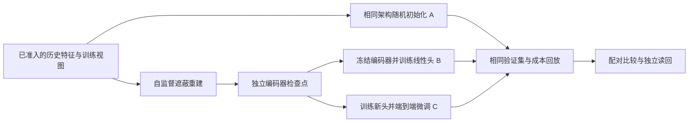

# SOL 市场编码器：先预训练，再继承权重微调

本研究落实历史市场序列 → 自监督预训练 → 编码器检查点 → 继承权重微调 → 预测与交易成本评估。用户已要求启动训练；此前账户余额阻断经 2026-09-27 08:28 UTC 的 ECS DryRun 复核解除。跟踪 [#1235](https://github.com/proerror77/monday/issues/1235)。源代码、镜像、真实输入、累计预算和实际 Job 仍须逐项绑定，方案或受控测试不能代替真实训练证据。

首轮回答：**相同 SOL 数据和下游任务上，自监督预训练后微调是否比同架构从零训练更有效？** 复用 Rust/Burn CPU TCN，以 C 为主路线，A/B 和计算量对照解释增量来源。

## 1. 当前源码与运行边界

本方案基准主线为 `462769a6a5850cca1ff4d91813812f9046c90fae`；以下接入能力属于当前实现切片，发布及真实运行状态仍以跟踪记录为准。

| 环节 | 已有能力 | 仍需核实 |
| --- | --- | --- |
| 输入及模型核心 | #1236 已合入；1s/Top5 盘口与聚合成交、60 帧/24 通道，独立特征与 30s 标签，遮蔽预训练与 P/A/B/C 参数继承 | 不是 LOBERT 消息级复现，也不是跨市场基础模型有效性证明 |
| 导出 | #1237 已合入；无标签尾部、完整 feature_sources、标签成熟所需独立尾部；当前切片新增最多 60s 的显式预热与 feature_start | 真实小时分片、整日回放的覆盖和内存要在 ACK 核验 |
| 对照与产物 | #1238 已合入；共有训练 anchors、独立复核、固定双种子均值、重建头审计、Ridge 共享缩放及额外计算量对照 | 没有真实收益或预测增量结论 |
| 原生 Campaign 接入 | 当前切片提供 cohort/freeze/finalize/dispatch/worker/settlement/readback，旧 #1230 路由保留 | 当前切片的 CI、合并和不可变镜像发布仍须完成 |
| 运行中授权 | 每阶段 nonce 许可由原 controller 在有效 Root/Study 审批下签发；撤销时按原 Job UID/RV 取消，独立确认失败后全额结算 | 真实 Pod 同节点、PVC UID/挂载及取消效果要单独读回 |
| 阶段状态 | 开始标记、完整阶段产物与收据保留在独立 attempt 子目录；完整阶段不重训，部分拟合不隐式恢复 | 持久卷能力不等于已验证跨 Spot 自动恢复 |
| 操作入口 | 原生 Root/Study 签名、审批登记衔接和累计 Study 登记/检查；每折独立 family/Root，同一累计 Study | 实际元数据、签名、ledger 与真实消费尚需填实；不复用无关旧研究的预算 |
| 最终评估 | 开发实验停在 pre-holdout；当前结果没有部署权限 | 本模型的最终评估适配仍待完成，不能直接打开 sealed |

本任务尚未创建云节点、PVC、grant 或真实训练 Job。旧 #1230 的保留记录指向未创建真实 grant/ledger、主拟合为零；这是已有记录的范围，不是全云不存在其他活动的证明。开始前仍核对当前所有权及累计资源承诺。

受控验证覆盖实际 P 权重继承、冻结/微调、两种子独立拟合、缺口与共有 anchors、完整来源、许可/撤销/取消、历史消费及远端结果读回。它们证明代码行为；真实连续覆盖、样本外表现与资源释放需要本轮 ACK 证据。

## 2. 建议冻结的首轮范围

| 项目 | 建议值与理由 |
| --- | --- |
| 标的与输入 | Binance USD-M SOLUSDT，继续使用每秒 Top5 盘口和聚合成交；60 秒上下文、24 个市场通道 |
| 编码器 | 复用五层因果 TCN；建议隐藏宽度 16，待资源基准确认后一次冻结；不增加训练框架或 CUDA 后端 |
| 下游任务 | **单一 30 秒简单中价收益回归，线性输出层只有 1 个输出**；保持既有持有期，集中改变训练路线 |
| 5 秒建议如何处理 | 用户材料中的 5 秒是示例。若最终选择 5 秒，统一修改标签、成熟期、purge、回放持有期和签名协议；不同时加跑 5/30 秒选择最好结果 |
| 诊断目标 | 第一轮不把 5/10 秒作为额外训练 loss，避免混入多任务训练；保留历史三目标产物为审计记录 |
| 数据窗 | 两个时间顺序的开发折，每折固定 14 天训练窗；移除本轮 7/14 天窗口对照；每折建议至少一个完整 24 小时验证区间 |
| 数据用量 | 首轮预训练和下游使用同一训练窗、同一合格 anchor 集，不额外加入更早数据，先控制数据量因素 |
| 训练取样 | 建议每 60 秒一个训练 anchor，仍保留其内部每秒 60 帧；14 天至多约 20,160 个样本，低于当前 32,768 上限。验证保留每秒完整决策网格，不能沿用训练筛选删除困难时点 |
| 成本 | 初始研究假设为每边 5bps 手续费、无返佣、0.5bps 额外延迟费用；不声称账户实测费率。原生 IOC 100ms 到达延迟另计；资金费 0 表示暂未建模，不能称真实账户净收益 |
| 种子 | 7、11；逐种子配对比较，经济评估使用两种子的平均预测，不挑最好种子 |
| 算力 | 现有 Burn ndarray CPU、已准入 ACK 资源形状；训练和原始数据验证保持 ACK 内执行 |
| 经费 | 原人民币 100 元总上限；节点目录价、磁盘与最大寿命绑定费用上界，扣除原已耗及在途承诺后再冻结 |

14 天窗是为了给预训练提供较多样本、同时缩小实验维度的建议，不是已证明最优的窗口。具体 UTC 起止、可用样本数、更新次数和学习率必须在数据与资源核验后写入协议，不能先填写没有证据的日期或收敛时长。仍需保留原记录中的 9 月 24–25 日缺口风险；本轮未重新核实该缺口。

该编码器首先是一个 **SOL、特定输入格式、特定训练截止时间的表示模型**。单品种、单任务试验不能证明它已是跨市场通用基座；接口应允许以后复用，报告只声明已验证的迁移范围。

## 3. 两阶段训练与产物

### 3.1 数据与标准化

已在 `hft-research-manifest::market_encoder` 将特征帧和监督标签分开表示：特征帧只含 series、观测/可用时间及 24 个通道；标签按稳定时间/series 键关联。成本元数据保留在独立评估记录，不能进入编码器输入。

在 collector 的已验证 replay seam 先产生不依赖未来标签的特征流，再生成监督标签。复用已有源哈希、分片、上下界、连续性和字节验证，不重新实现行情回放。移除被替换的活跃生产路径，保留旧 schema 产物为只读历史；不为本轮添加旧新模式回退链。

原始/PIT 窗口可以比显式 feature_start 最多早 60 秒，以取得首帧和 OFI 所需预热；该前缀不进入训练特征。每个特征分片结束后可额外准入 30 秒行情用于标签成熟，但不能把这段尾部重复导出为本分片特征；所有尾部仍必须落在该折训练截止以内。否则会在每个分片末尾损失样本，或将训练外行情带入标签。共有 anchor 索引只含时间与 series，由上下文和标签可用性生成；先固定索引，预训练入口只接收特征 reader 和该索引。评估不使用该索引过滤决策。

ML 层从同一特征流提供无标签样本和监督样本。预训练函数的数据契约不接受标签 reader，也不读取收益标签；同一个 Campaign Job 在监督阶段才通过任务 reader 使用其允许的标签。这是数据接口隔离，不能称为已实现独立进程或文件权限隔离。共有的 anchor 清单根据时间、上下文连续性和标签端点可用性预先构造，不按标签正负或幅度选择样本。首轮 P/A/B/C 使用这个共同 anchor 集；无标签接口未来可以使用额外历史，但那将是另一个数据量实验。

特征缩放只用训练视图中实际输入的唯一帧拟合，避免滑窗重复次数改变样本权重；将缩放产物及哈希固定给所有组。收益缩放是另一份下游训练产物，不进入预训练检查点。推理必须复用原缩放，不得因到达验证期而重新拟合。

### 3.2 P：自监督预训练

首版建议做**因果时间片遮蔽重建**，复用 TCN 的左侧上下文：

1. 将每个 60 帧样本划为 20 个不重叠的 3 秒块；保留最早两个块，从其余 18 块确定性抽取 6 块，遮蔽总计 18 帧，即 30%。相邻抽中块可形成更长缺失段。
2. 被遮蔽帧的 24 个标准化通道全部替换为零；附加一个遮蔽标志通道。编码器实际输入为 25 通道，A/B/C 的下游输入也使用同一结构，标志全部为零。
3. 编码器返回各时刻隐藏状态，重建头将它们映射回 24 个通道。只在遮蔽位置计算标准化 MSE，并保留价格、深度、成交三类分项误差。
4. 使用固定种子、样本身份与遍历编号生成遮蔽；遮蔽规则本身绑定哈希。真实值只进入重建目标，不能经原始行、残差旁路或未遮蔽的同帧派生量进入模型。
5. TCN 在重建时刻只能使用它之前的可见位置，不读取后续位置；这与双向 Transformer 遮蔽重建不同，必须如此标注。第一版不同时比较多种预训练目标。

对照未训练的“沿用最近可见值”重建误差，发现模型是否只学会平滑或复制；它无需拟合，不占模型 fit，但验证时间和资源仍计入经费。固定更新预算结束后保存编码器，重建头作为训练审计产物单独保存，不能当作交易预测头。

这些遮蔽比例、块长和宽度是本方案的待冻结默认值，不是从论文移植的最佳参数。可实现性验证只用于决定能否按资源上限完成，不在开发验证集上搜索这些超参数。

### 3.3 检查点与权重继承

产物契约与目前接口的对应关系如下；来源代码、镜像和 Campaign 身份在阶段收据中补齐，不能误称核心库已经绑定所有外层身份：

| 产物/请求 | 必须绑定的内容 |
| --- | --- |
| `MarketEncoderSpecV1` | 架构版本、24 个市场通道顺序、遮蔽输入约定、上下文长度、宽度、逐层形状、dtype |
| `MarketFitRequestV1` + 预训练入口 | 特征数据和 anchor 哈希、训练视图与截止时间、spec、种子、优化器和更新/样本预算；固定遮蔽策略另绑定 |
| `MarketEncoderCheckpoint` | 编码器 Burnpack 哈希及规范参数值摘要、request/缩放、终止诊断、允许的数据范围；外层收据补充来源代码和镜像 |
| `MarketAdaptationRequestV1` | scratch/probe/full-finetune 模式、父检查点哈希（scratch 必须为空）、单任务标签定义、训练视图、任务头种子和冻结日程 |
| `MarketTaskModel` + `FittedMarketStage` | 最终编码器与任务头权重、父检查点、输入和目标缩放、训练诊断；阶段产物绑定 study/fold/purpose，Campaign 再绑定执行收据 |

微调开始前按张量名、形状和值摘要确认编码器参数与父产物一致；缺失参数、额外参数、架构/通道/标准化不匹配一律失败。不能仅因路径存在或 `load` 返回成功就宣称继承。

部署/评估加载的是完整任务 bundle 中的最终编码器和任务头；父引用用于溯源。预训练 bundle 本身不提供收益预测或交易决策。检查点应能被两个不同任务头请求加载的接口测试复用，真实第一轮仍只训练一个下游任务。

### 3.4 A/B/C 的准确含义

| 分组 | 初始化与更新 | 回答的问题 |
| --- | --- | --- |
| A | 同架构随机编码器 + 新线性头；全部训练 `U_task` 次 | 相同下游预算从零训练能做到什么程度 |
| B | 加载 P；冻结全部编码器，只训练新线性头 `U_task` 次 | 固定预训练表示的线性可用性 |
| C | 独立加载同一个 P；前 `ceil(0.1 × U_task)` 次只训新头，之后解冻全编码器，合计仍为 `U_task` 次 | 表示经过任务适配后的收益 |
| A_compute | 与 A 同结构和数据，增加监督训练次数，使估算计算预算接近 P+C | C 的改进是否仅因多用了计算 |
| Ridge | 同一上下文、anchor、缩放和单目标的额外参考 | 简单模型的参考水平，不作为预训练的前置门槛 |

B 和 C 各自从 P 分叉，使用相同头初始化规则；C 不继承 B 训练完的头或优化器。C 的暖身与解冻是预先固定的一次适配训练日程，所有更新都进入收据。编码器优化器状态不从预训练跨任务继承；检查点也不声称支持中断后的逐步训练恢复。

解冻方式首轮只保留端到端；“只解冻部分层”留作后续有证据的独立问题。B 要求训练前后编码器值摘要完全相同；C 在有梯度的受控样本上应有可验证变化。实际市场任务出现零梯度或退化结果应保留为失败/诊断，不能伪造参数变化。

## 4. 时间隔离与实验比较

每折的预训练、标准化和下游标签都受同一训练截止时间约束。预训练不读开发验证期，更不能读独立选择期或 sealed 期。不能拿第二折的较晚 P 检查点回测第一折。不同折独立预训练；同折同种子的 P 可以被 B/C 复用一次。

建议训练结束到验证历史起点保留至少 30 秒 embargo；验证需要独立的 60 帧有效上下文，所有标签在所属视图结束前成熟。所有边界按最大依赖时间验证，不能只比较观测时间。真实行情缺口重置上下文；回放保留停止开仓后的到期退出尾部，不能因未来缺失删掉已经发生的交易。

开发期间不挂载独立选择集和 sealed 集。跨折扩大历史训练窗是否包含已公开的较早验证期，必须在 study 中提前声明；不允许根据较早验证表现挑选额外样本或替换后来一折的参数。最终保留区间还必须对照历史曝光记录，不能仅改一个 manifest 名字就称为“未见数据”。

**比较分三层报告：**

- 继承成立：P 可恢复，B 冻结不变，C 从相同 P 开始；这是软件行为证据。
- 预测增量：逐折、逐种子及固定平均预测比较 MSE/MAE、相关性、预测幅度，展示 C−A、C−B、C−A_compute 的配对差异。两折是有限探索证据，不能把每秒相邻预测当独立样本制造显著性。
- 经济可用性：同一 IOC taker 回放、费用/价差/深度/延迟/持有期与完整决策网格，报告订单、持仓、毛收益、费用、净收益、回撤、退出失败及六小时分块结果。复用既有 1.5 倍成本和 1000ms 延迟压力诊断；诊断不参与重新挑选策略。

建议首轮“值得进入最终验证”的最低判断：C 相对 A 和 A_compute 在两个开发折的种子平均预测 MSE 均严格下降，而且两个折都通过既有经济与数据门槛。种子差异和六小时盈亏集中度必须并列展示，作为证据局限，不临时增设或调整筛选阈值。否则报告无稳定增量、成本不通过、算力不足或数据不足。该规则是探索性 go/no-go，不是盈利保证或统计显著性声明；最终经济阈值使用冻结后的现有成本契约，不能看结果后放宽。

## 5. 拟合与经费预算

旧代码将一次完整监督训练算一个 fit。新协议建议把**每次预训练、线性探测、微调、从零训练**分别算一个主要 fit；中断和失败按已保留/已消耗预算记账，共享 P 的加载不重复计 fit，消耗的读入和推理资源照常计费。

以下是尚未扣除历史消耗的完整计划上界，不能直接解释为可用余额：

| 工作 | 计算 | 主要 fit |
| --- | --- | ---: |
| P 预训练 | 2 折 × 2 种子 | 4 |
| A 从零训练 | 2 折 × 2 种子 | 4 |
| B 线性探测 | 2 折 × 2 种子 | 4 |
| C 完整适配 | 2 折 × 2 种子 | 4 |
| A_compute 等计算量对照 | 2 折 × 2 种子 | 4 |
| Ridge 参考 | 2 折 × 1 次 | 2 |
| 开发小计 | | **22** |
| 条件式最终 P+C 重训 | 2 种子 ×（P 1 次 + C 1 次） | **4** |
| 合计 | | **26 / 30** |

最多另保留 26 次独立验证拟合，主要与验证合计最多 52 个计费 trial，仍受原 30 个主要/30 个验证及其累计消费上限约束。剩余 4 个主要和 4 个验证名额不是自动重试授权，不增加超参数组。真实 pilot 若更新了市场数据上的模型参数，也必须占上述名额；可冻结为第一个正式阶段并复用，不能藏在“基准测试”里免费训练。

`U_pretrain`、`U_task`、`U_compute` 分开记录。用同资源下的受控吞吐/内存测量估算各阶段成本，再在研究冻结前固定更新数；至少覆盖一遍共同 anchor 集。A_compute 的计算对齐需考虑重建头对 60 个位置输出的开销，不能只令更新次数相等。报告实际 CPU 时间、样本访问和估算计算量，偏差大时标为近似计算对照。

人民币 100 元覆盖本轮实际计费的准备、基准、训练、独立重训、回放、结果验证及清理资源。冻结前核验当前价格与原账本，不引用旧 Spot 单价推算保证。费用上界包含已用/已承诺部分，并为收尾保留至少 10%；超界不启动下一阶段。若余额不足，先减少可选 Ridge 或明确缩小实验范围，不能重置 root/Study 或把预训练成本排除在外；缺少 A_compute 时只能声称相同下游预算的差异，不能排除额外计算的解释。

## 6. Campaign 接入与恢复

继续走 `campaign-freeze → campaign-finalize → dispatch submit → campaign-execute → settlement/readback`。在已有 sequence 路径内扩展 schema 和阶段依赖，不建立另一个训练控制服务。

新路线改变了旧研究的允许模型和目标协议，不能修改已签名 grant 继续运行。执行前应按原累计预算与历史消费生成符合新协议的准入身份；旧 grant、曝光记录和失败费用保留原状，不能通过换研究名称获得一份新的免费预算。

- study 显式描述训练组、父检查点边、拟合次数、来源/目标视图、最终预算预留，校验不得成环、跨时间边界或偷换输入。
- 首版每折一个有界 Job，内部顺序完成 P、A、B、C、A_compute、Ridge；P 的两个种子各自供对应 B/C 使用。无需增加分布式调度。
- 替换 worker/dispatch/readback 中固定的 `7/14/4 folds` 等假设，所有 reserve、事件、结果与 settlement 从同一已验证阶段计划计算。正常每折 11 个主要 + 11 个验证，两个开发折共 44 个 trial；最终最多再用 8 个。
- 父 P 的独立重训先核对规范参数值；后续 B/C 验证训练使用已验证、哈希固定的同一父产物。每个任务的模型参数摘要、继承前摘要和继承收据都独立复核。
- 扩展结果归档清单与数量/字节限制，读回时验证父检查点、任务 bundle、预测与回放；不能仅放宽当前归档文件数上限而不绑定预期清单。
- 为已完成阶段保存不可覆盖的产物和完成收据，绑定 request/source/image/父哈希。只有这些都吻合才可复用。部分阶段没有完整收据时，不提供隐式恢复或无成本重跑；使用原 reservation、记录失败，等待有界恢复安排。
- 缺少父检查点、撤销/过期 grant、预算不足或数据变动阻止依赖阶段。C 失败可以有终态负面结果，不能自动转去尝试未冻结的新配置。

目前市场编码器最终评估接入尚缺。实施需适配既有 closed-family final evaluation：关闭开发 family、固定 C 的日程和种子平均规则、在允许的最终训练窗完成至多两份 P+C、先锁定全部模型，再做独立选择与一次性 sealed 评估。两者均不能进入最终重训或标准化。没有合格 C 就以负面结果结案，不为了花完预算打开 holdout。

## 7. 实施切片、文件责任与验收

下表是实施责任和验收清单；早期状态以本节上方的最新源码边界为准。完成状态以该切片的测试、提交和读回证据为准。每个切片独立可审查；源码可以用受控数据测试，真实研究原始数据、模型和账本仍留在 ACK/OSS。

| 切片与当前状态 | 主要文件/模块 | 交付与可证伪验收 |
| --- | --- | --- |
| 0. 真实可行性 | ACK 数据、曝光、原预算、云资源报价与释放期限 | 真实候选窗口与样本数；未观察标签表现前固定日期；费用和试验累计不重置 |
| 1. 数据准备 | collector market_encoder、mission_fresh_inputs、market_encoder inputs/cohort、物化脚本 | 预热/特征/标签尾部边界分离；独立重算 anchors；纯特征来源覆盖；16MiB 元数据及原 64GiB 输入界限；无填补缺口 |
| 2. 模型与对照 | research-core market_encoder、domain/engine market_encoder_study | P/B/C 真实参数关系、重建头与完整任务恢复、共享缩放与独立复核、固定种子均值及逐种子诊断 |
| 3. 运行授权和结算 | campaign_stage、stage_controller、study_authority、market worker/readback、store campaign_ledger | 两个 fold Root 共用一个累计 Study；只许可下一阶段；撤销、过期、错 UID/nonce、取消丢响应与失败计费；完整远端结果复算 |
| 4. 开发启动 | 当前源发布、task-owned 资源、原生 Campaign 接口 | 先有镜像再计费开节点；真实输入及权限读回；开始拟合事件与 Job/Pod UID，不把准备/Running 当训练结果 |
| 5. 最终研究适配 | closed-family final evaluation 及 dispatch/readback | 另行完成相同模型的最终适配、独立选择和一次性 sealed claim；无合格 C 时负面结案 |

每个阶段许可使用 controller 独立私钥，公钥及 work PVC 进入冻结请求。worker 只有公钥，不持活动账本或完整授权密钥。开始标记先于拟合持久化；已开始但缺少完成收据的阶段不得自动重训。controller 根据当前有效审批持续监督原 Job，取消仅作用于精确 UID；结果未知时不声称已停止或退还预算。

每折使用不同 family/Root、一个 generation0 Job、22 个计费 trial；两个 Root 登记在同一份累计 Study。科学 study_id 和模型比较协议相同，不能用新 family 获得新预算。

验证与原始回放可能携带边界源文件的完整字节，选择/封存分区必须晚于真实最后 source-segment.end。预热和训练标签尾部同样不能越过所属训练截止。独立选择及 sealed 产物单独保留，不挂载给开发 worker/controller。

collector 的特征导出变化只属于研究数据物化，不混入采集器线上切换。若新增持久收据必须迁移数据库，新增迁移而不改已应用迁移。更新活跃协议时用新的明确版本与身份，历史结果不重标为新试验。

后续从拥有该文件的 workspace 运行最近的过滤测试，优先检查 `hft-research-manifest`、`hft-research-ml` 的新数据/继承行为，再扩大至 `alpha-domain`、`alpha-engine`、`alpha-harness` 的阶段预算和读回契约；collector 只跑受影响导出测试。原有 `sequence` 测试名可作为起点，新测试必须实际触发相应失败条件。远程构建使用 `monday-remote-build`，随后按交付要求跑 scoped Clippy、当前提交 CI 与评审。

最低拒绝测试应包括：P 读取验证/封存文件；更换通道顺序或缩放；预训练目标由真实标签替代；冻结参数被更新；C 随机初始化冒充继承；不属于同一 study/fold/spec 的父模型拼入种子 ensemble；预算漏算 P/验证重训；旧检查点套用较早回测折；父文件缺失/篡改；重启造成重复训练；只有发布成功却未复算预测和回放。合法 ensemble 的两个种子各自有不同权重哈希，不能误判为父身份错误。

## 8. 开工前需要填实的四项

1. **研究选择**：推荐 30 秒单目标、14 天单窗口、两个开发折、训练每 60 秒取样；5 秒仍是可替换的设计选择。它们是待冻结默认值，不是已证明最优的参数。
2. **真实数据与曝光**：ACK 内获得可用的连续区间、输入收据、开发/独立选择/封存边界；元数据中“有小时目录”不等于可训练覆盖。
3. **资源和余额**：核验历史 trial 消费与人民币 100 元余额，确定批量、更新数、Job 时限及收尾余量。无法在上限内完成时报告受限结论。
4. **执行身份与终点**：实现完成后重新绑定源码、镜像与 grant；先以已验证的开发对照为阶段结果，只有完成最终适配和相应技术准入才走 sealed。模型有效性、经济可用性和线上激活分别报告。

## 9. 依据

代码核对入口：主分支核心与 PR 中的导出/对照已在第 1 节分开标明；未合入文件不能当作主分支可用接口。

- [新输入和训练契约](../../rust_hft/research-core/manifest/src/market_encoder.rs)、[新训练入口](../../rust_hft/research-core/ml/src/market_encoder/training.rs)、[编码器与任务产物](../../rust_hft/research-core/ml/src/market_encoder/artifacts.rs)。

- [输入和数据契约](../../rust_hft/research-core/manifest/src/sequence.rs)、[序列读取器](../../rust_hft/research-core/ml/src/sequence.rs)、[训练和模型保存](../../rust_hft/research-core/ml/src/sequence/training.rs)。
- [真实盘口序列物化](../../rust_hft/tools/collector/src/bin/lob-pit-materializer.rs)、[旧 study 固定分组和预算](../../rust_hft/alpha-harness/domain/src/sequence_study.rs)、[现有对照引擎](../../rust_hft/alpha-harness/engine/src/sequence_study.rs)。
- [序列 Campaign](../../rust_hft/alpha-harness/app/src/mission_campaign/sequence.rs)、[worker](../../rust_hft/alpha-harness/app/src/mission_campaign/sequence/worker.rs)、[dispatch](../../rust_hft/alpha-harness/app/src/mission_dispatch/sequence_admission.rs)、[独立读回](../../rust_hft/alpha-harness/app/src/mission_campaign/sequence/readback.rs)。
- [ACK 加速器约束](../research/ACK_RESEARCH_ACCELERATOR.md)、[ACK 数据和证据边界](../../deployment/aliyun/research/README.md#data-flow-review-and-host-lifetime)。

外部方法依据已读取原文，下面只借鉴训练结构，不借用论文收益结论：

- [LOBERT v2，§2.4 与 §3](https://arxiv.org/html/2511.12563v2)：遮蔽订单消息预训练，下游从预训练检查点初始化并使用任务头。它使用消息级信息和配套盘口；本方案的数据粒度、因果 TCN 及损失都不同，不是 LOBERT 复现。
- [PatchTST v2，§4.2](https://arxiv.org/html/2211.14730v2)：分别评估冻结编码器的线性探测，以及先训练头再端到端微调。这里采用该对照逻辑；其长期预测数据集结果不能证明 SOL 交易有效。

预算沿用此前会话记录中的 30 次主要拟合与人民币 100 元上限；本次代码核验确认新 study 的 `max_primary_fits=30`、`max_verification_fits=30`、`max_cost_fen=10000`，但没有确认实际剩余次数或经费。旧方案消耗必须计入同一累计约束。
