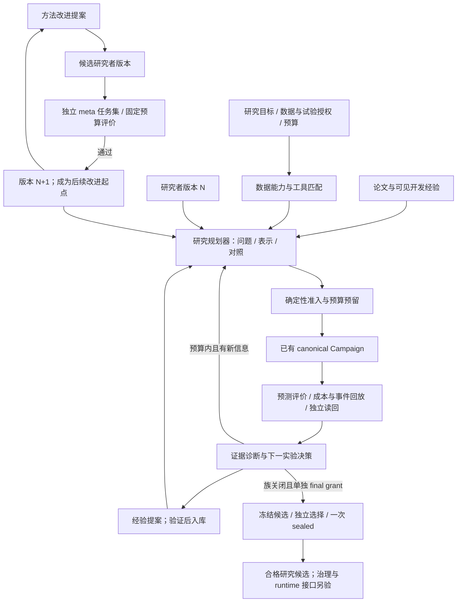

# Monday 日内研究控制面与 RSI 双闭环方案

日期：2026-10-06（Asia/Shanghai）。源码基线：`afd5ce1b39a3f4b720498a823086a69c932c3965`。
状态：设计方案。以下新增/扩展契约及自动决策尚未实现；不是研究、利润或部署完成证明。

## 目标

让系统从原始市场资料、论文及已有实验出发，主动提出可证伪的预测/策略实验，执行已准入的有界研究，按证据选择后续实验。同时建立独立的研究方法改进外环，让通过评价的研究者版本成为下一轮的起点。

系统追求找到成本后、样本外可靠的候选策略；预算耗尽、缺数据、无稳定增量或无经济候选均是合法终态。不能保证找到利润，不能无限搜索到出现漂亮分数。研究候选晋级与生产运行资格分开，LiveSmall 继续受现有禁用边界约束。

## 从论文提取方法，而不是照搬结果

| 论文启发 | 控制面应表达的实验问题 |
| --- | --- |
| [Deep OFI](https://doi.org/10.1111/mafi.12413)：订单流表示与期限 | 相同模型、目标、时间窗下，状态与历史订单流表示谁有增量；事件尺度不能冒充固定秒数 |
| [Cross-impact OFI](https://arxiv.org/abs/2112.13213)：滞后跨资产信息与衰减 | 数据已准入且时钟可对齐时，再提跨资产假设；所读论文未扣成本，不把 PnL 当净收益门槛 |
| [15 分钟 factor-zoo 研究](https://doi.org/10.1287/mnsc.2023.01657)：预测与控制换手 | 预测模型固定后，比较预声明的决策规则及总成本；股票组合数据不能当成加密盘口证据 |
| [短期可预测性研究](https://arxiv.org/abs/2211.13777)：表示、事件时钟与技术延迟 | 检查特征延迟和预测期限是否匹配，不能把亚秒统计结果转成分钟级利润主张 |
| [2026 加密反例](https://www.frontiersin.org/journals/blockchain/articles/10.3389/fbloc.2026.1811716/full)：泄漏和费用 | 预测通过、成本后失败是独立诊断分支；bar 代理失败不意味着完整 L2 无效 |
| [AIDE²](https://arxiv.org/abs/2609.26457)：研究者本身的双层优化 | 独立衡量方法改进，接受新的研究者版本，再让其参与后续研究；不由单次策略收益判断 RSI |

详见[文献核查](../reports/2026-10-06-hf-features-intraday-review.md)和[RSI 文献图谱](../research/2026-10-06-rsi-literature-landscape.md)。以下架构是基于这些论文与 Monday 源码的设计推断，未复现实验。

## 两个闭环与固定的验证边界

图中的角色是模块职责，不要求部署多个服务或固定多 Agent 队列。研究者只能写提案和实验产物；评价器、数据暴露账本、预算、权限和最终验收不进入候选的可编辑范围。

## 内环：自主推进预测与策略实验

### 1. 研究目标先固定

每个 Goal 绑定市场/标的、允许资料、预测目标、主要期限、输入与可用时间、决策频率/持有期、成本与执行模型、基线、时间划分、全族试验及资源预算、停止规则和允许变化范围。数据采样、历史窗、预测期限、下单时钟和持有期分别保存。

当前 BTC H1 和 SOL encoder 属于不同合同及历史预算，不能合并消费或覆盖失败记录。分钟级方向是新研究假设，不通过改变已冻结的 30 秒协议来实现。

### 2. 数据能力与表示规划

复用已有 Snapshot/diff 重建、订单流、sequence 和 encoder，按真实数据证据检查前置条件。允许完整重建时主动提出静态盘口、滞后订单流、多尺度成交状态等可比较表示；仅离散快照或有序列缺口时，明确拒绝无法恢复的事件/队列主张。

能力描述区分已观察的 metadata、已验证数据、可用工具与已授权执行。LLM 读取有界字段/时钟/论文/开发结果摘要，不接收完整 raw 或 sealed 数据。未被现有字段与工具契约支持的想法标为实施缺口。

### 3. 规划器输出实验，不直接决定买卖

复用 `CexResearchHypothesisV1` 的 statement、target、falsification_tests、来源和依赖字段。实验提案额外绑定对照、改变的变量、实现工具/版本、模型配置、预算、预期获得的信息和终止条件。自然语言理由须编译为确定性可检验的计划，不能让 LLM 自行认定通过。

首个实验族可以采用渐进比较：

- 表示比较：同一模型/目标/成本，比较静态盘口与加入历史订单流的输入。
- 模型比较：输入及目标冻结，再比较线性与已有神经模型；种子集合、训练信息和计算量差异显式保存。
- 决策比较：预测模型冻结，再比较少量预声明的成本阈值/滞回或持有规则。参数仅在开发视图选择，最终策略冻结后检验。

这些是模板，不是本次已批准或运行的市场实验。控制面按剩余预算、数据可行性和既有证据选择下一项，不能同时无界展开特征×模型×期限×交易规则。

### 4. 准入、执行和结果

继续使用 `campaign-freeze → campaign-finalize → dispatch submit → generated campaign-execute → settlement/readback`。执行前绑定 source/image、输入、协议、全族试验计数与允许范围。当前 `allowed_search_policy_revisions` 的完整 revision allowlist 继续有效；新表示、模型或期限超出原允许范围时，需要新的相应合同，不能由规划器暗改 grant。

控制面按操作身份、Job UID、checkpoint 和 receipt 等待终态。只有完整产物及独立读回通过才记为已完成；恢复复用同一身份，失败/不确定消耗保留。一个合同一个 writer。

结果分层保存：

| 层 | 需要解释什么 |
| --- | --- |
| 数据与实现 | 序列/可用时间/来源、缩放、单位、实际训练与恢复是否正确 |
| 预测 | 相对基线误差、IC/ICIR、校准、预测幅度、跨时间稳定性、依赖样本数 |
| 经济与执行 | 仓位、费用/价差/延迟/资金费、换手、容量、成交/退出失败、净收益与回撤 |
| 策略验收 | 冻结后的独立选择、回放和 sealed 证据；规定条件与证据充分性 |

覆盖缺口或信息不足应报告 insufficient_evidence。单次正收益、高 IC 或误差改善都不能跳过其他必要层。实际支持的执行范围必须以当前 replay contract 为准；缺少的行为不能默认已建模。

### 5. 下一实验决策和知识

| 观测结果 | 合理下一步 | 需要保留的边界 |
| --- | --- | --- |
| 数据不通过 | 定位分片/时钟/恢复问题，阻止模型研究晋级 | 不用新模型补造真实数据 |
| 单位、拟合或恢复不一致 | 修复实现并重新验证受影响阶段 | 不以更换策略掩盖错误 |
| 输入有效、预测无增量 | 提出一种表示或模型变更，与相同基线比较 | 不把一段负结果判为整个市场无 Alpha |
| 预测有信息、成本后不可用 | 检查校准、幅度、稀有机会、换手、期限与执行匹配 | 不通过放宽真实成本宣称成功 |
| 经济结果只集中于少数时期 | 设计固定的跨时期/状态稳定性检验 | 不丢弃不利日期 |
| 有合格 pre-holdout 候选 | 停止该族继续搜索，执行独立最终合同 | sealed 不用于继续调参 |
| 预算耗尽或无未试方案 | 保存负结果、结算并停止 | 不换名字重置预算 |

知识记录包含适用条件、试过的动作、验证结果、证据、局限和失效条件。LLM 总结先作为提案，确定性评价及 readback 决定可以记为已验证的内容。跨市场/期限/工具版本复用重新检查适用性，保存拒绝与不确定结果。

## 外环：研究方法自身的 RSI

第一版只演化研究规划、提议顺序、预算分配或经验检索配置，选择一个对象开始。以不可变 ResearcherVersion 绑定 policy/prompt/tool/memory 配置、父版本、变更、源码及评测结果。新版本必须实际驱动研究任务，而不是只有文案变化。

Candidate 与 incumbent 在相同预声明任务、数据可见度、预算与 seed schedule 下比较。先拒绝证据造假、越权、错误计费和泄漏，再评价结果质量、研究成本、有效实验率、重复失败及正确停止。正确的负结果有研究价值，不能让 evaluator 奖励编造盈利。

外环的数据分区与策略评测分区是两个不同层次：

1. Meta 开发任务：可读取结果并修改研究方法。
2. Meta 版本选择任务：选择 researcher version；重复选择会使这部分也成为适应数据，记录所有尝试。
3. Meta 独立认证任务：未参与修改，固定预算下确认泛化；认证输出不再用于同一次搜索调优。

内环策略自己的 sealed 仍隔离。不能因为外环需要反馈而泄露策略 holdout，不能反复对同一隐藏集查询后称其未曝光。后续独立认证需要新的、未用于适应的任务，并计入累计资源与统计搜索范围。

新版本通过预声明的独立比较后才晋级；失败保持 incumbent 并记录。晋级版本成为下一轮提出/执行方法改进的起点。连续晋级及跨任务提高研究效率，才支持 RSI 能力主张；稳定加速自我改进是进一步需要检验的事实，不能从双环结构直接推定。

## 控制过拟合的固定规则

- 全族登记表示、模型、期限、seed、决策规则、LLM 提议/重试和 meta 版本尝试；保留看过的备选、实际消费和不确定预算。
- 特征选择、缩放、调参和模型训练限定在对应开发/训练视图。按最大特征依赖、标签成熟期和持有期设置 purge/embargo。
- 一秒重叠收益标签不是独立样本；不按行数制造显著性。稳定性与不确定性检查需要对应时间依赖的协议。
- 接受条件和总成本预先固定。当前 Gaussian 多重试验 haircut 不等于完整 DSR/PBO；任何补充统计检验须版本化，不能事后挑更有利的检验。
- 最终验收冻结实际参数、输入、决策规则及经济协议，保留单次 sealed claim。指标不充分或协议缺项明确失败/未知。

这些规则降低适应性过拟合风险，不保证从有限市场数据发现真 Alpha。

## 实施切片与验收

| 切片 | 拥有模块 | 可验证结果 |
| --- | --- | --- |
| 1. 数据能力与表示提案 | alpha-domain/engine/app | 自动识别可重建盘口及可比较表示；缺口/快照-only 不生成虚假事件能力；只读输出并绑定 hash |
| 2. 研究计划与执行衔接 | app 的 render/admission/dispatch，domain | 类型化提案在允许范围内进入现有 Campaign；范围、预算、时钟及身份漂移失败 |
| 3. 诊断与有界后续 | engine/store，Campaign coordinator | H1 零入场与 SOL 准备失败走不同分支；每个后续有证据理由、变量、预算及停止状态 |
| 4. 经验验证与检索 | store/engine | 仅验收通过的知识可复用；原始记录、总结提案、已验证经验分别标注；适用性改变会失效 |
| 5. ResearcherVersion 外环 | domain/engine/app/store | 同任务同预算的 incumbent/challenger 比较、独立认证、版本晋级/拒绝与回退；新版本参与下一轮 |

复用既有知识、假设、LearningDirective 和 policy revision 接缝，按必要的 typed contract 补齐；不新增通用 Agent 消息总线、训练服务或 Python 生产执行栈。代码按独立行为分 PR，focused validation/review/CI/merge；真实研究、认证、发布与 runtime 分别按对应证据结束。

首个小型验收不以利润为要求：在有界受控案例里，系统能在不收到人工特征提示时，从数据能力自动提出一种合理的表示比较，并对数据失败、预测弱、经济失败做不同决策。随后用实际未曝光资料检验科学与经济结果；若要声称 RSI，再完成独立的研究者版本比较。

## 本次交付边界

本次只完成设计及源码接缝核对。实际标的、时间窗、剩余试验与费用预算、当前 grant/lease 不从历史记录推定；具体执行沿其任务核对。没有启动训练/云资源、读取 sealed、改动 runtime 或提交交易。

## 2026-10-07：RSI 外环的 Rust workspace 归属

核对远端 main：`d0ad35b5a14ac1c4441f3f86a64fd7d1ca2065bb`，主工作区仍为前述较旧基线。`workspaces.json`、实际 Cargo manifest 和布局文档共同确认六个 owner。RSI 使用 shared/research/control 三个既有 workspace，不新增第七个 workspace。

| 职责 | workspace / owning manifest | 建议位置与实现范围 |
| --- | --- | --- |
| 外环生命周期和权威 | control：`research-core/platform/Cargo.toml` | 在已有 platform 内增加 meta-study/version adoption 模块；复用 Build/Run/Task/Attempt、授权、预算、停止/恢复、结果读回与存储，不加载模型或 LLM 引擎 |
| 研究方法的生成与数值比较 | research：`research-core/Cargo.toml` | 建议功能 crate `research-core/agent-improvement`，处理改进提议、候选配置、研究方法比较与固定科学评价 worker；按明确 build recipe 调用既有 CEX 或 prediction 科学模块 |
| 跨边界的纯契约 | shared：`shared/Cargo.toml` | 如需两侧消费，建议小 crate `research-core/agent-contracts`，绑定版本、父代、可编辑范围、任务集、预算与评价收据身份；无 SQL、网络、provider、训练或 LLM 依赖 |

`agent-improvement`、`agent-contracts` 及上述模块名是建议新增位置，当前并不存在。采用时 package 显式声明唯一 owner；shared 源目录由 research workspace exclude，类似当前 manifest/cex-input，不因源码位于 research-core 就误归属 research。

当前 `alpha-domain` 实际属于 research，且拥有 CEX 科学评价类型；不能把它作为通用 RSI 共享契约而引入轻量 control。`alpha-engine` 仍属于 research，负责内环科学功能。市场特有的实验输入和证据映射留在其 owning 模块，领域无关的版本/评测身份独立。

依赖与调用接缝：shared 纯契约供 control 与 research 消费；control 通过已登记 Build 的固定 Job/受控 Session 调用 research worker，以结果收据衔接，不通过 Rust path dependency 导入整个训练/提议器。control 的正常依赖图继续排除 collector、Burn、ONNX、Parquet 和 alpha-engine；research 算法不持有 PG 或 Kubernetes 操作权。

外环第一版实现步骤：

1. 固定一个 incumbent 研究者版本，绑定实际 prompt/search-policy/memory retrieval 配置、tool/source/Build 身份；先只开放一种配置变更，源码变更另经 Build 发布流程。
2. Research proposer 用允许的开发结果提出 challenger。提案不修改 evaluator、数据暴露策略、预算或接受阈值。
3. control 建立受授权的 MetaStudy，将 baseline/challenger 编译为同任务、同 seed schedule、相同信息与资源上限的固定 Run。配置变化复用原 Build；代码或构建输入变化需要独立 verified Build，科学 Job 不运行 Cargo。
4. 独立可信 evaluator worker 使用固定实现和授权 DataView 评分，候选研究者不能访问认证标签。开发反馈、meta 选择与meta 认证分开；重复选择被计为适应性搜索。
5. control 读取真实结果与成本收据，核验绑定和预声明晋级规则，再以版本号/父版本条件更新 incumbent，避免两名 writer 同时晋级。失败保留旧版本与完整证据。
6. 下一个允许的研究/改进 Run 实际采用已晋级版本；记录它能否在独立任务上提高研究效能，不能把仅保存版本文件称为递归改进。

权威存储遵循当前唯一活动后端。新 PG 方案仍为暂停/迁移待验收状态时，不建立与 legacy 权威并行的第二实验 ledger。版本存储、迁移及 Run 启用跟随既有 quiescence/切换合同。真实 outer-loop 运行需其自己的累计预算、授权和终态证据。

第一份外环 PR 的最小行为是版本/评测契约与确定性的 incumbent/challenger 晋级检查，覆盖父版本漂移、预算/输入/任务集差异、伪造 JSON 收据、失败回退和重复晋级。随后再接 worker 与真实任务；不把新算法、控制权威迁移和云运行合在一个 PR。

### 首份实现的可变范围与证据边界

首份实现只允许 `ExperienceRankingOrder` 在任务匹配优先和时间优先之间变化。
实际 prompt、search-policy 内容、检索语句、corpus、top-k、上下文大小、允许数据范围、
工具、源码和 Build 均保持固定。选择和认证的任务、seed、评分规则、晋级阈值、资源和
预算进入不可变 Study 身份。开发反馈不能充当选择或认证得分。
每个任务明确冻结评分方向；误差或损失下降才产生正增益。开发任务的视图必须在
允许范围内，选择和认证视图不得进入提议器范围。晋级决定的身份包含完整前置 head
条件，包括前次决定，防止不同历史共用同一审计身份。

共享合同属于 `hft-research-agent-contracts`。控制侧通过
`researcher-verification` 复用 opaque 发布 Build 和现有 Run/Task 校验，逐项核对
实际调用的程序、两组相同的执行条件、受控签名角色及产物字节。验证结果和晋级决定
只属于原来的信任及执行上下文。切换密钥、任务或来源后，旧 proof 不能转移使用。

首份实现是纯校验和内存状态转换，不建立实际 MetaStudy 授权、持久晋级或新的活动
实验账本。每个冻结 Run 只接受首次 Attempt；后续重试必须先接完整累计费用和暴露
账本。调用者提供的冻结执行上下文仍须由后续活动权威适配器从真实记录构造。

本地签名、并发和失败测试使用明确的软件 fixture。它们证明协议的拒绝行为，不能
证明真实研究完成、认证资料未曝光、新版本已驱动下一次研究或研究效率有所提高。
持久采用、研究 worker、下一 Run 的实际消费与真实独立认证仍按后续切片验收。
