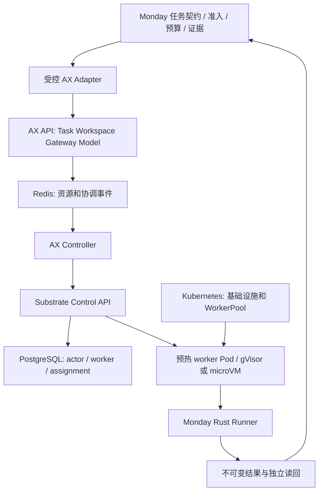

# Monday 采用 Google AX 的上游研究

核对日期：2026-09-23（Asia/Shanghai）。本报告为一手文档与固定提交源码审阅，没有部署 AX、启动集群、执行云实验或验证性能。建议属于设计推断，不是生产就绪证明。

## 结论与选型边界

建议把 AX 作为 **Monday 工程 Agent 的声明式执行后端候选**，先建立可替换的适配边界，再做隔离试点。Monday 的研究准入、预算、证据签名与交易权限继续由 Monday 控制。不要把“采用 AX”定义成让全部研究计算、行情采集和交易 Runtime 都变成 AX Task。

会改变选型的事实：

1. **尚未生产就绪。** AX 明示核心协议还会发生重大变化；Substrate 明示 early development、not ready for production，并非 Google 官方支持产品。发布标签不改变这项声明。[AX README][ax-readme]、[Substrate README][sub-readme]
2. **AX 默认恢复是文件恢复后重启进程。** Substrate 有完整进程快照能力，但 AX 当前构造的模板只保存 DATA，选择 gVisor，恢复从 golden 加持久化工作数据启动；不能宣称已获得完整 LLM 会话或进程内存恢复。[AX 模板源码][ax-client]、[Runner 契约][ax-runner]
3. **现有集群未必兼容。** Substrate 最新安装依赖 PodCertificateRequest、ClusterTrustBundle 等 Kubernetes API；GKE 专用指南限定 1.36 在建群时开启 beta API，或 1.37+。这不是 ACK 支持证明，必须单独只读核查 ACK API、节点权限、网络与存储支持。[GKE 安装前置][sub-gcp]、[kind 集群配置][sub-kind]
4. **权限隔离不完整。** Substrate 有 mTLS/JWT 认证，当前尚无控制面用户授权/RBAC；atespace 是资源作用域，不是已经证明的租户安全边界。AX 服务端也没有内置鉴权拦截器。[Substrate 认证][sub-auth]、[AX Server][ax-server]
5. **网络协议决定工作负载范围。** 最新官方 egress 文档列出 HTTP(S) 支持、WebSocket/其他 TCP/非 DNS UDP 阻止；该文档自身标注为 GA 目标规格，实际选定构建仍须测试。因此无法假定行情 WebSocket、交易连接或任意工具协议适用。[Egress 规格][sub-egress]
6. **warm worker 与 Spot 研究计算应分开。** 上游部署指南要求 worker 避免 Spot/preemptible、停用节点自动升级，防止活动状态在节点丢失时受损。Monday 的 CPU Spot 研究 Job 不应因引入 AX 而悄悄改为常驻昂贵节点；需要分别核算成本与恢复语义。[部署与升级警告][sub-gcp]

## 固定来源与版本

| 来源 | 本次固定身份 | 用途 |
| --- | --- | --- |
| `google/ax` | `d8ed0fe38bceb7842d3c47817d53d16ccdfcb601`，提交时间 2026-09-20 03:27:51 UTC；`v0.3.0` 标签指向同一提交 | AX API、控制器、runner、部署默认值 |
| AX 声明依赖的 Substrate | `672533541dbfcd29084e4de2475267088bda3651`，Go pseudo-version 日期 2026-09-11 | 兼容性基线：不能用最新 Substrate 文档推定这一组合已兼容 |
| `agent-substrate/substrate` 当前 HEAD | `d277088bc1d081ef716d81dd7986d05d0a36ad3a`，提交时间 2026-09-22 23:32:01 UTC | 当前能力、部署前置、恢复与安全边界 |
| `agentexecutor.io` | 2026-09-23 在线读取，无不可变版本 | 官方项目定位；规模与延迟文案不作为实测证据 |

通过 GitHub API 核对了提交和 release/tag，随后只读克隆上述两个 HEAD 并逐文件核对。AX `go.mod` 指定 Go 1.27.1 和上述 Substrate 依赖；Substrate 最新 HEAD 本身包含 `readyz` → `wakeupProbe` 字段命名变化，是接口仍在变化的具体例子。试点要固定 **AX SHA、Substrate SHA、runner digest、SandboxConfig 资产哈希、schema 版本** 五项，并测试组合，不能各取 `latest`。[AX go.mod][ax-gomod]、[Substrate 提交][sub-commit]

两库使用 Apache-2.0；本报告不是法律意见，实施时保留许可证与归属声明即可进入项目正常依赖审查流程。[AX LICENSE][ax-license]、[Substrate LICENSE][sub-license]

## 架构到底是什么

AX 是 Kubernetes 风格 API，不是把每个 Task 存进 Kubernetes 的 CRD。其高频资源记录放 Redis，协调事件走 Redis Streams，观看状态走 Pub/Sub。`ax-server` 负责 API，`ax-controller` 把资源协调成 Substrate actor，runner 在沙箱内准备环境、启动命令。Substrate 使用 PostgreSQL 管理 actor/worker 状态；Kubernetes 管基础设施、WorkerPool、SandboxConfig 和 worker Pod，actor 生命周期另由 Substrate 管。[AX Design][ax-design]、[Substrate Architecture][sub-architecture]

图中的 Monday adapter/runner 是建议新增边界，并非声称已实现。CPU 密集研究仍由 canonical Campaign 路径执行；agent 通过受控工具提出、提交和读取任务，不直接接管交易执行或签名权限。

| AX 对象 | 官方职责 | Monday 应绑定的内容 |
| --- | --- | --- |
| Task | 镜像、命令、workspace/gateway 引用、生命周期、资源声明 | 单次任务身份、contract hash、attempt、来源 SHA、runner digest；完成需另有 terminal receipt |
| Workspace | Git、MCP、skills 与可选环境准备目标 | 固定源 revision、可写路径、依赖与技能版本、输入证据索引；不得挂整个宿主 HOME |
| Gateway | 出网声明和入口监听 | 由任务权限派生的明确 host/protocol/port；未能完整落实则拒绝启动 |
| Model | 模型配置及 Secret 引用 | 模型版本、预算绑定和服务侧凭据；不同于交易授权或研究批准 |

这些对象的设计意图见 [Concepts][ax-concepts]，真实 schema 见 [ax.proto][ax-proto]。Task 的 budget/approval `policies` 字段已保留编号并移除，不能因仍有 `PendingApproval` 状态字段就认定审批执行已存在。

## 实现与宣称之间的缺口

以下为固定 AX 提交中的静态事实；“风险”列为对 Monday 的推断，未以攻击或故障注入实测。

| 审阅点 | 源码事实 | 对 Monday 的含义 |
| --- | --- | --- |
| 资源约束 | schema 有 `resources.requests/limits`，本次检索 controller、Substrate client、runner 未发现将这些字段映射到执行资源；`BuildActorTemplate` 未设置它们 | 资源声明不等于硬限制。适配层不能报告“已强制执行”，必须绑定实际 worker/cgroup 限额并验证 |
| 出网 | 未提供 Gateway 时 controller 产生 wildcard；策略应用失败仅记录条件，仍继续 resume；`Ready` 只检查 workspace，未包含 `GatewayReady` | Monday 必须默认拒绝，策略未成功落地禁止启动；仅外层字段校验不足以修复运行时失败 |
| 端口 | `HostRule.port` 存在，但 `ApplyEgressPolicy` 只提取 host/CIDR，没有传递端口 | 不能把 host:port 声明当作已执行的端口策略 |
| 模板失败 | 创建自定义 ActorTemplate 失败时回退默认模板 | image、env、workspace 契约可能不成立，必须拒绝回退并读回实际模板身份 |
| 完成语义 | runner 命令退出后继续服务，控制面不读取命令退出状态 | `Running`、`Ready`、`WorkspaceReady` 都不是研究或工程任务完成证据 |
| 工作区准备 | 缺失 Workspace 被跳过；clone 失败记录日志但返回非错误；goal bootstrap 缺 key/超时/失败也继续 | 输入缺失不得变成正常运行。用固定镜像和 Rust runner 验证 source/input hashes；MCP/skill 字段需逐项落实 |
| 模型与凭据 | controller 查找 Gemini Secret，必要时回退自身 `GEMINI_API_KEY`，然后放入 actor 环境 | 不能假定密钥始终在外置代理内；还需核查模板、快照和日志中的 Secret 暴露面 |

对应源码：[协调器][ax-reconciler]、[Substrate client][ax-client]、[队列 worker][ax-worker]、[Workspace setup][ax-setup]、[Runner 契约][ax-runner]。这里不建议在 Monday 内复制整个 Go 控制面；需要逐项判断可在 Rust runner/adapter 修复、需要上游修复，还是该版本暂不准入。

### 分布式协调与持久化

AX Redis 存储将资源写入、队列事件和发布通知放进事务 pipeline，但资源状态更新为读取整个记录再写回，未见资源版本 CAS；schema 元数据也无 generation/resourceVersion。多个事件分到不同 controller 并不等于同一 Task 串行化。新 consumer group 从 stream 尾部建立，只读 `>` 新事件；本次未发现 pending reclaim 路径。Worker 对处理失败的事件也 ACK，未发现周期重协调。Watch 使用即时 Pub/Sub，没有可恢复事件游标。[Redis store][ax-redis-store]、[Worker][ax-worker]

这些机制支持原型协调，但不能直接成为 Monday 的 durable task ledger 或 exactly-once 承诺。推荐仍由 Monday 保存权威契约和 append-only receipts；每个 attempt 带幂等键、generation、单 writer/fencing；外部效果读回后推进阶段。对于上游队列，必须实测“提交前 controller 不在线、消费后 crash、apply 与 status 竞争、重复提交、旧 controller 恢复”等场景。默认 Redis 清单仅单副本，未配置持久卷或 HA；生产采用前还需要可证明的持久化、备份与恢复策略。[Redis 部署清单][ax-redis-deploy]

Substrate 最新实现更明确地提供数据库一致性机制：actor workflow lease 丢失会取消工作上下文；PostgreSQL lease 通过 token/TTL 管理；actor 更新带 UID/version 条件；worker 分配使用行锁、唯一 actor assignment 与事务内容量检查。这些是可借鉴或复用的执行层机制，不替代 Monday 对外部副作用的幂等控制，也不能反推 AX 的 Redis 层已具备相同语义。[Workflow lease][sub-workflow]、[PG lease][sub-lease]、[Assignment][sub-assignment]、[Actor CAS][sub-actor]

### 恢复语义必须显式声明

建议 Monday 后端能力区分 `restart_from_workspace`、`resume_process_snapshot`、`application_checkpoint`。只有内存状态、文件、任务 cursor 与外部副作用一起经过测试后，才能承诺更强语义。默认 AX 仅满足第一类的设计方向，且 runner 是否安全跳过准备/命令重放仍须验证。

上游文档已有矛盾：GKE 安装指南说 CRASHED 无恢复路径，但同一最新 SHA 的 API 指南与 `workflow_revert.go` 已支持 `RevertActor`，从 RUNNING/PAUSED/CRASHED 丢弃当前执行并回到保留快照的 SUSPENDED；该操作使用 actor lease，并依持久状态实现重入。AX 固定版本 `EnsureActor` 对 CRASHED 的路径却是删掉再创建，没有调用 RevertActor。因此 **不能把最新 Substrate 恢复能力自动算给 AX**，也不能说所有版本的 CRASHED 都永远不可恢复。[Revert 源码][sub-revert]、[AX EnsureActor][ax-client]、[部署警告][sub-gcp]

Monday 的验收应记录 RPO（最近完整快照以后可能丢失什么）、snapshot identity、实际恢复类型与新的 attempt/generation。未证明外部请求可安全重放时，恢复后先对账，不自动重跑有副作用的命令。

## 部署、安全与跨平台判断

**已确认：** 默认 gVisor 路径不要求 KVM，官方 kind 脚本在 `/dev/kvm` 缺失时仍支持 gVisor。microVM 使用 Kata + Cloud Hypervisor，需要 KVM 及相应硬件/虚拟化支持；官方 macOS 路径是 Lima 内 Linux VM 的嵌套虚拟化，并注明 Apple Silicon M3+。因此 Mac 是 CLI/开发宿主，Linux VM/节点承载实际 worker，不能把宿主脚本隔离等同于这套沙箱。[kind 脚本][sub-kind]、[microVM 本地指南][sub-microvm]

**已确认：** AX 自带 API 用未加密 HTTP/2，未配置 auth interceptor；controller → Substrate 清单则配置 token/CA。Substrate 用户认证后目前可操作全部 atespace；Kubernetes RBAC 不会自动替另一套 gRPC API 提供租户授权。初次试点应限于单一可信操作者、独立环境、私网控制面，不向不可信 actor 发放控制面凭据。[AX Server main][ax-server-main]、[controller 清单][ax-controller-deploy]、[Substrate Authentication][sub-auth]

**需验证：** ACK 是否具备所需证书 API、特权/设备/内核能力、CNI、可用存储插件及快照访问权限；S3 兼容接口是否能满足选定版本全部读写语义，不能因 OSS 提供某种兼容接口便认定通过。还要测试 sandbox 到宿主 metadata、控制面、其他 actor 的拒绝路径；凭据注入与 TLS 信任；恢复后策略与身份是否仍正确。Substrate 自己的 threat model 也明确当前早期安全加固尚不充分，不能把设计不变量当完成证明。[Threat model][sub-threat]

## 建议的采用顺序与证据出口

| 阶段 | 范围和产物 | 退出证据 |
| --- | --- | --- |
| 0. 固定能力与边界 | 对照 Monday 当前对象建立映射；固定上游五项身份；声明后端能力与未支持字段 | 研究报告、ADR、contract schema、无副作用的验证示例；发现不支持字段即拒绝 |
| 1. 收敛当前执行语义 | 本地任务单 writer、真实停止、文件检查点命名准确、终态与结果哈希、严格 source/workspace 输入验证 | 并发启动、进程子树终止、失败准备、重复恢复、退出码和 receipt 的回归 |
| 2. Rust adapter/runner | 将受审 Task 转为 AX；自定义 runner 处理 PID 1、准备、预算、退出、恢复；将不可在边界修复的问题留为上游阻塞 | schema→实际 actor/image/network/resources 逐项读回；缺依赖/失效策略/错误版本均失败关闭 |
| 3. 独立开发集群试点 | 先做基础设施只读兼容性检查，再按单独资源上限部署；一个无外部副作用的真实工程任务 | apply→ready→执行→pause→恢复→terminal receipt→独立 readback→资源清理；同时保留负向结果 |
| 4. 故障和成本验证 | worker/controller/Redis 故障、重复事件、快照损坏、网络阻断、凭据轮换、恢复幂等 | 数据丢失范围和故障结果明确；CPU/内存硬限真实生效；延迟/成本用 Monday workload 实测 |
| 5. 限范围推广 | 仅迁移已验证的工程 Agent 类型，保持 Campaign/训练/交易边界 | 小流量观察、精确回退身份、旧/新后端归属清楚；无双 writer |

优先改善的是 **契约、终态、恢复与权限语义**；Kubernetes 部署放在这些验收之后。试点预算、目标集群和节点选择要另行记录，不因报告提到某平台就创建资源。若集群前置、上游 fail-open 路径或恢复可靠性无法满足，保持 AX-compatible 的资源设计和现有受控后端即可，不把阻塞解释成需要重写 Monday 交易系统。

## 未知与本次未做事项

- 未在 Monday 现有 ACK 或任何新集群部署 AX/Substrate；没有集群兼容性、网络隔离、CPU/内存限额、密钥隔离或恢复性能实测。
- 未证明 AX `v0.3.0` 与 Substrate 当前 HEAD 互相兼容；版本漂移和文档冲突需在确定试点版本后验证。
- 未证明完整 LLM 对话、工具调用、远端长连接能靠进程快照一致恢复；第三方 API 的副作用不在快照内。
- 官方“十亿任务”“亚秒恢复”等文案只作为目标或官方演示陈述，本报告不将其转换为 Monday 容量/SLO。
- 本报告没有修改当前执行改造 worktree、部署服务、外发消息、运行付费模型或创建云资源。

## 固定官方来源

[ax-readme]: https://github.com/google/ax/blob/d8ed0fe38bceb7842d3c47817d53d16ccdfcb601/README.md
[ax-gomod]: https://github.com/google/ax/blob/d8ed0fe38bceb7842d3c47817d53d16ccdfcb601/go.mod
[ax-license]: https://github.com/google/ax/blob/d8ed0fe38bceb7842d3c47817d53d16ccdfcb601/LICENSE
[ax-design]: https://github.com/google/ax/blob/d8ed0fe38bceb7842d3c47817d53d16ccdfcb601/DESIGN.md
[ax-concepts]: https://github.com/google/ax/blob/d8ed0fe38bceb7842d3c47817d53d16ccdfcb601/docs/concepts.md
[ax-proto]: https://github.com/google/ax/blob/d8ed0fe38bceb7842d3c47817d53d16ccdfcb601/pkg/apis/v1alpha1/ax.proto#L56-L128
[ax-runner]: https://github.com/google/ax/blob/d8ed0fe38bceb7842d3c47817d53d16ccdfcb601/docs/runner.md#L7-L53
[ax-reconciler]: https://github.com/google/ax/blob/d8ed0fe38bceb7842d3c47817d53d16ccdfcb601/internal/controller/reconciler.go#L94-L327
[ax-client]: https://github.com/google/ax/blob/d8ed0fe38bceb7842d3c47817d53d16ccdfcb601/internal/substrate/client.go#L213-L535
[ax-worker]: https://github.com/google/ax/blob/d8ed0fe38bceb7842d3c47817d53d16ccdfcb601/internal/controller/worker.go#L63-L167
[ax-setup]: https://github.com/google/ax/blob/d8ed0fe38bceb7842d3c47817d53d16ccdfcb601/internal/workspace/setup.go#L77-L124
[ax-server]: https://github.com/google/ax/blob/d8ed0fe38bceb7842d3c47817d53d16ccdfcb601/internal/server/server.go#L38-L70
[ax-server-main]: https://github.com/google/ax/blob/d8ed0fe38bceb7842d3c47817d53d16ccdfcb601/cmd/ax-server/main.go#L68-L90
[ax-controller-deploy]: https://github.com/google/ax/blob/d8ed0fe38bceb7842d3c47817d53d16ccdfcb601/deploy/ax-controller.yaml
[ax-redis-store]: https://github.com/google/ax/blob/d8ed0fe38bceb7842d3c47817d53d16ccdfcb601/internal/store/redis/store.go
[ax-redis-deploy]: https://github.com/google/ax/blob/d8ed0fe38bceb7842d3c47817d53d16ccdfcb601/deploy/redis.yaml
[sub-readme]: https://github.com/agent-substrate/substrate/blob/d277088bc1d081ef716d81dd7986d05d0a36ad3a/README.md
[sub-commit]: https://github.com/agent-substrate/substrate/commit/d277088bc1d081ef716d81dd7986d05d0a36ad3a
[sub-license]: https://github.com/agent-substrate/substrate/blob/d277088bc1d081ef716d81dd7986d05d0a36ad3a/LICENSE
[sub-architecture]: https://github.com/agent-substrate/substrate/blob/d277088bc1d081ef716d81dd7986d05d0a36ad3a/docs/architecture.md
[sub-gcp]: https://github.com/agent-substrate/substrate/blob/d277088bc1d081ef716d81dd7986d05d0a36ad3a/tools/setup-gcp/README.md#L65-L122
[sub-kind]: https://github.com/agent-substrate/substrate/blob/d277088bc1d081ef716d81dd7986d05d0a36ad3a/hack/create-kind-cluster.sh#L74-L112
[sub-microvm]: https://github.com/agent-substrate/substrate/blob/d277088bc1d081ef716d81dd7986d05d0a36ad3a/docs/dev/microvm-local.md
[sub-auth]: https://github.com/agent-substrate/substrate/blob/d277088bc1d081ef716d81dd7986d05d0a36ad3a/docs/authentication.md#L19-L29
[sub-egress]: https://github.com/agent-substrate/substrate/blob/d277088bc1d081ef716d81dd7986d05d0a36ad3a/docs/egress-traffic.md
[sub-threat]: https://github.com/agent-substrate/substrate/blob/d277088bc1d081ef716d81dd7986d05d0a36ad3a/docs/threat-model.md
[sub-workflow]: https://github.com/agent-substrate/substrate/blob/d277088bc1d081ef716d81dd7986d05d0a36ad3a/cmd/ateapi/internal/controlapi/workflow.go#L195-L221
[sub-lease]: https://github.com/agent-substrate/substrate/blob/d277088bc1d081ef716d81dd7986d05d0a36ad3a/cmd/ateapi/internal/store/atepg/lease.go#L29-L145
[sub-assignment]: https://github.com/agent-substrate/substrate/blob/d277088bc1d081ef716d81dd7986d05d0a36ad3a/cmd/ateapi/internal/store/atepg/worker_assignment.go#L30-L170
[sub-actor]: https://github.com/agent-substrate/substrate/blob/d277088bc1d081ef716d81dd7986d05d0a36ad3a/cmd/ateapi/internal/store/atepg/actor.go#L118-L133
[sub-revert]: https://github.com/agent-substrate/substrate/blob/d277088bc1d081ef716d81dd7986d05d0a36ad3a/cmd/ateapi/internal/controlapi/workflow_revert.go#L38-L141
