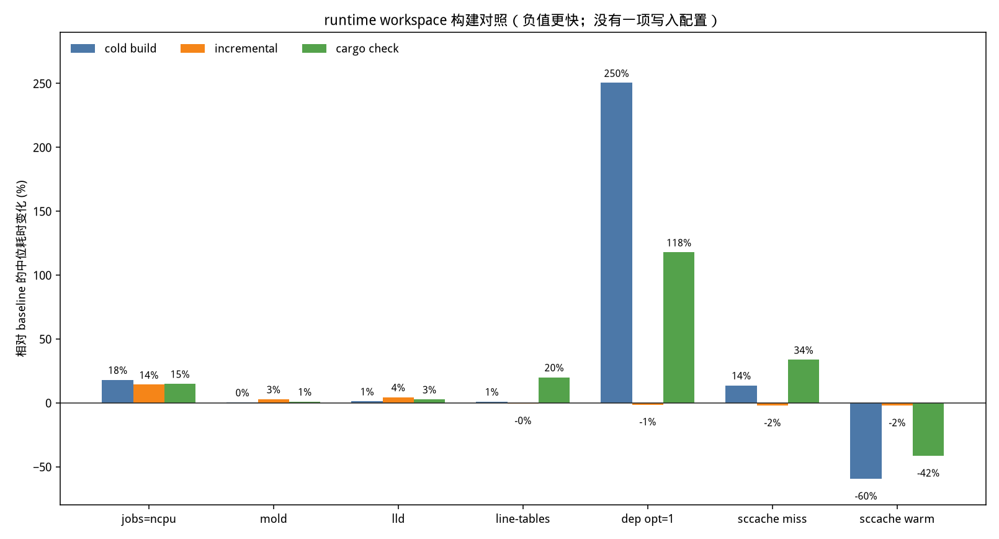

# Runtime workspace 構建速度對照

測量日：2026-10-07。基線提交：`b864d5c009b710b3542aa06421556d34f6cef52a`。

沒有改 Cargo profile、`.cargo/config.toml` 或 crate 邊界。下表裡除 baseline 外全部拒絕。圖由 `render-rust-build-speed.py` 按表中的 delta 生成。

## 機器和工具鏈

| 項 | 值 |
| --- | --- |
| CPU | Intel(R) Xeon(R) Processor，family 6，model 207，stepping 2，4 核，每核 1 線程，KVM |
| 內存 | MemTotal 16398384 KiB（約 15.6 GiB）。測量開始時 MemAvailable 約 5 GiB |
| 系統 | Ubuntu 24.04，Linux 6.12.94+ |
| rustc | 1.98.1 (48a229cea 2026-09-01) |
| cargo | 1.98.1 (797e8a9bc 2026-08-05) |
| mold / lld / sccache | 2.30.0 / Ubuntu LLD 18.1.3 / 0.7.7 |

## 測法

工作區是 `rust_hft/runtime/Cargo.toml` 的 default members（含 `hft-engine`、`hft-runtime`、`hft-strategy-dl`、`hft-live`、`hft-paper`、`hft-all-in-one`）。命令是 `cargo build` 或 `cargo check --locked --timings`，工作目錄是 `rust_hft`，因此讀到 `build.jobs = 8`。每個場景 3 次，表中是中位數。

- cold-build：刪除 `runtime/target`，`drop_caches`，再 `cargo build`。
- incremental-build：在已完成的 cold build 上，給 `market-core/engine/src/lib.rs` 插入一行 `//! build-speed-probe`，再 `cargo build`。這行沒有進入提交。
- noop-build：源碼不變再 `cargo build`。
- cold-check：刪除 target，`drop_caches`，再 `cargo check`。

對照組都經過同一個測量用 linker timer，再轉給 `cc`、`clang -fuse-ld=mold` 或 `clang -fuse-ld=lld`。timer 不在倉庫裡。baseline 的鏈接時間是 69 次鏈接的耗時之和，中位數 9.23 秒；單次最長約 1.8 秒。

`jobs-ncpu` 是在 `/tmp` 裡跑的同一組命令。Cargo 沒有讀到倉庫配置，timings 顯示 `jobs=4 ncpu=4`。當時配置裡只有 `jobs = 8`，所以這組等於去掉這個上限。

## 對照

delta 相對 baseline。負值表示更快。

| 場景 | 變體 | 中位秒 | delta | 三次實測 | 決定 | 原因 |
| --- | --- | ---: | ---: | --- | --- | --- |
| cold-build | baseline | 60.45 | 0 | 61.31, 60.45, 59.79 | 保留 | 當前配置。`jobs = 8`，系統鏈接器 |
| incremental-build | baseline | 4.29 | 0 | 4.29, 4.39, 4.02 | 保留 | 同上 |
| noop-build | baseline | 0.48 | 0 | 0.48, 0.41, 0.67 | 保留 | 同上 |
| cold-check | baseline | 31.51 | 0 | 31.19, 31.51, 31.70 | 保留 | 同上 |
| cold-build | jobs-ncpu | 71.33 | +18.0% | 71.33, 75.60, 67.03 | 拒絕 | 比 `jobs = 8` 慢。不刪除現有上限 |
| incremental-build | jobs-ncpu | 4.90 | +14.2% | 5.44, 4.90, 4.83 | 拒絕 | 同上 |
| noop-build | jobs-ncpu | 0.46 | -4.2% | 1.23, 0.42, 0.46 | 拒絕 | 空編譯差在 0.1 秒內，冷編譯更慢 |
| cold-check | jobs-ncpu | 36.22 | +14.9% | 34.84, 36.98, 36.22 | 拒絕 | 同上 |
| cold-build | mold | 60.71 | +0.4% | 60.81, 60.71, 60.43 | 拒絕 | 牆鐘和鏈接總時間都沒有下降（鏈接中位 10.87s，baseline 9.23s） |
| incremental-build | mold | 4.41 | +2.8% | 4.32, 4.41, 4.42 | 拒絕 | 單行重編沒有變快。單次鏈接最長約 1.8s，不是瓶頸 |
| noop-build | mold | 0.46 | -4.2% | 0.46, 0.45, 0.52 | 拒絕 | 無實質收益 |
| cold-check | mold | 31.84 | +1.0% | 31.93, 31.80, 31.84 | 拒絕 | 同上。不把 linker 寫進配置，沒有 mold 的機器保持系統鏈接器 |
| cold-build | lld | 61.16 | +1.2% | 61.35, 61.16, 60.26 | 拒絕 | 與 mold 相同，沒有收益（鏈接中位 10.28s） |
| incremental-build | lld | 4.48 | +4.4% | 4.48, 4.60, 4.06 | 拒絕 | 同上 |
| noop-build | lld | 0.44 | -8.3% | 0.44, 0.41, 0.44 | 拒絕 | 空編譯快零點幾秒，冷編譯沒有變快 |
| cold-check | lld | 32.36 | +2.7% | 32.36, 31.54, 33.12 | 拒絕 | 同上 |
| cold-build | line-tables | 61.08 | +1.0% | 61.08, 61.42, 58.85 | 拒絕 | `debug = "line-tables-only"` 沒有縮短冷編譯。臨界路徑是 `tract-core` 的 codegen |
| incremental-build | line-tables | 4.27 | -0.5% | 4.27, 4.84, 3.89 | 拒絕 | 增量鏈接總時間從 2.59s 降到 1.46s，牆鐘仍在噪聲內 |
| noop-build | line-tables | 0.31 | -35.4% | 0.36, 0.31, 0.28 | 拒絕 | 絕對差約 0.17s，抵不過 check 變慢 |
| cold-check | line-tables | 37.81 | +20.0% | 34.29, 37.81, 39.39 | 拒絕 | check 變慢。CI 已另設 `CARGO_PROFILE_DEV_DEBUG=0` |
| cold-build | dep-opt1 | 211.80 | +250.4% | 215.26, 211.80, 205.38 | 拒絕 | `[profile.dev.package."*"] opt-level = 1` 把乾淨編譯拉到 3.5 分鐘 |
| incremental-build | dep-opt1 | 4.23 | -1.4% | 4.23, 4.38, 4.00 | 拒絕 | 單行重編沒有變快。代價全在冷編譯 |
| noop-build | dep-opt1 | 0.30 | -37.5% | 0.40, 0.30, 0.27 | 拒絕 | 同上 |
| cold-check | dep-opt1 | 68.63 | +117.8% | 68.63, 68.91, 67.91 | 拒絕 | check 也變慢 |
| cold-build | sccache | 24.84 | -58.9% | 68.71, 24.10, 24.84 | 拒絕 | 三次中位數混了一次空 cache 和兩次熱 cache，見下兩行 |
| incremental-build | sccache | 4.20 | -2.1% | 4.20, 4.12, 4.32 | 拒絕 | 單行增量沒有變快。stats 裡 165 次編譯因 incremental 不可緩存 |
| noop-build | sccache | 0.27 | -43.7% | 0.26, 0.27, 0.27 | 拒絕 | 空編譯本身不到半秒 |
| cold-check | sccache | 18.68 | -40.7% | 42.12, 18.20, 18.68 | 拒絕 | 同樣混了 miss 和 warm |
| cold-build | sccache-miss | 68.71 | +13.7% | 68.71 | 拒絕 | 空 cache 的第一次冷編譯比 baseline 慢 |
| cold-check | sccache-miss | 42.12 | +33.7% | 42.12 | 拒絕 | 同上 |
| cold-build | sccache-warm | 24.47 | -59.5% | 24.10, 24.84 | 拒絕 | 熱 cache 的乾淨重編確實更快，但不改項目配置 |
| cold-check | sccache-warm | 18.44 | -41.5% | 18.20, 18.68 | 拒絕 | 同上 |
| cold-build | crate split | 未測改動 | — | — | 拒絕 | 最慢單元是第三方 `tract-core`，不是可拆的 Monday crate |

sccache 不寫進 `.cargo/config.toml`。CI 的 Rust job 已經設置 `RUSTC_WRAPPER=sccache`。項目配置若寫死 `sccache`，沒安裝它的 macOS 和未裝該工具的 CI job 會直接失敗。配置注釋已經說明 wrapper 留在 CI opt-in，避免元數據和安全工具被綁住。本地單行編輯循環也沒有從 sccache 得到牆鐘收益。

## 最慢單元

`jobs = 8` 的 cold-build 第 3 次，timings 總時間 59.7 秒，429 個 dirty unit，並發 `jobs=8 ncpu=4`。下表是該次單元耗時，不是三次中位數。

| 秒 | crate | 說明 |
| ---: | --- | --- |
| 29.22 | tract-core 0.22.3 | 第三方。由 default member `hft-strategy-dl` 經 tract-onnx 引入 |
| 16.12 | zstd-sys 2.0.16 | C 構建腳本 |
| 12.58 | hft-runtime 0.1.0 | 最慢的 Monday crate，但不是臨界路徑本身 |
| 10.13 | hft-engine 0.1.0 | 增量測量改的就是這個 crate |
| 8.91 | hft-research-manifest 0.1.0 | |
| 8.76 | hft-data 0.1.0 | |
| 8.51 | tract-data 0.22.3 | 第三方 |
| 8.40 | tract-hir 0.22.3 | 第三方 |

拆 `hft-runtime` 去不掉 `tract-core`。把 `hft-strategy-dl` 移出 default members 會少編這段依賴，但那是改變 `cargo build` 的編譯集合，不是把同一份編譯變快。這次沒有改 default members。
