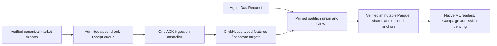

# Shared ACK research data service

Issue [#1256](https://github.com/proerror77/monday/issues/1256) separates reusable
market data from an experiment's seed, model, and budget. `research-data-service`
is a Rust controller CLI for verified incremental ingestion and immutable
numerical views. All payload reads and writes run inside ACK. It does not submit
a Campaign, fit a model, open a sealed holdout, or write a research ledger.

The implemented boundary is:



The existing raw collector verifier and `lob-pit-materializer` still own OSS
discovery, `_SUCCESS`, source/reference verification, point-in-time construction,
and normalized market exports. This CLI does **not** discover raw folders or
infer another normalization policy. The native publication bridge described
below enqueues those existing verified exports. The native coordinator still
needs the explicit background data-plane configuration and its bounded
scheduled invocation before continuous OSS ingestion can be claimed. The
current Campaign native-source-index provenance/admission branch is also
pending; compatible numerical readers alone do not establish Campaign admission.

## Deployment and ownership

The executable requires `MONDAY_ACK_DATA_PLANE=1`. The published `--version`
reports its compiled `MONDAY_SOURCE_REVISION`; `source-unbound` is unsuitable for
production admission. The environment flag is an execution guard, not a signed
grant or an authentication mechanism.

Use one controller Deployment and an ACK block-disk state root, for example
`/work/data-service`. The controller account owns `catalogue`, `claims`, `views`
and `queue-cursor.json`. Advisory locks protect cooperating processes on that
same filesystem; they do not provide cross-node consensus. Agents receive a
request tool and read-only published views, rather than write access to the
state root or raw ClickHouse credentials. No private ledger or signing key is
stored in this data service.

The common invocation is:

```text
research-data-service --state-root /work/data-service \
  --clickhouse-url http://monday-clickhouse.monday-research.svc:8123 \
  --database monday_analytics --user <admitted-role> <command>
```

`CLICKHOUSE_PASSWORD` supplies the role's password and is never printed. The
ingestion role needs bounded insert/read access to `cex_market_datasets`,
`cex_market_feature_frames`, and `cex_market_target_frames`. The ordinary
preparation role reads the feature table and registry; the separately admitted
supervised preparation role also reads targets. The service's HTTP queries set
bounded memory/result settings; configure fixed limits or constrained settings
with a read-only profile that permits those limits (`readonly=2`).

## Canonical ingestion receipts

An admitted `monday.market_ingest_receipt.v1` JSON document contains:

| Field | Contract |
| --- | --- |
| `sequence`, `previous_receipt_sha256` | Contiguous append-only queue position and hash of the preceding canonical JSON receipt; the first receipt is position 1 with a null predecessor. |
| `features` | Relative canonical feature manifest path and independent SHA-256. Only `monday.market_features.v1` source exports are accepted. |
| `targets` | Optional relative target manifest and SHA-256, bound to that exact feature dataset. |
| `source_manifest`, `source_manifest_sha256` | Pinned existing `monday.market_feature_sources.v1` file, original source revision and collector manifest/success-marker identities, source clocks and observed coverage. |
| `transform_sha256` | Coordinator-pinned normalization/schema implementation identity. |
| `allowed_ranges` | Ordered disjoint half-open `{start_ms,end_ms}` ranges admitted by the canonical coordinator. |
| `pre_holdout_supervised` | Explicit target admission; it must be true exactly when targets are present. |

The coordinator that supplies and seals these receipts must validate the actual
research grant and exclude sealed holdout windows. A receipt is not itself a
cryptographic grant. Every ingested feature observation is checked against its
admitted ranges before insertion. Every target observation **and its maturity
clock** must lie in one admitted range before any target write. Inserting a
broader supervised source and relying on a later query filter is rejected.

`ingest --receipt <file> --receipt-sha256 <hash> --artifact-root <mount>` verifies
the source manifest bytes, source-shard SHA-256, actual decoded clocks/counts,
causal availability and canonical recovery timestamp series IDs. Source lines
are rehashed while decoding, so a concurrent source change cannot commit.
Rows are inserted in batches of at most 4,096. Float32 channels and targets are
typed columns; no feature JSON column is used for the numerical training path.

The controller then reads **all actual numeric columns** back with paginated
RowBinary queries. It checks projected row identities, row count, clock order
and an ordered digest over exact integer/Float32/Float64 bits. A stored checksum
alone cannot make a dataset ready. Only after this passes does it insert the
complete registry version, read that registry back independently, and publish
the immutable catalogue entry. Interrupted inserts remain unavailable through
the request API; a retry reinserts identical keys and verifies the complete
content. It never declares partial rows complete.

`drain --queue <file> --queue-sha256 <hash> --artifact-root <mount>
--max-partitions 16` accepts a bounded JSON array of at most 1,024 receipts. It
verifies the full chain and previously committed cursor identity, processes at
most the requested number of new receipts, and atomically advances the cursor
only after each verified catalogue commit. Repeated unchanged drains perform
no source discovery or old-partition materialization. A source repair creates a
new content identity and receipt; it does not overwrite an old ready version.
Queue rollover/recovery requires an explicitly reviewed cursor/queue handoff;
truncation or rewriting is rejected rather than silently resetting progress.
At hourly receipt cadence, the 1,024-entry bound is about 42 days. Automatic
queue rollover is a later controller capability; current operators must retain
and hand off the prior cursor/hash chain before reaching that bound.

## Native publication bridge

`enqueue` accepts the already published native `campaign-inputs.json` and
`materialization-receipt.json`, with independent hashes for each, the published
run root, the global artifact root, and a controller-owned admission document:

```text
research-data-service --state-root /work/data-service enqueue \
  --campaign-inputs <run-root>/receipts/campaign-inputs.json \
  --campaign-inputs-sha256 <pinned-hash> \
  --materialization-receipt <run-root>/receipts/materialization-receipt.json \
  --materialization-receipt-sha256 <pinned-hash> \
  --run-root <run-root> --artifact-root <global-published-output-root> \
  --admission <controller-admission.json> --admission-sha256 <pinned-hash>
```

The admission schema is `monday.market_data_admission.v1`, containing
`transform_sha256`, ordered `allowed_ranges`, and `pre_holdout_supervised`.
Its authority comes from the existing canonical coordinator's grant checks;
the CLI does not invent or bypass a grant. It verifies the paired publication
receipts, immutable image digest, published path ownership, frozen inventory
hash, original PIT snapshot/report identity, and pinned feature/source/target
manifest identities. The bridge does not rerun normalization or scan OSS.

Under the sole controller lock it atomically replaces
`<state-root>/receipt-queue.json`, then independently reads and verifies its
sequence/hash chain. Retry of the same content/admission returns the existing
receipt and queue hash, even when the same immutable objects have another
published locator. A conflicting transform/target/admission fails without
modifying the queue. Consumer run IDs and optimizer parameters are excluded
from the ingestion receipt; the canonical data producer must continue to use
stable partition production rather than reconstructing data per experiment.
`enqueue` returns `queued`, not ready; `drain` performs the actual payload and
ClickHouse verification. A failed publication callback can retry that same
native publication identity without creating a second data partition.

## Fixed Agent DataRequest

`request --request <file> --request-sha256 <hash>` accepts only the
`monday.market_data_request.v1` fields below. Unknown fields, including consumer
experiment IDs and optimizer seeds, are rejected.

| Field | Contract |
| --- | --- |
| `sources` | Up to 512 ordered disjoint `{feature_dataset_sha256,target_dataset_sha256}` partitions. Daily/hourly versions are reusable, so adding a day ingests the new source partition rather than rewriting previous days. |
| `transform_sha256`, `input` | Exact normalization identity and ordered channel/context/cadence specification. Every selected source must agree. |
| `view` | Existing `SequenceViewV1`: history start, decision start, exclusive end, and decision stride. |
| `anchor_end_ms` | Exclusive end of eligible decision anchors. |
| `purpose` | `label_free` or `pre_holdout_supervised`; no sealed-holdout purpose exists. |
| `qualified_anchors` | Whether the immutable training grid should be prepared. Evaluation can retain all frames without creating a training anchor index. |

Label-free requests must omit target identities. They make no target query and
create no target file. Supervised requests must pin a matching admitted target
identity for every source. The source union is ordered and disjoint; duplicate,
overlapping, out-of-order, unrelated and out-of-grant partitions are blocked.
Actual canonical timestamp series IDs are preserved. A gap or series boundary
clears the causal context; the preparer never joins different recovery series.

The canonical request digest is the shared preparation key. A missing source
returns `preparing`; an active owner of the same preparation claim also returns
`preparing`. Invalid admission, corruption, budget excess or incomplete end
coverage returns `blocked`. Only a verified immutable directory returns `ready`.

On first preparation, full source registry/content checks precede bounded view
reads. The service writes typed Parquet shards, independently decodes every
new shard and compares all integer/float bits to the verified query values.
Qualified anchors require a complete causal context on the declared time grid;
supervised anchors additionally require a matching mature target. Anchor counts
remain within the existing 32,768 training limit. The service publishes source
union provenance, actual series/gaps, feature/target manifests, optional anchors,
and a prepared-view digest, then atomically renames the staging directory. No
partially written directory can answer `ready`.

On repeat requests, the controller checks the pinned ready/manifests/anchor
identities and a separate physical cache certification bound to the prepared
view hash. Each block's device, inode, byte size, ctime and mtime must agree.
Unchanged fingerprints need no payload read or database connection. A changed
fingerprint or restored cache acquires one certification owner and requires
full SHA-256 and a complete typed decoding pass before recertification; a
same-size corruption fails. Certification never changes the immutable ready
receipt or dataset identity. These filesystem observations are an optimization
for controller-owned ACK block storage, not cryptographic proof against a
privileged filesystem writer. Agents and training workers must have read-only
access to the immutable blocks. The hot path does not discover OSS, align raw
events, or cut another dataset. Numerical readers also verify the published
shard content during their bounded decoding passes. The Parquet
manifest identities can therefore survive changes in experiment seed, batch
size, or model. Causal windows are constructed in memory in the reader; they
are not expanded into repeated 60-row disk windows.

Control-plane stdout is capped at 256 KiB. A ready response contains row/series/
gap counts, first/last observed coverage, at most 32 gap previews, and the pinned
`prepared-view.json` reference. Full partition/series/gap evidence remains in
the ACK artifact and is retrieved through the artifact protocol, rather than
being copied into workstation logs.

## Resource and evidence limits

Each ClickHouse query has at most 4,096 rows, an 8 MiB response cap and a 256 MiB
query-memory limit. Canonical JSONL frames are capped at 32 KiB and metadata at
16 MiB. Prepared numerical shards and row groups follow
`prepared_market` limits (16 MiB / 4,096 rows). The request union has bounded
partition, coverage, gap and training-anchor metadata, and at most 14 days of
decisions plus the bounded causal-context/label edges. These are application bounds; cgroup memory,
query slots, disk capacity and concurrent preparation slots still need explicit
ACK deployment limits.

Published views are immutable replayable inputs, not optimizer checkpoints.
They grant no training trial, GPU, live runtime, sealed evaluation or trade
authority. The canonical Campaign still owns admission, budget, source/image
binding, settlement and independent result readback. Existing DuckDB remains
the single-owner control/evidence ledger.

An empty ClickHouse service, passing unit test, generated Parquet file or
successful preparation is not a completed scientific experiment. Deployment
acceptance requires real source ingestion and corruption/restart tests, the
real 14-day view's actual gaps/coverage, a repeat ready hit, and measured ACK
read/prepare timings. Keep Issue #1256 open until those runtime receipts and the
upstream incremental scheduling integration pass.

Focused ACK checks:

```text
cargo test --locked -p hft-collector --bin research-data-service data_service_
cargo clippy --locked -p hft-collector --bin research-data-service --no-deps -- -D warnings
```

Source tests cover fixed view identity, cursor-chain rewrites, atomic enqueue
deduplication/admission conflicts, exact RowBinary
float bits/value tampering, pre-holdout maturity, path traversal, line limits,
and ready reuse/cache restoration/same-size corruption without an available
database. Their fixtures are tests only;
they must never substitute for the real cloud ingestion acceptance run.
