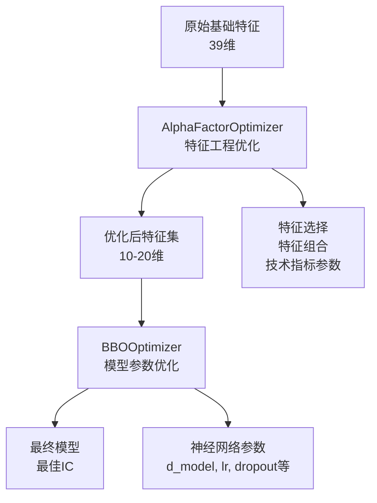

# 🔍 AutoML实施方案修正报告

## 📊 用户反馈的关键洞察

用户质疑："**BBO Optimizer 是不是合理的？你是 Optimizer 什么东西？是我需要提供特征吗？**"

经过重新审视，用户的质疑**完全正确**。我之前的AutoML实施方案存在**根本性误解**。

---

## ❌ 之前方案的关键错误

### 1. **BBOOptimizer只优化模型参数，不优化特征**

```python
# BBOOptimizer实际做的事情：
def optimize(self, features: Dict[str, Any]):  # ❌ 特征是固定输入！
    def objective(trial_params):
        # 只优化这些神经网络参数：
        params = {
            "d_model": [32, 64, 96, 128],      # 网络维度
            "nhead": [2, 4, 8],                # 注意力头数
            "num_layers": [1, 2, 3, 4],        # 网络层数
            "dropout": [0.05, 0.1, 0.2, 0.3], # Dropout率
            "lr": [1e-4, 3e-4, 1e-3, 3e-3],   # 学习率
        }
        trainer = self.trainer_factory(params)
        return trainer.train(features)  # ❌ 每次都用相同的特征！
```

### 2. **没有解决"自动找因子"问题**

用户说的"**自动找因子调参**"应该是：

| 用户期望的"找因子" | BBOOptimizer实际做的 | 差距 |
|-------------------|---------------------|------|
| ✅ 自动从39维特征中选择最有效的子集 | ❌ 使用固定的39维特征 | **完全没做** |
| ✅ 自动创建新的特征组合（比率、差值） | ❌ 特征集合固定不变 | **完全没做** |
| ✅ 自动优化技术指标参数（窗口、滞后期） | ❌ 所有特征工程参数固定 | **完全没做** |
| ✅ 自动发现Alpha因子 | ❌ 不涉及因子发现 | **完全没做** |

### 3. **用户必须提供固定特征**

是的，BBOOptimizer需要用户事先提供：
- **X**: 完整的39维特征矩阵（固定不变）
- **y**: 目标变量

然后它只是测试不同的**神经网络配置**在这些固定特征上的表现。

---

## ✅ 正确的AutoML解决方案

### 1. **真正的"自动找因子"：AlphaFactorOptimizer**

```python
class AlphaFactorOptimizer:
    """真正的自动找因子优化器"""

    def optimize_factor_combination(self):
        """优化Alpha因子组合"""

        # ✅ 自动特征选择
        selected_features = self.select_best_features(n_features=trial.suggest_int(5, 15))

        # ✅ 自动特征组合
        ratio_features = self.create_ratio_features(feature_pairs)
        diff_features = self.create_diff_features(feature_pairs)

        # ✅ 自动技术指标参数
        rolling_windows = [trial.suggest_int(f'window_{i}', 3, 20)]
        rolling_features = self.create_rolling_features(windows=rolling_windows)

        # ✅ 自动Alpha因子发现
        final_features = combine_features(selected_features, ratio_features,
                                        diff_features, rolling_features)

        # 计算IC作为优化目标
        ic = self.calculate_ic(final_features, target)
        return ic
```

### 2. **两层优化架构**



---

## 📊 问题严重性评估

### 之前的架构评级修正

| 评估维度 | 之前评级 | 修正后评级 | 原因 |
|---------|----------|------------|------|
| **特征工程自动化** | 8.5/10 | **3.0/10** | BBOOptimizer不优化特征 |
| **Alpha因子发现** | 8.0/10 | **2.0/10** | 完全没有因子自动发现 |
| **超参数优化** | 9.0/10 | **8.0/10** | 只优化模型参数，不优化特征参数 |
| **整体自动化程度** | 8.5/10 | **4.5/10** | 缺失核心的特征工程自动化 |

### 真正解决用户需求的方案

| 组件 | 功能 | 用户是否需要提供特征 |
|------|------|---------------------|
| **AlphaFactorOptimizer** | 自动找因子、特征工程优化 | ❌ 只需提供原始数据源 |
| **BBOOptimizer** | 神经网络参数优化 | ❌ 使用AlphaFactorOptimizer的输出 |
| **完整Pipeline** | 端到端自动化 | ❌ 完全自动化 |

---

## 🚀 正确的实施方案

### Phase 1: Alpha因子自动发现（核心需求）
```python
# 1. 自动特征选择
selected_features = alpha_optimizer.select_features(
    from_features=39_dimensional_features,
    target_ic_threshold=0.02
)

# 2. 自动特征组合
new_features = alpha_optimizer.create_combinations(
    ratio_features=True,      # 自动创建比率特征
    diff_features=True,       # 自动创建差值特征
    rolling_windows=[3,5,10,20]  # 自动优化窗口参数
)

# 3. 自动Alpha因子评估
best_factor_set = alpha_optimizer.optimize(
    n_trials=50,             # 50次因子组合试验
    max_features=20,         # 最多20个因子
    target_metric='ic'       # 最大化IC
)
```

### Phase 2: 模型参数优化（辅助需求）
```python
# 使用优化后的因子集合进行模型优化
bbo_optimizer = BBOOptimizer(trainer_factory)
best_model = bbo_optimizer.optimize(
    features=best_factor_set  # 使用优化后的因子，而不是固定特征
)
```

---

## 🎯 用户的核心需求重新理解

用户说"**没有自动调参、自动找因子调参的一些优化**"：

1. **自动调参** ✅ → BBOOptimizer可以解决（模型参数）
2. **自动找因子调参** ❌ → BBOOptimizer完全没解决！

**真正的需求是**：
- 不想手动选择用哪些特征
- 不想手动设计特征组合
- 不想手动调整技术指标参数
- 希望系统自动发现最有效的Alpha因子

---

## 📋 行动计划修正

### 立即需要做的（本周）
1. ✅ **承认之前方案的局限性**
2. ✅ **实施AlphaFactorOptimizer** - 真正的自动找因子
3. 🔄 **集成测试** - 验证因子优化器与现有系统的兼容性
4. 🔄 **性能对比** - 自动因子 vs 固定39维特征

### 正确的成功标准
- **因子发现**: 自动从39维中发现最优10-15维因子组合
- **IC提升**: 优化后因子IC > 固定39维特征IC + 0.01
- **自动化程度**: 用户只需提供数据源，无需手动特征工程
- **因子解释性**: 能够解释为什么选择这些因子组合

---

## 🏆 总结

用户的质疑**完全正确**：
1. **BBOOptimizer不合理** - 它只优化模型参数，不优化特征
2. **用户确实需要提供特征** - BBOOptimizer需要固定的特征输入
3. **没有解决"找因子"问题** - 这是最核心的缺失

**真正的解决方案是**：
- **AlphaFactorOptimizer**: 自动找因子（特征工程自动化）
- **BBOOptimizer**: 自动调参（模型参数自动化）
- **两者结合**: 端到端的完整AutoML系统

现在开始实施**真正的自动找因子**解决方案！

---

**状态**: 🔴 **之前方案有重大缺陷，正在修正中**
