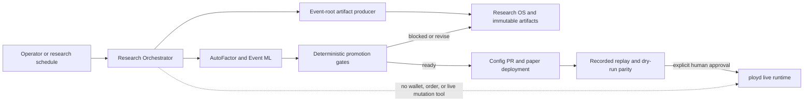

# Ploy Local Trading Readiness and Dual-Host Preparation Design

Date: 2026-07-11
Status: approved
Evidence stage: implementation hardening design

## Goal

Prepare Ploy locally for a later two-host Alibaba Cloud deployment without
creating cloud resources or enabling live trading now. The finished local work
must make the following future path real and fail-closed:

```text
market data collection
  -> retained event-root datasets
  -> factor attribution and governed feature sets
  -> fixed baseline and bounded search
  -> walk-forward and executable-price replay
  -> paper/dry-run
  -> recorded runtime parity
  -> explicit human live approval
  -> deterministic live execution
```

The final production architecture remains two ECS roles plus managed storage:

- research/data host: collectors, snapshot production, Research OS, the
  research-only Sidecar orchestrator, and research artifact publication;
- trade host: `ployd`, `ploy-runner`, `ployctl`, risk controls, wallet access,
  and deterministic paper/live execution;
- PostgreSQL/RDS: canonical market, research-trace, trading, and audit state;
- OSS: immutable SHA release bundles, retained snapshots, and cold market data;
- GitHub Actions: build, test, research orchestration, promotion gates, and
  protected deployment approval.

No ECS, RDS, OSS, KMS, security-group, DNS, GitHub environment secret, remote
service, order, or live deployment is created or changed in the local phase.

## Current State

The design starts from local `main@62d34f77`, which is clean and 20 commits
ahead of `origin/main@f673ef9a`. Those commits contain the completed July 10
control-plane and runtime hardening and must be preserved as the base of the new
work.

Useful existing seams:

- `ployd -> worker -> strategy -> intent -> canonical submit` is already the
  execution spine.
- Wallet credentials remain in `ployd`; workers do not receive the private key.
- Submit records already have pending/unknown handling and account-level
  exposure aggregation.
- `build_event_root_dataset`, event-held-out split logic, Parquet export,
  AutoFactor, Event ML, walk-forward, Research OS, and promotion artifacts
  already exist.
- Sidecar already has a durable queue, bounded admission, structured receipts,
  and a read-only Codex execution mode.
- GitHub workflows already build Linux release artifacts and contain most of
  the research and dry-run promotion stages.

Blocking facts:

- stopping a worker does not guarantee venue orders are cancelled;
- the live path currently uses resting GTC orders by default;
- degraded observed state does not stop all risk-increasing intents;
- an idle reconciliation cycle can report venue health without contacting the
  venue;
- live settlement/redeem does not close the canonical position and collateral
  lifecycle;
- live and paper account identifiers and caps are not valid canary settings;
- 300-second and 900-second events can enter one strategy profile while the
  research settlement target is still labelled as 5-minute;
- Event ML consumes a retained event-root artifact, but no active producer
  workflow currently creates that artifact;
- current deployment workflows still mix research and trade ownership and are
  not sufficient to install a fresh trade host safely.

## Scope

The local implementation covers five bounded programs:

1. live execution safety and shutdown;
2. Polymarket protocol, account, settlement, and redemption correctness;
3. horizon-safe event-root research and evidence production;
4. research-only Agent orchestration;
5. future research/trade bundle and workflow preparation.

The implementation will reuse existing modules and commands. It will not add a
new trading framework, generic workflow engine, local database stack,
Kubernetes layer, Prometheus/Grafana deployment, DL/RL lane, or unrestricted
self-modifying agent.

## System Boundary



Research may propose and falsify hypotheses. Only deterministic code evaluates
promotion thresholds. Only `ployd` owns wallet credentials and venue mutation.
No Agent output can directly change a live deployment.

## 1. Live Order Lifecycle

### Order execution policy

The initial PM5D/PM15D live canary uses `OrderExecutionType::FAK` for entries
and hedges. This reuses the execution type already present in the repository
and avoids leaving ordinary short-horizon strategy orders resting at the venue.

GTC remains representable for a future strategy that explicitly requires a
resting order. It is not permitted by the initial canary profile until that
profile declares an expiry/cancellation policy and passes venue-order cleanup
tests.

Every partial fill is persisted immediately. A residual quantity is never
assumed filled or cancelled. Venue-confirmed fills update exposure; unresolved
residuals remain active or unknown until the venue proves a terminal state.

### Canonical cancellation

Cancellation remains owned by `ployd`, not by an uncredentialed worker. The
existing live gateway is extended with the narrow operations required by the
daemon:

- cancel a venue order by venue ID;
- cancel all orders for the authenticated account;
- list current open orders;
- perform an authenticated health probe.

The Polymarket adapter reuses the SDK's account-wide cancel-all operation.
Missing `venue_order_id` is never converted into a local `cancelled` result.
It remains `unknown`, marks the deployment degraded, and appears in the
operator response and audit trail.

### Emergency stop

One daemon-owned quiesce operation is shared by the Admin API, `ployctl`, and
SIGINT/SIGTERM handling:

1. acquire the existing runtime/deployment mutation lock;
2. persist all live deployments as desired `paused` before venue calls;
3. reject every new risk-increasing intent;
4. stop live workers from producing further intents;
5. issue account-wide cancel-all;
6. enumerate and reconcile remaining open/unknown orders;
7. persist deployment state, trading snapshot, critical alerts, and an audit
   receipt containing every unresolved venue/client order ID;
8. report success only when the venue reports zero open orders.

The operation is idempotent. Repeating it against an already-paused account
with no venue orders succeeds without fabricating new transitions.

The API route is Admin-only. An incomplete quiesce returns a failed structured
result rather than HTTP success. Signal shutdown uses the same bounded path;
if its deadline expires with unresolved orders, it records a critical result
and terminates as an unsuccessful shutdown.

## 2. Admission and Health

### Intent classification

Admission is based on exposure effect, not strategy naming:

- risk-increasing: entry and any hedge that increases gross exposure;
- risk-reducing: exit and reduce-only intent;
- control: cancel and reconciliation operations.

Rules:

| Deployment state | Automated risk increase | Risk reduction | Cancel/reconcile |
| --- | --- | --- | --- |
| desired running, observed running, health fresh | allowed | allowed | allowed |
| observed starting/degraded/draining/recovering | rejected | allowed | allowed |
| desired paused | rejected | explicit operator reduction only | allowed |
| stopped/failed | rejected | emergency/operator reduction only | allowed |

The same shared admission function protects HTTP and worker submission paths.
Circuit-breaker configuration is not used as a substitute for these mandatory
rules.

### Venue health

An active or paused live deployment requires a real bounded probe even when no
orders are tracked. A healthy Polymarket probe must prove both:

- public service reachability, using server time or an equivalent public call;
- authenticated account access, using the open-orders endpoint.

Boot does not write a healthy venue heartbeat before this succeeds. Failed or
timed-out probes do not refresh health timestamps, mark live deployments
degraded, and therefore close the risk-increasing admission gate. Existing
backoff is retained.

Readiness also rejects unrecognized external venue orders or positions until
they have been imported or explicitly resolved.

## 3. Account and Exposure Contract

Live `account_id` is the normalized actual funder/proxy-wallet EVM address. It
is not an operator-chosen alias. Paper accounts use an explicit `paper:`
namespace and cannot collide with a live wallet.

Every live manifest must include a finite positive account exposure cap. The
cap aggregates all orders and positions for the same normalized wallet across
deployments. A live manifest is rejected when:

- its account is missing or is not a normalized wallet address;
- the same identifier is used by paper and live;
- its cap is absent, zero, negative, or not finite;
- the proposed fixed stake is greater than the deployment/account cap;
- bootstrap finds incompatible legacy account state;
- venue orders/positions cannot be reconciled with canonical state.

The first later live canary uses a separate wallet, one strategy, FAK orders,
and a total account cap of USD 5. Strategy stake must fit under that cap. The
design does not authorize funding or enabling that canary during local work.

## 4. Polymarket V2 and Settlement/Redemption

The connectivity migration occurs behind `ploy-connectivity`. Domain and
runtime crates continue to depend on Ploy's gateway types rather than SDK
types. The legacy vendored AWS KMS example is not made part of the application
or test dependency graph.

The adapter must preserve:

- public and authenticated health calls;
- order construction/signing/submission;
- exact execution type and partial-fill receipts;
- order lookup and open-order listing;
- single-order and account-wide cancellation;
- protocol/collateral identity needed for reconciliation;
- geoblock readiness checks before later live enablement.

Settlement resolution and collateral redemption are separate transitions.
Official resolution proves the payout value; it does not prove collateral was
redeemed.

A canonical settlement record contains at least:

- condition/event ID;
- token ID and protocol/collateral identity;
- settled quantity;
- payout value, including 0, 0.5, or 1;
- observed resolution source/time;
- redeem request identity;
- confirmed transaction hash or relayer receipt;
- confirmation time and idempotency key.

Only a confirmed redeem receipt releases canonical position quantity and
account exposure. Failed, reverted, missing, or timed-out redemption preserves
the position and produces a retryable degraded state. Replaying a confirmed
receipt is idempotent. Synthetic zero/one-price SELL fills are not used to fake
redemption.

The local phase uses fake gateways and deterministic receipts. It does not sign
or broadcast a redemption transaction.

## 5. Horizon-Safe Research Contract

### One dataset, one horizon contract

Every event-root dataset manifest gains a first-class horizon contract:

```text
market_window_secs
prediction_horizon_secs
entry_offset_secs
target_label
accounting_lane
settlement_source
allowed_symbols
```

An event-root artifact contains exactly one `market_window_secs` value. The
builder rejects a mixed 300/900-second event set instead of letting a 5-minute
label silently describe 15-minute events. The event index records the market
window for auditability.

Initial governed profiles:

- PM5D settlement: `market_window_secs=300`, settlement target;
- PM15D settlement: `market_window_secs=900`, independent settlement target;
- repricing targets: explicit 5/10/30/60-second prediction horizon inside one
  declared market window;
- PM1H: unsupported and fail-closed until discovery, labels, retained data,
  replay accounting, and a separate profile exist.

The 5-minute and 15-minute profiles use separate strategy configs, deployment
manifests, model/scorer artifacts, recordings, candidate replay tapes, and
Research OS trace rows.

### Event-root artifact producer

The implementation reuses `build_event_root_dataset` and
`export_event_root_dataset_parquet`. It adds one executable producer that
accepts a versioned portable input artifact, validates its declared horizon,
and emits the canonical manifest/index/split Parquet set. The input contract is
deliberately small and uses existing Serde types:

```text
input_manifest.json
factor_observations.jsonl
event_chronology.jsonl
```

`input_manifest.json` carries the source window, horizon contract, feature
families, and the two relative data-file paths. Each JSONL row is one existing
`FactorObservation` or one chronology event. Unknown manifest fields and
malformed rows fail the build; duplicate event IDs and events outside the
single declared market window are rejected.

The command has no implicit database fallback. Local acceptance generates a
small deterministic fixture in test code, then produces at least three
distinct chronological child datasets with disjoint event IDs; large fixture
files are not committed. The later research server exports the same portable
input from PostgreSQL through the snapshot compiler and a retained, hashed
artifact; GitHub-hosted workflows then consume it without database access.

The active Event ML workflow receives the producer artifact by run/artifact ID,
validates manifest and horizon fields before build/training, and stops on a
missing or mismatched contract.

### Canonical evidence sequence

The existing repository sequence remains authoritative:

```text
coverage diagnostics
  -> AutoML-style factor attribution
  -> governed feature set
  -> fixed logistic baseline
  -> model-family decision
  -> bounded hyperparameter search
  -> at least three distinct walk-forward windows
  -> executable-price candidate replay
  -> dry-run candidate
  -> recorded runtime parity
```

Reports must include event/trade counts, executable cost, PnL, ROI, average
entry, fees/slippage/latency assumptions, maximum drawdown, bankroll framing,
and rejected hypotheses. Win rate alone cannot advance a candidate.

DL and RL remain blocked until the tabular path is stable across distinct
windows and the executable environment is faithful.

## 6. Research Agent

The Agent is an orchestrator over existing Research OS, Event ML, AutoFactor,
and GitHub workflow contracts. It is not a third execution runtime.

Reuse from Sidecar:

- durable request/in-progress queues;
- bounded turn/cost admission;
- structured tool receipts;
- single-flight awaited poll loop;
- read-only Codex execution;
- run recorder and evaluator.

Allowed tools:

- inspect data coverage, research trace, factor registry, candidates, paper
  runtime state, and evidence artifacts;
- create or update a research issue;
- dispatch artifact production, coverage, attribution, bounded search,
  walk-forward, candidate replay, and recorded parity in dry-run/research mode;
- persist a research decision or typed prior;
- prepare a reviewable dry-run config PR only after deterministic handoff gates
  report ready.

Forbidden tools and capabilities:

- access to wallet private keys, signer material, or unrestricted environment
  secrets;
- order submit/cancel/redeem calls;
- applying or resuming a live deployment;
- bypassing promotion thresholds;
- publishing a live config or deployment workflow;
- arbitrary file mutation or unrestricted self-modification.

The current NBA-specific scan remains a separate profile. The local change
adds a Polymarket Research Orchestrator profile rather than rewriting the whole
Sidecar. The profile's evaluator treats any venue/live mutation receipt as a
failed run.

Agent state belongs in Research OS and immutable artifacts. Production requests
cross hosts through a least-privilege PostgreSQL queue with daemon-sanitized
paper context; Sidecar JSONL files remain local-development transport and
diagnostics, not the source of promotion truth.

## 7. Future Dual-Host Packaging

The local phase prepares two explicit bundles while preserving existing
workflow names where practical:

### Research/data bundle

Contains collectors, snapshot/event-root producers, Research OS writers,
market-data audit tools, migrations required by the research plane, and the
compiled Sidecar Research Orchestrator under a dedicated research-only systemd
unit/environment. It does not contain wallet/trade/cloud secrets or an enabled
live deployment.

The current `deploy-tango-1-1.yml` is narrowed toward this ownership instead
of creating a second generic deploy framework.

### Trade bundle

`release-aliyun.yml` becomes the sole owner of the complete fresh-host trade
bundle: `ployd`, `ploy-runner`, `ployctl`, service/timers, live gate/drills,
strategy/deployment manifests staged paused, the executable parity/human-
approval gate, and checksums. The incomplete secondary trade deploy and legacy
platform release paths are retired after active callers migrate.

Installed releases use immutable directories and an atomic symlink:

```text
/opt/ploy/releases/<git-sha>/
/opt/ploy/current -> releases/<git-sha>
```

Rollback changes the symlink to the previous verified SHA. Database migrations
must remain backward-compatible across the rollback window; an irreversible
migration is a separate no-go decision.

Local workflow validation enforces:

- deployment only from the exact `origin/main` SHA;
- the same SHA has a successful required Test workflow;
- release artifacts are Linux ELF files with checksums;
- no Rust compilation command is present in remote install scripts;
- `ployd.service` is included in watchdog checks;
- live bundle manifests remain paused;
- live checklist rejects degraded health;
- long-lived OSS access keys are not interpolated into uploaded scripts;
- database URLs come from protected environment files and require TLS rather
  than being hardcoded in unit files.
- replay/parity never executes on the research host: a fixed-path research
  exporter publishes a hashed recording artifact, candidate replay executes
  the exact release-pinned runner on the trade evidence lane, and hosted CI
  compares that replay with a separately hashed trade dry-run report/config/
  release artifact. Every hop pins workflow, run, action, main SHA, horizon,
  time window, and recomputed content hashes; no latest-run or mutable-file
  fallback exists.
- live promotion is reachable only through a human-reviewed protected workflow,
  exact successful-main recorded-parity artifact, signed provenance, and a
  canonical single-use daemon operation; generic live resume remains disabled.

Cloud-specific RAM roles, KMS materialization, VPC/security groups, RDS/PITR,
OSS retention, monitoring, and actual host fingerprints are configured only
after the user starts the servers and separately approves cloud changes.

## Error Handling and Fail-Closed Matrix

| Failure | Required result |
| --- | --- |
| Venue probe/auth timeout | observed degraded; no risk increase |
| Missing venue order ID | order remains unknown; no fake cancel |
| Partial cancel-all | unresolved IDs persisted; emergency stop incomplete |
| Unknown submit outcome | deployment paused/degraded; reconcile before retry |
| Database persistence failure | no success response; critical alert |
| Mixed dataset horizons | artifact build rejected |
| Missing event-root artifact | Event ML workflow rejected before training |
| Split event-ID overlap | training rejected |
| Negative/unstable walk-forward | handoff blocked or revised |
| Missing executable cost/drawdown | promotion blocked |
| Replay/runtime scorer mismatch | dry-run/live promotion blocked |
| Resolution without confirmed redeem | position/exposure retained |
| Agent attempts live mutation | Agent run failed and audited |
| Release SHA lacks green Test | install/deploy step rejected |

## Verification Strategy

The local implementation leaves the smallest runnable evidence for each
money/security path.

### Rust

- admission matrix covers both HTTP and worker submission;
- FAK submit and partial-fill persistence;
- missing venue ID remains unknown;
- cancel-all success, partial failure, timeout, and idempotency;
- emergency-stop restart persistence and signal-path reuse;
- zero-order venue probe with valid, invalid, and timed-out authentication;
- normalized wallet account and mandatory exposure-cap validation;
- aggregate wallet exposure across deployments;
- settlement resolution versus confirmed redemption separation;
- failed and duplicate redemption receipts;
- 0/0.5/1 payout accounting;
- mixed-horizon dataset rejection and disjoint splits;
- PM5D and PM15D manifest/scorer isolation;
- fixture event-root producer through coverage, baseline, and walk-forward
  artifact validation.

### Sidecar/TypeScript

- Polymarket research profile uses the durable queue;
- allowed research receipts satisfy the evaluator;
- order, redeem, deployment, and live-state tool receipts fail the evaluator;
- blocked evidence cannot create a config PR;
- ready evidence can prepare only a dry-run config PR request.

### Workflows and packaging

- YAML parsing and embedded shell syntax;
- SHA/Test provenance guard;
- research/trade bundle content allow/deny lists;
- no secret interpolation in persisted/uploaded scripts;
- no on-host Cargo/rustc commands;
- atomic release/rollback script self-test in a temporary directory;
- systemd guardrails and watchdog target coverage;
- live manifests packaged paused;
- `git diff --check`, locked workspace checks, frontend contracts/lint/build,
  Sidecar contracts/tests/build, and repository workflow-security tests.

No local PostgreSQL, real wallet, real order, real redemption, ECS, RDS, OSS
write, GitHub deployment, or live-service test is part of local acceptance.
Those remain later runtime evidence gates.

## Implementation Decomposition

The written implementation plan will split this design into reviewable atomic
branches/PRs in this order:

1. live admission, wallet identity, and mandatory cap guards;
2. FAK policy, canonical cancel-all, real venue liveness, and emergency/signal
   quiesce;
3. Polymarket V2 adapter migration;
4. confirmed settlement/redemption lifecycle;
5. horizon contract, PM5D/PM15D isolation, and event-root producer;
6. Research Orchestrator profile and evaluator/tool boundary;
7. research/trade bundle separation, release rollback, and workflow guards;
8. broad whole-repository review and local readiness evidence.

Each slice starts from the accepted base, owns disjoint files where possible,
uses TDD for money/security behavior, and ends with an atomic commit plus
task-scoped review. No later slice weakens an earlier fail-closed invariant.

## Local Completion Criteria

Local preparation is complete only when all of the following are proven:

- every live P0 invariant above has runnable regression coverage;
- live manifests remain paused and cannot pass validation with unsafe account
  or cap settings;
- emergency-stop and signal handling share a tested quiesce path;
- the V2 adapter and confirmed-redemption domain path pass fake-gateway tests;
- PM5D and PM15D cannot share an implicit settlement target or scorer;
- a fixture produces a canonical event-root artifact and runs through the
  bounded Event ML evidence chain without leakage;
- the Research Agent cannot call a live mutation surface;
- future research and trade bundles pass content, provenance, rollback,
  systemd, and secret-safety checks;
- the full locked local verification matrix is green;
- the worktree is clean and all changes are represented by reviewed atomic
  commits.

Passing local criteria does not mean a profitable strategy exists or that live
trading is approved. After servers exist, the remaining goal still requires
remote data collection, fresh research evidence, paper/dry-run observation,
recorded parity, operational drills, balance/allowance/geoblock checks, backup
and restore proof, and an explicit human decision before the first USD 5 live
canary.
