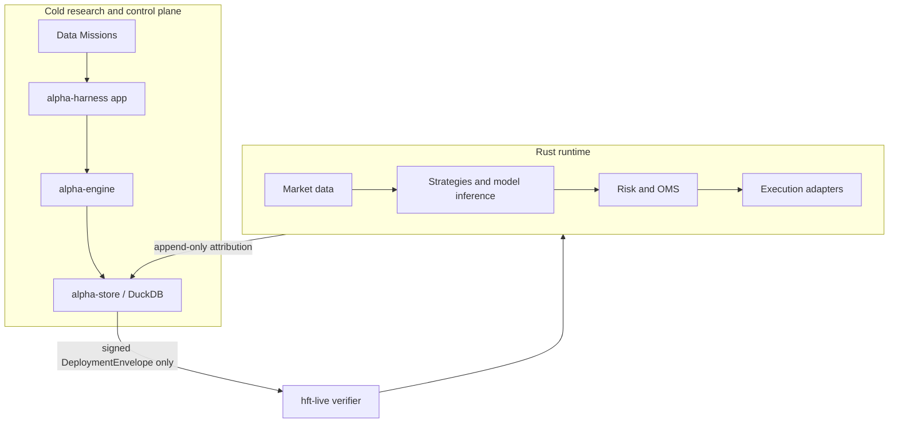

# Rust Trading Architecture
## Ownership Boundaries

### Research Plane

- `alpha-harness/domain`: mission, candidate, learning, approval, and signed deployment contracts.
- `alpha-harness/store`: DuckDB migrations and append-only control-plane repositories.
- `alpha-harness/engine`: resumable AutoResearch kernel, search engines, causal evaluation, LLM client, and learning coordinator.
- `alpha-harness/app`: structured CLI for data, missions, candidates, holdout evaluation, promotion, approvals, policies, feedback, and signing.
- `tools/collector`: exchange connector ownership and governed public Data Missions.

The research plane has no dependency on execution adapters and exposes no order or trade command.

### Runtime Plane

- `market-core`: event, engine, and runtime construction.
- `data-pipelines`: venue market-data adapters and replay.
- `strategy-framework`: deterministic strategies and ONNX inference.
- `risk-control`: risk checks, OMS, portfolio state, and sentinel controls.
- `execution-gateway`: venue-specific execution adapters.
- `apps/live`: runtime startup, signed envelope intake, nonce ledger, audit, and feedback output.

## Data and Time

Every research event must preserve event, exchange, receive, available, and ingestion time. Labels are evaluated at their availability time. Dataset artifacts are content addressed and quality-gated; a failed real acquisition writes failure evidence and never falls back to synthetic data.

## Evaluation and Promotion

1. Engines propose bounded typed artifacts.
2. The factor DSL evaluator uses causal operators.
3. Purged walk-forward folds include fees, funding, latency, and turnover.
4. Resume replays historical observations and rejects duplicate artifacts.
5. Only a walk-forward Keep candidate can access the sealed holdout.
6. Promotion and deployment are separate records.
7. Runtime rechecks the signed envelope against current policy.
8. Paper/shadow results return as immutable attribution events.

No passing result or candidate count is fabricated. Budget exhaustion is a valid terminal mission result.

## Deployment Safety

The runtime owns trusted public keys, config/risk hashes, policy caps, nonce ledger, and audit log. The sequence is verification, pre-activation audit fsync, nonce fsync, runtime adapter, then activation attribution.

Paper forces venue `Paper`. Shadow forces `quotes_only`. Live-small currently fails closed because max order size and slippage are not yet enforced universally in every execution path.

## Storage

- DuckDB: missions, lineage, registries, approvals, feedback, policy revisions, and memory.
- Trace/Parquet: raw and large derived research datasets.
- ClickHouse: optional real-time analytics, not control-plane truth.
- Runtime files: trusted keys, nonce ledger, audit, and feedback; these are not stored in AlphaStore.

## Build Discipline

Use focused package commands. The default workspace members remain execution-oriented; alpha harness crates are explicit workspace members but not default members.
