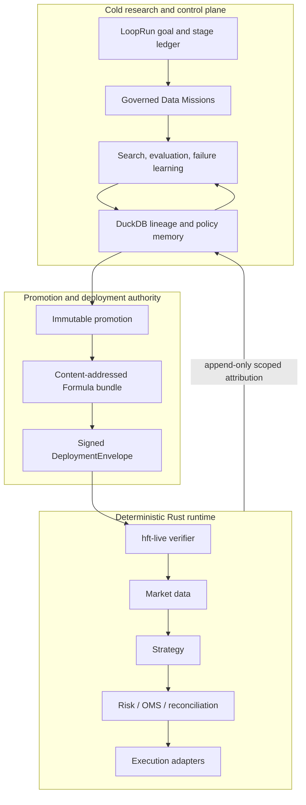

# Rust Loop Engineer Architecture

## Trust Domains

| Domain | Owns | Must not own |
| --- | --- | --- |
| Research | Goals, datasets, hypotheses, candidates, evaluation, failure evidence, learning directives | Credentials, orders, runtime resume, hard risk increases |
| Governance | Promotion records, approvals, bundle/envelope binding and signing | Market connectivity or direct execution |
| Runtime | Trusted keys, policy caps, nonce/audit state, account truth, risk, OMS, cancel, reconciliation, execution | LLM-driven decisions or unverified artifacts |

## Durable Packages

- `alpha-harness/domain`: mission, LoopRun, candidate, evaluation, learning, approval, bundle, and signed deployment contracts.
- `alpha-harness/store`: DuckDB migrations and append-only control-plane repositories.
- `alpha-harness/engine`: resumable search kernel, GP/MCTS/Bayesian engines, causal evaluator, bounded LLM client, offline-RL lab engine, and learning coordinator.
- `alpha-harness/app`: structured CLI for data, loops, missions, evaluation, promotion, approvals, policies, feedback, and signing.
- `tools/collector`: streaming connectors plus governed public Binance OHLCV acquisition.
- `market-core` and `data-pipelines`: events, runtime construction, venue market data, and replay.
  The live quote/depth/recovery contract is defined in
  [`docs/architecture/MARKET_DATA_HOT_PATH.md`](docs/architecture/MARKET_DATA_HOT_PATH.md).
- `strategy-framework`: deterministic Formula strategies and ONNX runtime compatibility.
- `risk-control`: risk checks, OMS, portfolio accounting, reconciliation policy, and sentinel controls.
- `execution-gateway`: venue-specific execution adapters.
- `apps/live`: signed envelope intake, runtime startup, nonce ledger, audit, and attribution output.

The research crates do not depend on execution adapters and expose no order, cancel, wallet, or transaction command.

## Multi-Venue And Market-Family Modules

Monday is one trading system. Venue variation lives behind the market-data and
execution interfaces, with one Adapter per exchange. The existing Binance,
Polymarket, OKX, Hyperliquid, and other Adapters share the same runtime-owned
risk, OMS, reconciliation, cancellation, and execution authority.

Prediction markets are a market-family module at `prediction-markets`, not a
parallel product or execution stack. That module owns event-settlement datasets,
probability evaluation, replay, research, and operator views. Polymarket-specific
connectivity stays in the canonical data and execution Adapter directories.
Imported paper/runtime contracts inside the module are transitional migration
debt, not production authority; they may only shrink until canonical Monday
interfaces replace them.
Continuous-contract and event-settlement research keep different evaluator
implementations because their labels and evidence differ, while sharing Monday's
governance and runtime interfaces.

The nested Rust 1.91 workspace under `prediction-markets` is a transitional build
seam for the imported PLOY code. Existing `ploy-*` names remain compatibility
identifiers only; new core capabilities must be placed in the canonical Monday
module that owns them. See `../docs/architecture/PREDICTION_MARKETS.md` and
`../docs/architecture/REPOSITORY_LAYOUT.md`.

## Bounded Loop

A `LoopRun` advances only through persisted evidence:

1. `Researching`
2. `WalkForwardKept`
3. `HoldoutPassed`
4. `PaperHealthy`
5. `ShadowHealthy`
6. `LiveSmallEligible`

The declared target stage, not candidate count, determines success. Awaiting evidence pauses the run; budget exhaustion, mission failure, and policy completion are distinct terminal reasons. Exact MCTS/Bayesian state, observations, iterations, and hashes are checkpointed so resume does not restart a different search.

Repeated failures may create one idempotent follow-up mission. A learning directive can alter only a future lab search policy after deterministic validation. It cannot alter a runtime hard cap or authorize capital.

This is a durable goal/evidence loop. Cron, Kubernetes Jobs, or event consumers may invoke it, but scheduling is not itself evidence and does not bypass any stage.

## Data And Time

Governed research rows preserve exchange event time, receive time, availability time, and ingestion time. Historical candle availability is strictly after candle close. Dataset artifacts are content-addressed and their exact manifest must match an immutable DuckDB registry revision before mission execution or sealed evaluation.

The Binance OHLCV v2 acquisition path rejects open/partial candles, duplicates, gaps, stale windows, non-finite values, invalid OHLC relationships, non-positive prices, negative volume, time-bound violations, identity mismatch, row-count mismatch, and artifact hash mismatch. A failed real acquisition writes failure evidence and never falls back to synthetic data.

Streaming connector availability is a runtime capability, not proof that the same source is supported by the governed research loader.

## Evaluation And Promotion

- Formula signals use causal operators and an explicit zero position for zero signal. Proposal engines receive label-free metadata rather than evaluation rows.
- Purged walk-forward and sealed-holdout v3 evidence evaluates raw factor values before position mapping with time-series IC, RankIC, ICIR, RankICIR, and positive-IC ratio.
- Trading evidence then persists per-fold and aggregate rows, trades, post-cost return, drawdown, per-observation net Sharpe, raw score, adjusted score, config, and failure reasons.
- Mission policy pre-registers the multiple-testing family; the evaluator applies a Gaussian expected-maximum haircut without claiming full DSR or PBO.
- Domain and store layers recompute evidence, evaluator config/metrics hashes, candidate binding, and bundle hash before promotion.
- Only a canonical Formula v3 candidate with predictive and trading gates can be promoted by the current producer.
- Offline RL remains lab-only and is blocked from holdout and promotion.
- ONNX remains runtime schema compatibility only until point-in-time training lineage and a governed model evaluator are implemented.

No passing result, candidate count, or profitability claim is fabricated. DuckDB replay proves plumbing and lineage, not alpha.

## Deployment Safety

The runtime verifies current config/risk hashes, account, venue, instruments, intent types, limits, validity window, envelope signature, runtime-owned approval evidence, and durable nonce before preparing activation. The order is pre-activation audit fsync, nonce reservation/fsync, runtime construction, then signed activation attribution.

Paper forces paper execution. Shadow also uses simulated Paper execution, but emits Shadow-scoped attribution so fills and portfolio health are measurable without sending a real venue order. `LiveSmall` remains disabled even when eligibility evidence exists; a human approval cannot bypass missing real-venue acceptance tests.

Runtime accounting uses exact decimals and covers long/short increases, partial closes, full closes, and position crossing. Unknown balance, position, open-order, sequence, or reconciliation state halts live execution. Emergency mode rejects new intents and cancels locally open orders; universal reduce-only flattening is not claimed.

## Storage

- DuckDB: goals, missions, lineage, registries, evaluations, approvals, feedback, policy revisions, and memory.
- Trace/Parquet: raw and large derived research datasets.
- ClickHouse: optional streaming analytics, not control-plane truth.
- Runtime-owned files: deployment trusted keys, approval policy, feedback signing key, nonce ledger, audit log, and signed attribution feedback.

## Build Discipline

Use package-scoped development checks. The default workspace members remain execution-oriented; alpha crates are explicit members but are not default members. Run release feature graphs, production image builds, and Kubernetes validation only at release gates.
