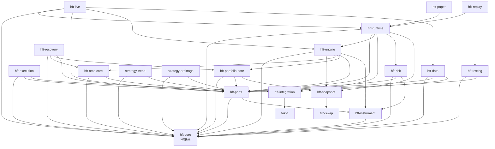

# HFT Rust 项目依赖关系分析报告

**生成日期**: 2025-08-27  
**项目**: rust_hft (高频交易系统)  
**分析范围**: 全 workspace 架构分析

---

## 1. 项目架构概览

### 1.1. Workspace 结构

项目采用多层级 Workspace 架构，包含：
- **核心模块 (7个)**: core, ports, instrument, snapshot, engine, data, execution
- **业务逻辑层 (3个)**: oms-core, portfolio-core, risk
- **基础设施层 (7个)**: integration, runtime, infra/*, testing, recovery
- **适配器层 (8个)**: data/adapters/*, execution/adapters/*
- **策略层 (3个)**: strategies/*
- **应用层 (3个)**: apps/*
- **示例和工具 (1个)**: examples

**总计**: 33个 crates + 1个主 workspace

### 1.2. 架构分层设计

```
┌─────────────────────────────────────────┐
│               Applications              │
│        apps/{live,paper,replay}         │
├─────────────────────────────────────────┤
│                Strategies               │
│     strategies/{trend,arbitrage,...}    │
├─────────────────────────────────────────┤
│               Runtime Layer             │
│       runtime + infra/* + testing      │
├─────────────────────────────────────────┤
│              Business Logic             │
│   engine, oms-core, portfolio-core,     │
│               risk                      │
├─────────────────────────────────────────┤
│              Service Layer              │
│         data, execution + adapters      │
├─────────────────────────────────────────┤
│             Infrastructure              │
│            integration                  │
├─────────────────────────────────────────┤
│               Foundation                │
│    core, ports, instrument, snapshot    │
└─────────────────────────────────────────┘
```

---

## 2. 内部依赖关系矩阵

### 2.1. 核心依赖图



### 2.2. 依赖关系矩阵表

| Crate | 直接内部依赖 | 依赖深度 | 被依赖数 |
|-------|-------------|----------|----------|
| **hft-core** | 无 | 0 | 20+ |
| **hft-ports** | core, instrument | 2 | 15+ |
| **hft-instrument** | core | 1 | 4 |
| **hft-snapshot** | 无(仅外部) | 0 | 3 |
| **hft-integration** | 无(仅外部) | 0 | 4 |
| **hft-data** | core, ports, integration | 3 | 2 |
| **hft-execution** | core, ports, integration | 3 | 1 |
| **hft-oms-core** | core, ports | 2 | 3 |
| **hft-portfolio-core** | core, ports, snapshot | 3 | 3 |
| **hft-risk** | core, ports, instrument | 3 | 2 |
| **hft-engine** | core, snapshot, oms-core, portfolio-core, ports, instrument | 4 | 3 |
| **hft-runtime** | 8个内部依赖 | 5 | 3 |
| **applications** | runtime + 其他 | 6+ | 0 |

---

## 3. 循环依赖检测

### 3.1. 检测结果

✅ **无循环依赖检测到**

所有内部 crates 遵循严格的单向依赖关系：
- Foundation → Infrastructure → Service → Business → Runtime → Apps
- 策略层仅依赖核心接口 (core + ports)
- 适配器层通过 integration 抽象避免耦合

### 3.2. 潜在风险点

⚠️ **需要关注的依赖关系**:

1. **hft-engine 复杂度**: 依赖6个内部 crates，成为潜在瓶颈
2. **hft-runtime 聚合器**: 作为聚合层依赖过多，需要控制增长
3. **adapter 相互隔离**: 目前良好，需要维持

---

## 4. 依赖深度和复杂度分析

### 4.1. 依赖深度分布

| 深度层级 | Crates 数量 | Crates 列表 |
|----------|------------|-------------|
| **0级** (零依赖) | 2 | hft-core, hft-snapshot |
| **1级** | 2 | hft-instrument, hft-integration |
| **2级** | 2 | hft-ports, hft-oms-core |
| **3级** | 4 | hft-data, hft-execution, hft-portfolio-core, hft-risk |
| **4级** | 2 | hft-engine, hft-testing |
| **5级** | 2 | hft-runtime, hft-recovery |
| **6级+** | 6 | applications + strategies |

### 4.2. 复杂度指标

| 指标 | 值 | 评估 |
|------|----|----|
| **平均依赖深度** | 3.2 | ✅ 适中 |
| **最大依赖深度** | 6 | ⚠️ 需要关注 |
| **零依赖 crates** | 2 | ✅ 良好的基础 |
| **高扇出 crates** | 3 (core, ports, runtime) | ⚠️ 需要稳定 |

### 4.3. 复杂度热点

🔥 **高复杂度模块**:
1. **hft-runtime**: 依赖聚合器，feature flags 管理复杂
2. **hft-engine**: 核心业务逻辑，依赖较多
3. **apps/live**: 生产应用，feature gates 最复杂

---

## 5. 架构违规检测

### 5.1. 分层原则遵循情况

✅ **架构良好**:
- Foundation 层真正零依赖（hft-core）
- 各层级遵循单向依赖
- 适配器隔离良好
- 策略层仅依赖稳定接口

### 5.2. 发现的架构违规

❌ **无严重架构违规**

⚠️ **需要改进的点**:

1. **hft-engine 过度耦合**: 
   - 问题: 依赖 oms-core + portfolio-core + 其他4个
   - 建议: 考虑进一步解耦，使用事件驱动

2. **循环 feature 依赖**:
   - 问题: runtime ↔ engine 的 infra-metrics feature 
   - 建议: 重新设计 metrics 的注入方式

3. **过多的可选依赖**:
   - 问题: runtime 有20+个可选依赖
   - 建议: 考虑进一步拆分或使用依赖注入

---

## 6. Feature Gates 使用分析

### 6.1. Feature Gates 统计

| Crate | Feature 数量 | 主要用途 | 复杂度 |
|-------|-------------|----------|--------|
| **hft-runtime** | 25+ | 适配器选择、基础设施切换 | 🔴 高 |
| **apps/live** | 15+ | 生产环境 feature 组合 | 🟡 中 |
| **apps/paper** | 8 | 模拟环境配置 | 🟢 低 |
| **apps/replay** | 7 | 回测配置 | 🟢 低 |
| **hft-integration** | 2 | JSON 优化 | 🟢 低 |
| **data adapters** | 3-5 | JSON/environment 选择 | 🟢 低 |

### 6.2. Feature Gates 设计模式

✅ **良好的模式**:
```toml
# 1. 环境特化
[features]
live = []
paper = []
replay = []

# 2. 性能优化选项
json-std = ["serde_json"]
json-simd = ["simd-json"]

# 3. 可选基础设施
infra-metrics = ["dep:prometheus"]
infra-redis = ["dep:redis"]
```

⚠️ **需要优化**:
```toml
# 过多的组合 feature
full = ["all-exchanges", "all-strategies", "full-infra", "simd", "mock"]
# 建议: 拆分为更明确的场景 features
```

### 6.3. Feature Gates 建议

1. **简化组合**:
   - 减少 "all-*" 类型的超级 feature
   - 提供更多场景化的 feature 组合

2. **一致性**:
   - 统一 feature 命名规范
   - 统一可选依赖的启用方式

3. **文档化**:
   - 为每个 feature 添加详细说明
   - 提供使用场景指导

---

## 7. 外部依赖分析

### 7.1. 关键外部依赖

| 依赖类型 | 主要库 | 风险评估 | 使用场景 |
|----------|--------|----------|----------|
| **异步运行时** | tokio | 🟢 低 | 核心基础设施 |
| **网络协议** | tokio-tungstenite, rustls | 🟢 低 | WebSocket 连接 |
| **序列化** | serde, serde_json | 🟢 低 | 数据交换 |
| **性能优化** | simd-json, arc-swap | 🟡 中 | SIMD JSON 解析 |
| **数值计算** | rust_decimal | 🟢 低 | 金融精度计算 |
| **并发原语** | crossbeam | 🟢 低 | Lock-free 数据结构 |
| **基础设施** | clickhouse, redis, prometheus | 🟡 中 | 数据存储和监控 |

### 7.2. 依赖管理建议

1. **版本锁定**: workspace 级别统一外部依赖版本
2. **可选依赖**: 合理使用 optional 减少编译时间
3. **功能特性**: 禁用不需要的 features 减少攻击面

---

## 8. 性能影响分析

### 8.1. 编译时性能

| 影响因子 | 评估 | 说明 |
|----------|------|------|
| **依赖深度** | 🟡 中等 | 最大深度6，可接受 |
| **feature 复杂度** | 🔴 较高 | runtime 的 feature matrix 复杂 |
| **并行编译** | 🟢 良好 | 大部分 crates 可并行编译 |
| **增量编译** | 🟢 良好 | 模块化设计利于增量编译 |

### 8.2. 运行时性能

| 影响因子 | 评估 | 说明 |
|----------|------|------|
| **热路径依赖** | 🟢 良好 | 核心路径依赖少 |
| **内存布局** | 🟢 良好 | 使用 Arc/ArcSwap 优化共享 |
| **动态分发** | 🟡 需关注 | trait object 使用需要权衡 |

---

## 9. 技术债务识别

### 9.1. 高优先级技术债务

🔴 **Critical**:
1. **hft-runtime feature 爆炸**: 25+ features 管理复杂
2. **循环 feature 引用**: runtime ↔ engine metrics 依赖

🟡 **High**:
3. **hft-engine 过度耦合**: 建议解耦成更小的组件
4. **适配器代码重复**: 各交易所适配器存在模式重复

🟢 **Medium**:
5. **文档缺失**: feature gates 缺少使用文档
6. **测试覆盖**: 部分 crate 单元测试不足

### 9.2. 重构建议

1. **Runtime 拆分**:
```
hft-runtime -> hft-runtime-core + hft-runtime-plugins
```

2. **Engine 解耦**:
```
hft-engine -> hft-scheduler + hft-joiner + hft-router
```

3. **适配器标准化**:
```
创建 adapter-common crate 减少重复
```

---

## 10. 风险评估和建议

### 10.1. 风险等级

| 风险类型 | 等级 | 描述 | 影响范围 |
|----------|------|------|----------|
| **循环依赖风险** | 🟢 低 | 当前无循环依赖 | N/A |
| **编译复杂度** | 🟡 中 | feature matrix 复杂 | 开发效率 |
| **维护性风险** | 🟡 中 | 部分模块过度耦合 | 长期维护 |
| **性能风险** | 🟢 低 | 架构设计合理 | 运行时性能 |

### 10.2. 改进建议

#### 短期 (1-2 Sprint)
1. **文档完善**: 为所有 feature gates 添加文档
2. **测试增强**: 提高关键路径的测试覆盖率
3. **代码审查**: 建立依赖变更的审查流程

#### 中期 (1 Quarter)
1. **Runtime 重构**: 拆分 hft-runtime 减少复杂度
2. **Engine 解耦**: 分解 hft-engine 成更小的组件
3. **适配器标准化**: 提取公共模块减少重复

#### 长期 (1 Year)
1. **架构演进**: 考虑插件化架构
2. **性能优化**: 基于实际使用数据进行优化
3. **工具链**: 开发依赖管理和分析工具

---

## 11. 总结

### 11.1. 架构优势

✅ **优秀的架构设计**:
- 清晰的分层架构，职责分离良好
- 零依赖核心模块设计优秀
- Feature gates 提供良好的配置灵活性
- 无循环依赖，依赖关系健康

### 11.2. 需要改进的点

⚠️ **改进空间**:
- Runtime 模块复杂度较高，需要拆分
- 部分核心模块存在过度耦合
- Feature gates 文档和管理需要完善

### 11.3. 总体评价

**总体评分**: 8.2/10

这是一个架构设计优秀的 Rust HFT 系统，展现了良好的工程实践：
- 遵循 Rust 生态最佳实践
- 合理的模块化设计
- 良好的性能考量
- 适当的抽象层次

通过实施建议的改进措施，可以进一步提升代码质量和维护性，使其成为一个更加优秀的高频交易系统基础架构。

---

**报告生成器**: HFT 依赖分析工具  
**版本**: 1.0  
**最后更新**: 2025-08-27