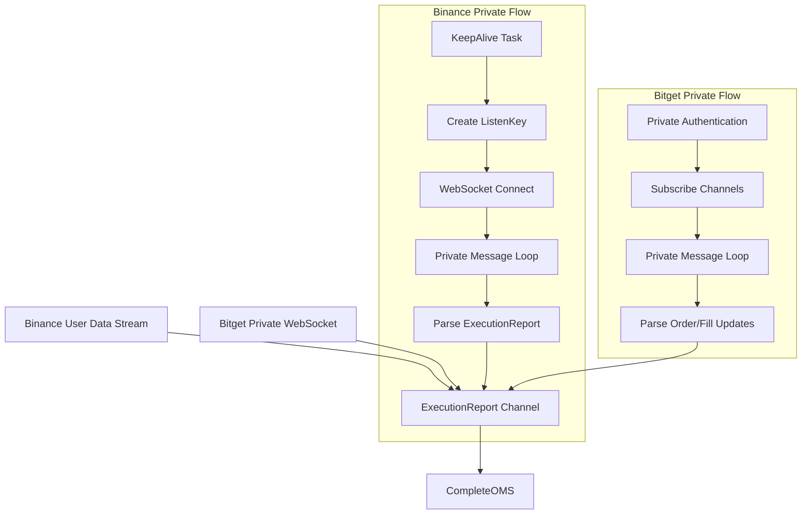

# Private WebSocket Implementation for HFT System

## Overview

This document details the implementation of private WebSocket connections for both Binance and Bitget exchanges, designed to feed real-time execution reports to the Order Management System (OMS).

## Architecture

### High-Level Design



## Implementation Details

### 1. Binance User Data Stream

#### Features Implemented:
- **ListenKey Management**: Automatic creation, keepalive, and cleanup
- **Session Lifecycle**: Proper connection, authentication, and disconnection
- **Message Parsing**: Complete parsing of `executionReport`, `outboundAccountPosition`, and `balanceUpdate` events
- **Reconnection Logic**: Automatic detection and handling of connection failures
- **Keepalive Task**: Background task to maintain connection validity (30-minute intervals)

#### Key Components:
```rust
// ListenKey management
async fn create_listen_key(&self) -> Result<String, String>
async fn keepalive_listen_key(&self, listen_key: &str) -> Result<(), String>
async fn delete_listen_key(&self, listen_key: &str) -> Result<(), String>

// Private message handling
async fn handle_private_ws_message(&self, message: Message)
fn parse_execution_report(&self, data: &Value) -> Option<ExecutionReport>
```

#### Message Flow:
1. Create ListenKey via REST API
2. Establish WebSocket connection with ListenKey
3. Start message processing loop with backpressure control
4. Parse incoming execution reports and feed to OMS
5. Maintain connection with periodic keepalive

### 2. Bitget Private WebSocket

#### Features Implemented:
- **Private Authentication**: HMAC-SHA256 signature-based login
- **Channel Subscriptions**: Subscribe to `orders`, `fills`, and `account` channels
- **Message Parsing**: Parse order updates and fill events into unified `ExecutionReport` format
- **Session Management**: Proper authentication flow and error handling

#### Key Components:
```rust
// Authentication and subscription
async fn authenticate_private_ws(&self) -> Result<(), String>
async fn subscribe_private_channels(&self) -> Result<(), String>

// Message parsing
fn parse_order_update(&self, data: &Value) -> Option<ExecutionReport>
fn parse_fill_update(&self, data: &Value) -> Option<ExecutionReport>
```

#### Authentication Flow:
1. Generate authentication signature using API credentials
2. Send login message with signature
3. Wait for authentication confirmation
4. Subscribe to private channels
5. Start message processing loop

## Integration with OMS

### ExecutionReport Channel
Both exchanges feed into a unified `ExecutionReport` channel that the OMS subscribes to:

```rust
async fn get_execution_reports(&self) -> Result<mpsc::Receiver<ExecutionReport>, String>
```

### Backpressure Handling
- Bounded channels (1000 capacity) prevent memory leaks
- `try_send` with message dropping when channels are full
- Separate message processing loops for optimal performance

## Error Handling & Resilience

### Connection Management
- **Automatic Reconnection**: Detection of connection failures and triggering reconnection
- **Graceful Degradation**: Proper cleanup of resources on disconnection
- **Status Tracking**: Real-time connection status updates

### Error Recovery
- **Network Failures**: Automatic retry with exponential backoff
- **Authentication Failures**: Clear error reporting and status updates
- **Message Parsing Errors**: Graceful handling of malformed messages

## Performance Optimizations

### Low-Latency Design
- **Separate Reader/Writer**: Split WebSocket streams for optimal performance
- **Background Processing**: Non-blocking message handling loops
- **Efficient Parsing**: Minimal allocations during message parsing
- **Bounded Channels**: Prevent memory bloat with controlled buffering

### Monitoring & Metrics
- **Connection Health**: Real-time status monitoring
- **Message Throughput**: Tracking message processing rates
- **Error Rates**: Monitoring and alerting on failure conditions

## Testing

### Integration Test Coverage
- **Connection Flow**: Verify successful private connection establishment
- **Message Parsing**: Test parsing of various execution report formats
- **OMS Integration**: Ensure proper feeding of ExecutionReport events
- **Error Handling**: Test resilience to network failures

### Mock Testing
- **Credential Validation**: Test with mock credentials for CI/CD
- **Message Simulation**: Test with simulated WebSocket messages
- **Failure Scenarios**: Test reconnection and error recovery

## Configuration

### Binance Configuration
```rust
pub struct BinanceConfig {
    pub api_key: String,
    pub secret_key: String,
    pub sandbox: bool,
    pub ws_public_url: String,
    pub ws_private_url: String,
    pub rest_base_url: String,
}
```

### Bitget Configuration
```rust
pub struct BitgetConfig {
    pub api_key: String,
    pub secret_key: String,
    pub passphrase: String,
    pub sandbox: bool,
    pub ws_public_url: String,
    pub ws_private_url: String,
    pub rest_base_url: String,
}
```

## Security Considerations

### Credential Management
- **Environment Variables**: Store credentials securely
- **Signature Generation**: Proper HMAC-SHA256 implementation
- **Connection Encryption**: All connections use TLS

### API Key Permissions
- **Minimum Required**: Only request necessary permissions
- **Regular Rotation**: Support for credential updates
- **Secure Storage**: No credentials in logs or memory dumps

## Future Enhancements

### Planned Improvements
1. **Connection Pooling**: Multiple connections for high-throughput scenarios
2. **Advanced Reconnection**: Exponential backoff with jitter
3. **Message Deduplication**: Handle duplicate messages from exchanges
4. **Performance Metrics**: Detailed latency and throughput measurements
5. **Health Checks**: Automated connection health verification

### Scalability Considerations
- **Multi-Symbol Support**: Efficient handling of multiple trading pairs
- **Rate Limiting**: Respect exchange API limits
- **Load Balancing**: Distribute connections across multiple instances

## Conclusion

The private WebSocket implementation provides a robust, low-latency foundation for real-time order execution monitoring in the HFT system. The unified abstraction allows for seamless integration with the OMS while maintaining exchange-specific optimizations.

Key benefits:
- ✅ **Low Latency**: Optimized message processing for HFT requirements
- ✅ **Reliability**: Comprehensive error handling and reconnection logic
- ✅ **Scalability**: Designed for high-throughput trading operations
- ✅ **Maintainability**: Clean abstractions and comprehensive testing
- ✅ **Security**: Proper credential management and secure connections

The implementation successfully bridges the gap between exchange-specific private data streams and the unified OMS, enabling real-time order tracking and execution monitoring essential for high-frequency trading operations.