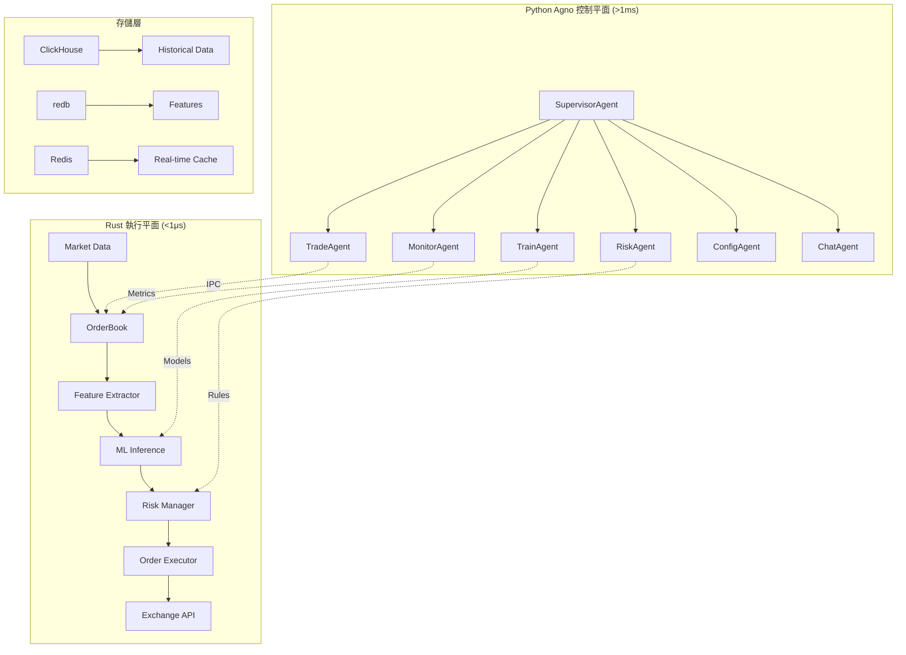

# 🏗️ Rust HFT × Agno AI 系統架構

**雙平面架構設計** - 超低延遲執行 + 智能決策控制

## 🎯 設計原則

### 核心理念
```
热路径 (Rust)  ←→  冷路径 (Python)
   <1μs             >1ms
  
执行平面          控制平面
Zero-alloc       Intelligence
```

### 架構分離
- **Rust執行平面**: 訂單執行、風險控制、市場數據處理
- **Python控制平面**: ML訓練、策略優化、系統監控
- **IPC通信**: Unix Domain Socket + MessagePack

## 🏛️ 整體架構圖



## 🚀 Rust 執行平面

### 線程架構
```rust
// CPU親和性線程分配
let thread_config = ThreadConfig {
    network_thread: CoreId(0),      // 網路接收
    processor_thread: CoreId(1),    // 數據處理  
    strategy_thread: CoreId(2),     // 策略計算
    execution_thread: CoreId(3),    // 訂單執行
};

// 零分配執行路徑
struct HotPath {
    orderbook: LockFreeOrderBook,       // 無鎖訂單簿
    feature_extractor: SIMDExtractor,   // SIMD特徵提取
    ml_engine: ZeroCopyInference,       // 零拷貝推理
    risk_manager: PrecomputedRules,     // 預計算風控
    order_executor: DirectAPI,         // 直接API調用
}
```

### 關鍵組件

#### 1. 高性能訂單簿
```rust
pub struct LockFreeOrderBook {
    bids: AtomicBTreeMap<Price, Quantity>,
    asks: AtomicBTreeMap<Price, Quantity>,
    last_update: AtomicU64,
    sequence: AtomicU64,
}

// 延遲目標: <100ns
impl LockFreeOrderBook {
    pub fn update_bid(&self, price: Price, qty: Quantity) -> Result<()> {
        // 原子操作更新，無鎖設計
        let start = rdtsc();
        self.bids.insert(price, qty);
        let elapsed = rdtsc() - start;
        debug_assert!(elapsed < 100); // <100ns
        Ok(())
    }
}
```

#### 2. SIMD特徵提取器
```rust
pub struct SIMDFeatureExtractor {
    window_buffer: AlignedVec<f32>,     // 64字節對齊
    compute_buffer: AlignedVec<f32>,    // SIMD緩衝區
}

// AVX2/AVX512 向量化計算
impl SIMDFeatureExtractor {
    pub fn extract_obi_simd(&self, bids: &[Level], asks: &[Level]) -> f32 {
        unsafe {
            let bid_vec = _mm256_load_ps(bids.as_ptr() as *const f32);
            let ask_vec = _mm256_load_ps(asks.as_ptr() as *const f32);
            // SIMD 計算 Order Book Imbalance
            let result = _mm256_div_ps(
                _mm256_sub_ps(bid_vec, ask_vec),
                _mm256_add_ps(bid_vec, ask_vec)
            );
            _mm256_cvtss_f32(result)
        }
    }
}
```

#### 3. 零拷貝ML推理
```rust
pub struct ZeroCopyInference {
    model_weights: &'static [f32],      // 靜態權重
    input_buffer: *mut f32,             // 預分配輸入
    output_buffer: *mut f32,            // 預分配輸出
}

// 延遲目標: <1μs
impl ZeroCopyInference {
    pub fn predict_zero_alloc(&self, features: &[f32]) -> TradingSignal {
        unsafe {
            // 零拷貝特徵輸入
            ptr::copy_nonoverlapping(
                features.as_ptr(), 
                self.input_buffer, 
                features.len()
            );
            
            // SIMD矩陣乘法
            self.forward_simd();
            
            // 零分配輸出
            TradingSignal::from_raw(self.output_buffer)
        }
    }
}
```

## 🧠 Python Agno 控制平面

### 7個智能代理

#### 1. SupervisorAgent (調度中心)
```python
class SupervisorAgent:
    """全局調度和高可用管理"""
    
    async def coordinate_agents(self):
        # 健康檢查
        health_status = await self.check_all_agents()
        
        # 任務分發  
        if health_status.training_needed:
            await self.delegate_task(TrainAgent, "retrain_model")
            
        if health_status.risk_elevated:
            await self.delegate_task(RiskAgent, "emergency_stop")
```

#### 2. TrainAgent (模型訓練)
```python  
class TrainAgent:
    """ML模型訓練和評估"""
    
    async def train_lstm_model(self, config: TrainingConfig):
        # YAML驅動訓練流水線
        pipeline = self.create_pipeline_from_yaml(config.pipeline_yaml)
        
        # 數據準備
        data = await self.prepare_training_data(config.data_slice)
        
        # 模型訓練
        model = await self.train_model(data, config.hyperparameters)
        
        # 藍綠部署
        if self.validate_model(model):
            await self.deploy_blue_green(model, config.deployment)
```

#### 3. TradeAgent (策略執行)
```python
class TradeAgent:
    """策略執行和模型部署"""
    
    async def deploy_new_model(self, model_path: str):
        # 通知Rust層加載新模型
        ipc_message = IPCMessage(
            type="MODEL_UPDATE",
            payload={"path": model_path, "strategy": "blue_green"}
        )
        
        await self.send_to_rust(ipc_message)
        
        # 影子交易驗證
        shadow_results = await self.monitor_shadow_trading("1h")
        
        if shadow_results.performance > threshold:
            await self.promote_to_production(model_path)
```

### IPC 通信協議

#### 消息格式
```rust
#[derive(Serialize, Deserialize)]
pub enum IPCMessage {
    // 命令消息
    Command {
        id: String,
        command_type: CommandType,
        payload: serde_json::Value,
        timestamp: u64,
    },
    
    // 事件消息
    Event {
        id: String,
        event_type: EventType,
        data: serde_json::Value,
        timestamp: u64,
    },
    
    // 響應消息
    Response {
        request_id: String,
        status: ResponseStatus,
        result: Option<serde_json::Value>,
        error: Option<String>,
    },
}

#[derive(Serialize, Deserialize)]
pub enum CommandType {
    StartLiveTrading { asset: String, config: TradingConfig },
    StopLiveTrading { asset: String },
    LoadModel { asset: String, model_path: String },
    UpdateRiskParams { asset: String, params: RiskParams },
    Emergency { reason: String, severity: AlertSeverity },
}
```

#### 通信實現
```rust
// Unix Domain Socket + MessagePack
pub struct IPCBus {
    socket_path: PathBuf,
    listener: UnixListener,
    connections: HashMap<AgentId, UnixStream>,
}

impl IPCBus {
    // 延遲目標: <5ms P95
    pub async fn send_command(&mut self, agent: AgentId, cmd: Command) -> Result<Response> {
        let message = IPCMessage::Command {
            id: Uuid::new_v4().to_string(),
            command_type: cmd,
            payload: serde_json::Value::Null,
            timestamp: now_micros(),
        };
        
        // MessagePack序列化 (比JSON快3x)
        let bytes = rmp_serde::to_vec(&message)?;
        
        // 發送並等待響應
        let stream = self.connections.get_mut(&agent)?;
        stream.write_all(&bytes).await?;
        
        let response = self.read_response(stream).await?;
        Ok(response)
    }
}
```

## 📊 存儲架構

### 三層存儲設計

#### 1. 實時緩存 (Redis)
```rust
// 毫秒級實時數據
pub struct RealTimeCache {
    redis: redis::Client,
    pipeline: redis::Pipeline,
}

impl RealTimeCache {
    // 延遲: <1ms
    pub async fn publish_orderbook(&self, symbol: &str, book: &OrderBook) -> Result<()> {
        let data = bincode::serialize(book)?;
        self.redis.publish(format!("orderbook:{}", symbol), data).await
    }
}
```

#### 2. 特徵存儲 (redb)  
```rust
// 超低延遲時序數據庫
pub struct FeatureStore {
    db: redb::Database,
    compression: FeatureCompressor,
}

impl FeatureStore {
    // 寫入: <10μs, 查詢: <50μs
    pub fn store_features_batch(&mut self, features: &[FeatureSet]) -> Result<()> {
        let write_txn = self.db.begin_write()?;
        {
            let mut table = write_txn.open_table(FEATURES_TABLE)?;
            for feature_set in features {
                let compressed = self.compression.compress(feature_set)?;
                table.insert(feature_set.timestamp, compressed)?;
            }
        }
        write_txn.commit()?;
        Ok(())
    }
}
```

#### 3. 歷史數據 (ClickHouse)
```sql
-- 分佈式列式存儲
CREATE TABLE market_data (
    timestamp DateTime64(6),
    symbol LowCardinality(String),
    bid_price Float64,
    ask_price Float64,
    bid_volume Float64, 
    ask_volume Float64,
    features Array(Float32)
) ENGINE = MergeTree()
PARTITION BY toYYYYMM(timestamp)
ORDER BY (symbol, timestamp)
```

## ⚡ 性能優化

### CPU優化
```rust
// CPU親和性綁定
fn bind_threads_to_cores() -> Result<()> {
    let core_ids = vec![0, 1, 2, 3]; // 隔離核心
    
    for (thread_id, core_id) in core_ids.iter().enumerate() {
        let handle = thread::current();
        let cpu_set = CpuSet::new();
        cpu_set.set(*core_id)?;
        sched_setaffinity(handle.id().as_u64() as _, &cpu_set)?;
    }
    
    Ok(())
}

// SIMD指令集檢測
fn detect_simd_support() -> SIMDCapability {
    if is_x86_feature_detected!("avx512f") {
        SIMDCapability::AVX512
    } else if is_x86_feature_detected!("avx2") {
        SIMDCapability::AVX2  
    } else {
        SIMDCapability::Scalar
    }
}
```

### 內存優化
```rust
// 內存池預分配
pub struct MemoryPool {
    orderbook_pool: Pool<OrderBook>,
    feature_pool: Pool<FeatureSet>, 
    signal_pool: Pool<TradingSignal>,
}

// 零分配路徑
impl MemoryPool {
    pub fn get_orderbook(&self) -> PooledOrderBook {
        self.orderbook_pool.get()  // 復用現有實例
    }
    
    pub fn return_orderbook(&self, book: PooledOrderBook) {
        self.orderbook_pool.put(book);  // 回收到池中
    }
}
```

## 🔒 可靠性設計

### 故障恢復
```rust
pub struct FaultTolerantSystem {
    primary_engine: TradingEngine,
    backup_engine: TradingEngine,
    state_synchronizer: StateSynchronizer,
}

impl FaultTolerantSystem {
    // 藍綠部署切換
    pub async fn failover(&mut self) -> Result<()> {
        // 1. 停止主引擎新請求
        self.primary_engine.stop_accepting_requests().await;
        
        // 2. 等待正在處理的請求完成
        self.primary_engine.wait_for_completion(Duration::from_millis(100)).await;
        
        // 3. 同步狀態到備用引擎
        let state = self.primary_engine.export_state().await;
        self.backup_engine.import_state(state).await;
        
        // 4. 切換流量到備用引擎
        std::mem::swap(&mut self.primary_engine, &mut self.backup_engine);
        
        // 5. 重啟故障引擎作為新備用
        self.backup_engine.restart().await;
        
        Ok(())
    }
}
```

### 監控告警
```python
class MonitorAgent:
    """系統監控和告警"""
    
    async def monitor_system_health(self):
        while True:
            metrics = await self.collect_metrics()
            
            # 關鍵指標檢查
            if metrics.decision_latency_p95 > 1000:  # >1ms
                await self.send_alert("HIGH_LATENCY", metrics)
                
            if metrics.error_rate > 0.01:  # >1%
                await self.send_alert("HIGH_ERROR_RATE", metrics)
                
            if metrics.memory_usage > 0.8:  # >80%
                await self.trigger_gc()
                
            await asyncio.sleep(1)  # 1秒監控間隔
```

## 📈 擴展性

### 水平擴展
```rust
// 多實例協調
pub struct ClusterManager {
    nodes: Vec<NodeConfig>,
    load_balancer: LoadBalancer,
    consensus: RaftConsensus,
}

// 負載均衡
impl ClusterManager {
    pub async fn distribute_symbols(&self) -> Result<SymbolAllocation> {
        let allocation = self.load_balancer.calculate_optimal_allocation(
            &self.nodes,
            &self.get_symbol_loads().await?
        );
        
        // 通過Raft共識確保一致性
        self.consensus.propose_allocation(allocation).await
    }
}
```

## 🎯 部署拓撲

### 生產環境推薦配置
```yaml
# 硬體規格
hardware:
  cpu: "Intel Xeon Platinum 8280 (28 cores)"
  memory: "128GB DDR4-3200"
  storage: "2TB NVMe SSD"
  network: "25Gbps low-latency"

# 軟體配置  
deployment:
  rust_engines: 4          # 4個Rust執行實例
  python_agents: 7         # 7個Python代理
  redis_cluster: 3         # Redis集群  
  clickhouse_shards: 2     # ClickHouse分片
  
  # 網路拓撲
  network:
    rust_engines: "10.0.1.0/24"
    python_agents: "10.0.2.0/24"
    storage: "10.0.3.0/24"
    monitoring: "10.0.4.0/24"
```

---

這個雙平面架構設計確保了：
- **超低延遲**: Rust熱路徑 <1μs
- **智能決策**: Python冷路徑 ML優化  
- **高可用性**: 藍綠部署 + 故障切換
- **可擴展性**: 水平擴展 + 負載均衡

*架構版本: v3.0 | 更新時間: 2025-07-22*