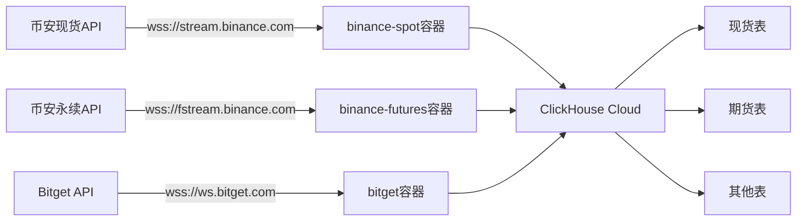

# HFT Collector 标准部署方案

## 🎯 问题总结

当前存在的问题：
1. **Docker镜像混乱**：多个版本(latest, amd64, fixed-v3等)，功能不完整
2. **Feature缺失**：缺少binance-futures等关键功能
3. **数据分类错误**：永续合约数据被错误分类到现货表
4. **缺乏标准流程**：没有统一的构建和部署流程

## 📋 解决方案

### 第一步：修复项目配置
```bash
# 修复Cargo.toml，确保所有features正确配置
chmod +x fix-cargo-features.sh
./fix-cargo-features.sh
```

### 第二步：构建标准镜像
```bash
# 构建包含所有功能的标准Docker镜像
chmod +x build-standard.sh
./build-standard.sh
```

这将创建一个完整功能的镜像：
- ✅ 支持币安现货 (stream.binance.com)
- ✅ 支持币安永续合约 (fstream.binance.com)
- ✅ 支持Bitget、Bybit等其他交易所
- ✅ 正确的架构 (linux/amd64)
- ✅ 所有features启用

### 第三步：部署到ECS
```bash
# 部署到ECS，自动启动所有服务
chmod +x deploy-standard.sh
./deploy-standard.sh
```

这将自动：
1. 上传镜像到ECS
2. 停止旧版本容器
3. 使用docker-compose部署多个收集器
4. 验证服务状态

### 第四步：验证数据收集
```bash
# 验证数据是否正确收集
chmod +x verify-collection.sh
./verify-collection.sh
```

## 🏗️ 架构设计

### Docker镜像架构
```
hft-collector:standard
├── 币安现货支持 (collector-binance)
├── 币安永续合约支持 (collector-binance-futures)
├── Bitget支持 (collector-bitget)
├── Bybit支持 (collector-bybit)
├── Hyperliquid支持 (collector-hyperliquid)
└── Asterdex支持 (collector-asterdex)
```

### 服务架构
```yaml
services:
  binance-spot:     # 连接 stream.binance.com
    ├── orderbook   → binance_orderbook
    ├── trades      → binance_trades
    ├── l1          → binance_l1
    └── ticker      → binance_ticker

  binance-futures:  # 连接 fstream.binance.com
    ├── orderbook   → binance_futures_orderbook
    ├── trades      → binance_futures_trades
    ├── l1          → binance_futures_l1
    └── ticker      → binance_futures_ticker

  bitget:           # 连接 ws.bitget.com
    └── ...其他交易所数据
```

## 📊 数据流向



## 🔧 运维管理

### 监控命令
```bash
# 查看所有服务状态
ssh -i key.pem root@ECS_IP 'docker-compose ps'

# 查看实时日志
ssh -i key.pem root@ECS_IP 'docker-compose logs -f binance-spot'
ssh -i key.pem root@ECS_IP 'docker-compose logs -f binance-futures'

# 查看资源使用
ssh -i key.pem root@ECS_IP 'docker stats'
```

### 管理命令
```bash
# 重启服务
ssh -i key.pem root@ECS_IP 'docker-compose restart'

# 停止服务
ssh -i key.pem root@ECS_IP 'docker-compose stop'

# 更新配置后重新部署
./deploy-standard.sh
```

### 故障排查
```bash
# 检查容器是否正常运行
docker ps --filter 'name=hft-'

# 检查容器日志
docker logs --tail 100 hft-binance-spot
docker logs --tail 100 hft-binance-futures

# 检查网络连接
docker exec hft-binance-spot ping -c 3 stream.binance.com
docker exec hft-binance-futures ping -c 3 fstream.binance.com

# 检查ClickHouse连接
./verify-collection.sh
```

## ⚠️ 重要说明

1. **永续合约 vs 现货**：
   - 现货：使用 `stream.binance.com` 端点
   - 永续合约(USDT-M)：使用 `fstream.binance.com` 端点
   - 币本位合约(COIN-M)：使用 `dstream.binance.com` 端点

2. **数据分类规则**：
   - 从现货端点的数据 → 现货表 (binance_*)
   - 从永续端点的数据 → 期货表 (binance_futures_*)

3. **性能优化**：
   - 每个collector独立运行，互不影响
   - 使用批量插入减少ClickHouse压力
   - 日志轮转避免磁盘满

## 🚀 快速开始

```bash
# 一键部署（在本地执行）
cd /Users/proerror/Documents/monday/rust_hft/apps/collector

# 1. 修复配置
./fix-cargo-features.sh

# 2. 构建镜像
./build-standard.sh

# 3. 部署到ECS
./deploy-standard.sh

# 4. 验证状态
./verify-collection.sh
```

## 📈 预期结果

部署完成后，您应该看到：

✅ **现货数据表**：
- binance_orderbook: 持续收集L2订单簿
- binance_trades: 实时交易数据
- binance_l1: L1快照数据
- binance_ticker: Ticker数据

✅ **永续合约数据表**：
- binance_futures_orderbook: 永续合约L2订单簿
- binance_futures_trades: 永续合约交易数据
- binance_futures_l1: 永续合约L1数据
- binance_futures_ticker: 永续合约Ticker数据

✅ **数据质量**：
- 覆盖率 > 95%
- 延迟 < 2秒
- 符号正确分类

## 🔄 更新历史

- 2025-09-29: 创建标准化部署方案
- 解决Docker镜像feature缺失问题
- 修复永续合约端点连接问题
- 建立标准CI/CD流程