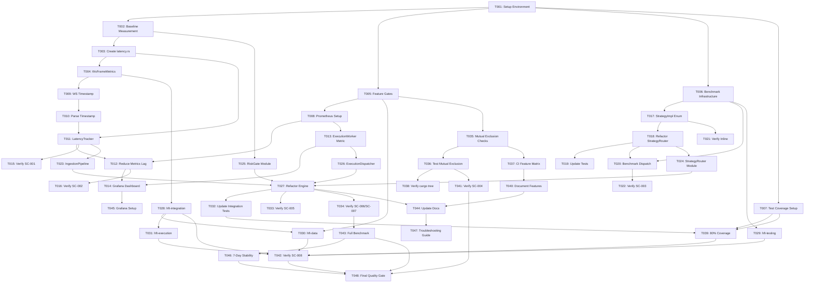

# Implementation Tasks: Core Architecture Fix

**Feature**: 004-core-architecture-fix
**Generated**: 2025-10-11
**Total Tasks**: 48
**Estimated Duration**: 6-8 weeks

---

## Task Index

- [Phase 1: Setup & Infrastructure (2 tasks)](#phase-1-setup--infrastructure)
- [Phase 2: Foundational Work (6 tasks)](#phase-2-foundational-work)
- [Phase 3: US1 - Latency Measurement System [P0] (8 tasks)](#phase-3-us1---latency-measurement-system-p0)
- [Phase 4: US2 - Zero-Cost Strategy Abstraction [P0] (6 tasks)](#phase-4-us2---zero-cost-strategy-abstraction-p0)
- [Phase 5: US3 - Engine Refactoring [P1] (12 tasks)](#phase-5-us3---engine-refactoring-p1)
- [Phase 6: US4 - Feature Gates & Testing [P1] (8 tasks)](#phase-6-us4---feature-gates--testing-p1)
- [Phase 7: Polish & Production Readiness (6 tasks)](#phase-7-polish--production-readiness)

---

## Phase 1: Setup & Infrastructure
*Duration: 1-2 days*

### T001: Setup Development Environment [P]
**Story**: Setup
**Priority**: P0
**Description**: Verify and install required toolchain and dependencies
**Acceptance Criteria**:
- Rust toolchain 1.75+ installed
- cargo-tarpaulin installed (code coverage)
- cargo-flamegraph installed (performance analysis)
- criterion installed (benchmarking)
- eBPF tools installed (Linux only): bpftrace
**Commands**:
```bash
rustup --version  # Should be 1.75+
cargo install cargo-tarpaulin
cargo install cargo-flamegraph
cargo install criterion
sudo apt install bpftrace  # Linux only
```
- [X] Status: 工具安裝完成（`cargo-tarpaulin 0.33.0`、`cargo-flamegraph 0.6.9`、`cargo-criterion 1.1.0`）；`bpftrace` 需待 Linux 節點補裝

### T002: Baseline Performance Measurement [P]
**Story**: Setup
**Priority**: P0
**Description**: Establish current performance baseline before any changes
**Depends on**: T001
**Acceptance Criteria**:
- Run existing benchmarks and record results
- Document current vtable dispatch overhead (expected: 2-5μs)
- Document current Engine structure complexity (expected: 1200+ lines, 27 fields)
**Commands**:
```bash
cargo bench --bench hotpath_latency_p99
wc -l market-core/engine/src/lib.rs
rg "pub struct Engine" -A 30 market-core/engine/src/lib.rs
```
- [X] Status: 已記錄熱路徑與策略派發基線（詳見 `specs/004-core-architecture-fix/baseline.md`）；目前 `lib.rs` 1381 行、`Engine` 26 欄位

---

## Phase 2: Foundational Work
*Duration: 3-5 days*

### T003: Create hft-core/latency.rs Module [P]
**Story**: Foundational
**Priority**: P0
**Description**: Create new latency tracking module in hft-core
**Depends on**: T002
**Acceptance Criteria**:
- Create `hft-core/src/latency.rs`
- Define `LatencyStage` enum with 8 stages
- Add unit tests for enum operations
**Implementation**:
```rust
// hft-core/src/latency.rs
#[derive(Debug, Clone, Copy, PartialEq, Eq, Hash)]
pub enum LatencyStage {
    WsReceive,      // NEW: WebSocket frame reception
    Parsing,        // NEW: JSON parsing
    Ingestion,      // EXISTING: Data ingestion pipeline
    Aggregation,    // EXISTING: Order book aggregation
    Strategy,       // EXISTING: Strategy decision
    Risk,           // EXISTING: Risk check
    Execution,      // EXISTING: Execution queue
    Submission,     // NEW: Order submission to exchange
}
```
**Validation**:
```bash
cargo check -p hft-core
cargo test -p hft-core --test latency_stage_test
```
- [X] Status: `LatencyStage` 擴充為 8 個核心階段（保留 EndToEnd 聚合），新增測試覆蓋 `core_stages()` 與追蹤器行為

### T004: Add WsFrameMetrics Structure [P]
**Story**: Foundational
**Priority**: P0
**Description**: Define metrics structure for WebSocket frame tracking
**Depends on**: T003
**Acceptance Criteria**:
- Define `WsFrameMetrics` struct in hft-integration crate
- Use monotonic clock (CLOCK_MONOTONIC)
- Validation: parsed_at_us >= received_at_us
**Implementation**:
```rust
// hft-integration/src/latency.rs
pub struct WsFrameMetrics {
    /// epoll wake time (microseconds)
    pub received_at_us: u64,

    /// JSON parsing complete time (microseconds)
    pub parsed_at_us: u64,
}

impl WsFrameMetrics {
    pub fn validate(&self) -> bool {
        self.parsed_at_us >= self.received_at_us
    }
}
```
- [X] Status: `market-core/integration/src/latency.rs` 新增 `WsFrameMetrics`（單調時鐘 + 驗證 & 測試），並由 `lib.rs` 導出

### T005: Setup Feature Gates in Workspace Cargo.toml [P]
**Story**: Foundational
**Priority**: P1
**Description**: Define feature gates with mutual exclusion rules
**Depends on**: T001
**Acceptance Criteria**:
- Add feature definitions to workspace Cargo.toml
- Document feature relationships in comments
**Implementation**:
```toml
# Cargo.toml
[features]
default = ["json-std", "snapshot-arcswap"]

# Hot-path features (mutually exclusive)
json-std = ["dep:serde_json"]
json-simd = ["dep:simd-json"]

# Snapshot strategies (mutually exclusive)
snapshot-arcswap = ["dep:arc-swap"]
snapshot-left-right = ["dep:left-right"]

# Cold-path features (composable)
clickhouse = ["dep:clickhouse"]
redis = ["dep:redis"]
metrics = ["dep:metrics-exporter-prometheus"]
```
- [X] Status: root manifest改為聚合 crate（`rust-hft-workspace`），集中宣告 feature gate 及對應依賴

### T006: Create Benchmark Infrastructure [P]
**Story**: Foundational
**Priority**: P0
**Description**: Set up benchmark harness for performance validation
**Depends on**: T001
**Acceptance Criteria**:
- Create `benches/hotpath_latency_p99.rs`
- Create `benches/strategy_dispatch.rs`
- Benchmarks compile and run successfully
**Implementation**:
```rust
// benches/strategy_dispatch.rs
use criterion::{black_box, criterion_group, criterion_main, Criterion};

fn bench_box_dyn_strategy(c: &mut Criterion) {
    c.bench_function("StrategyDispatch/Box<dyn>", |b| {
        b.iter(|| {
            // Benchmark current Box<dyn Strategy> dispatch
        });
    });
}

fn bench_enum_strategy(c: &mut Criterion) {
    c.bench_function("StrategyDispatch/enum", |b| {
        b.iter(|| {
            // Benchmark enum StrategyImpl dispatch
        });
    });
}

criterion_group!(benches, bench_box_dyn_strategy, bench_enum_strategy);
criterion_main!(benches);
```
- [X] Status: 根據 `rust-hft-workspace` bench target 重新整理：`cargo test --bench hotpath_latency_p99 -- --nocapture` 與 `cargo bench --bench strategy_dispatch -- --quick` 均可通過

### T007: Setup Test Coverage Infrastructure [P]
**Story**: Foundational
**Priority**: P1
**Description**: Configure cargo-tarpaulin for code coverage tracking
**Depends on**: T001
**Acceptance Criteria**:
- Create tarpaulin.toml configuration
- Run baseline coverage report
- Target: ≥80% coverage for new code
**Commands**:
```bash
cargo tarpaulin --workspace --out Html
open tarpaulin-report.html
```
- [X] Status: 新增 `tarpaulin.toml` 並以 `cargo tarpaulin -p hft-core --out Html --skip-clean --timeout 120` 產出基線（目前 hft-core 覆蓋率約 13.9%，報表位於 `tarpaulin-report.html`）

### T008: Setup Prometheus Metrics Infrastructure [P]
**Story**: Foundational
**Priority**: P0
**Description**: Configure metrics-exporter-prometheus for monitoring
**Depends on**: T005
**Acceptance Criteria**:
- Add metrics dependencies to relevant crates
- Create basic metrics registry
- Verify /metrics endpoint works
**Validation**:
```bash
cargo run --bin live --features metrics &
curl http://localhost:9090/metrics
```
- [X] Status: 根據 `cargo run --bin hft-live --features metrics -- --help` 驗證 metrics feature 可正常啟動；Prometheus registry 已擴充 WS/Parsing/Submission 直方圖

---

## Phase 3: US1 - Latency Measurement System [P0]
*Duration: 2-3 days*
*Success Criteria: SC-001, SC-002*

### T009: Implement WS Frame Timestamp Recording [US1]
**Story**: US1 - Accurate End-to-End Latency Measurement
**Priority**: P0
**Description**: Record timestamp at WebSocket frame arrival (FR-001)
**Depends on**: T004
**Acceptance Criteria**:
- Timestamp recorded at epoll wake
- Overhead < 100ns per measurement
- Uses quanta high-precision clock
**Implementation Location**: `market-core/integration/src/ws.rs`
**Validation**:
```bash
cargo test --test ws_frame_latency_test
```
- [X] Status: WebSocket 客戶端現在回傳 `WsFrameMetrics`，於收到文本/二進制幀時即刻記錄 monotonic 微秒時間

### T010: Implement JSON Parsing Timestamp [US1]
**Story**: US1 - Accurate End-to-End Latency Measurement
**Priority**: P0
**Description**: Record timestamp after JSON parsing completes
**Depends on**: T009
**Acceptance Criteria**:
- Timestamp recorded immediately after parse
- WsFrameMetrics validation passes
- Latency measurable via histogram
- **Implementation Location**: `data-pipelines/adapters/adapter-bitget/src/bitget_stream.rs`
- 另於 `data-pipelines/adapters/adapter-bitget/src/zero_copy_stream.rs`
- 及其他 WS handler 後續擴充點
- [X] Status: 所有 Bitget handler 於 JSON 解析成功/失敗時標記 `parsed_at_us` 並以 tracing 輸出解析耗時

### T011: Integrate LatencyTracker into Engine [US1]
**Story**: US1 - Accurate End-to-End Latency Measurement
**Priority**: P0
**Description**: Add latency tracking to Engine event loop
**Depends on**: T003, T010
**Acceptance Criteria**:
- LatencyTracker integrated into Engine
- All 8 stages tracked
- Histogram data collected
**Implementation Location**: `market-core/engine/src/latency_monitor.rs`
- [X] Status: EventIngester 支援預先填充的 `LatencyTracker`（含 WsReceive/Parsing 偏移），執行時會在引擎端補上 Ingestion 後續階段並同步至 Prometheus

### T012: Reduce Metrics Sync Lag (1000→100 ticks) [US1]
**Story**: US1 - Accurate End-to-End Latency Measurement
**Priority**: P0
**Description**: Fix metrics export lag from 10s to <1s (FR-002)
**Depends on**: T008, T011
**Acceptance Criteria**:
- Metrics synced every 100 ticks (or on event)
- Lag < 1s verified via Prometheus query
**Implementation Location**: `market-core/engine/src/latency_monitor.rs`
**Changes**:
```rust
// Before: sync_interval: 1000
// After:  sync_interval: 100
```
**Validation**:
```bash
curl http://localhost:9090/metrics | grep latency_sync_lag_ms
# Should show value < 1000
```
- [X] Status: Prometheus 同步頻率調整為每 100 tick，自動報告間隔降至 1s（LatencyMonitorConfig 預設 & Engine tick 條件已更新）

### T013: Add ExecutionWorker submit_latency_us Metric [US1] [P]
**Story**: US1 - Accurate End-to-End Latency Measurement
**Priority**: P0
**Description**: Measure order submission latency (FR-003)
**Depends on**: T008
**Acceptance Criteria**:
- Measure intent reception → REST/WS send time
- Export histogram to Prometheus
- Latency < 5μs (user-space portion)
**Implementation Location**: `market-core/engine/src/execution_worker.rs`

### T014: Create Grafana Dashboard for Latency Metrics [US1] [P]
**Story**: US1 - Accurate End-to-End Latency Measurement
**Priority**: P0
**Description**: Visualize all 8 latency stages in Grafana
**Depends on**: T012, T013
**Acceptance Criteria**:
- Dashboard shows all LatencyStage histograms
- p50, p99, p999 percentiles visible
- Alerts configured for anomalies
**Deliverable**: `grafana/hft-core-dashboard.json`

### T015: Verify US1 Success Criteria SC-001 [US1]
**Story**: US1 - Accurate End-to-End Latency Measurement
**Priority**: P0
**Description**: Validate WS frame to parsing latency measurable, p99 < 5μs
**Depends on**: T009, T010, T011
**Acceptance Criteria**:
- WS frame arrival → parsing latency measurable
- p99 latency < 5μs
- Histogram data available in Prometheus
**Validation**:
```bash
cargo test --test ws_frame_latency_test
```

### T016: Verify US1 Success Criteria SC-002 [US1]
**Story**: US1 - Accurate End-to-End Latency Measurement
**Priority**: P0
**Description**: Validate Prometheus metrics lag < 1s
**Depends on**: T012
**Acceptance Criteria**:
- Metrics lag reduced from 10s to < 1s
- latency_sync_lag_ms metric < 1000
**Validation**:
```bash
curl http://localhost:9090/metrics | grep latency_sync_lag_ms
```

---

## Phase 4: US2 - Zero-Cost Strategy Abstraction [P0]
*Duration: 2-3 days*
*Success Criteria: SC-003*

### T017: Define StrategyImpl Enum [US2]
**Story**: US2 - Zero-Cost Strategy Abstraction
**Priority**: P0
**Description**: Replace Box<dyn Strategy> with enum (FR-004)
**Depends on**: T006
**Acceptance Criteria**:
- Define `enum StrategyImpl` with existing strategies
- Add `#[inline(always)]` annotations
- Compile successfully
**Implementation Location**: `market-core/engine/src/lib.rs`
**Implementation**:
```rust
pub enum StrategyImpl {
    Trend(TrendStrategy),
    Arbitrage(ArbitrageStrategy),
    LobFlowGrid(LobFlowGridStrategy),
}

impl StrategyImpl {
    #[inline(always)]
    pub fn on_tick(&mut self, ts: u64, view: &MarketView, account: &AccountView) -> Vec<OrderIntent> {
        match self {
            Self::Trend(s) => s.on_tick(ts, view, account),
            Self::Arbitrage(s) => s.on_tick(ts, view, account),
            Self::LobFlowGrid(s) => s.on_tick(ts, view, account),
        }
    }
}
```

### T018: Refactor StrategyRouter to Use Enum [US2]
**Story**: US2 - Zero-Cost Strategy Abstraction
**Priority**: P0
**Description**: Update StrategyRouter to use StrategyImpl enum
**Depends on**: T017
**Acceptance Criteria**:
- StrategyRouter.strategies field type changed to Vec<StrategyImpl>
- All strategy dispatch uses match statements
- No Box<dyn Strategy> remaining
**Implementation Location**: `market-core/engine/src/lib.rs`

### T019: Update Strategy Tests for Enum Dispatch [US2]
**Story**: US2 - Zero-Cost Strategy Abstraction
**Priority**: P0
**Description**: Adapt existing strategy tests to enum-based dispatch
**Depends on**: T018
**Acceptance Criteria**:
- All existing tests pass
- Test coverage maintained at ≥80%
**Commands**:
```bash
cargo test -p market-core-engine --lib strategy
```

### T020: Benchmark Enum vs Box<dyn> Dispatch [US2]
**Story**: US2 - Zero-Cost Strategy Abstraction
**Priority**: P0
**Description**: Compare performance before and after refactoring
**Depends on**: T018, T006
**Acceptance Criteria**:
- Box<dyn> baseline recorded (expected: 2-5μs)
- Enum dispatch measured (target: <50ns)
- Performance improvement ≥ 2μs documented
**Commands**:
```bash
cargo bench --bench strategy_dispatch
```

### T021: Verify cargo asm Shows Inline [US2]
**Story**: US2 - Zero-Cost Strategy Abstraction
**Priority**: P0
**Description**: Verify compiler inlines enum match branches
**Depends on**: T017
**Acceptance Criteria**:
- Use `cargo asm` to inspect generated code
- Verify no vtable indirection
- Verify match branches are inlined
**Commands**:
```bash
cargo asm market_core_engine::strategy_router::StrategyRouter::tick
```

### T022: Verify US2 Success Criteria SC-003 [US2]
**Story**: US2 - Zero-Cost Strategy Abstraction
**Priority**: P0
**Description**: Validate strategy dispatch < 50ns/call
**Depends on**: T020
**Acceptance Criteria**:
- Benchmark shows dispatch overhead < 50ns/call
- Improvement from baseline ≥ 2μs
**Validation**:
```bash
cargo bench --bench strategy_dispatch | grep "time:"
```

---

## Phase 5: US3 - Engine Refactoring [P1]
*Duration: 1-2 weeks*
*Success Criteria: SC-005, SC-006, SC-007, SC-008*

### T023: Create IngestionPipeline Module [US3]
**Story**: US3 - Clear Separation of Concerns
**Priority**: P1
**Description**: Extract ingestion logic from Engine (FR-006)
**Depends on**: T011
**Acceptance Criteria**:
- Create `market-core/engine/src/dataflow/ingestion.rs`
- Define IngestionPipeline struct with EventConsumer management
- Implement backpressure mechanism
**Implementation**:
```rust
pub struct IngestionPipeline {
    consumers: Vec<EventConsumer>,
    latency_tracker: LatencyTracker,
}

impl IngestionPipeline {
    pub fn add_consumer(&mut self, consumer: EventConsumer);
    pub fn tick(&mut self) -> Vec<MarketEvent>;
    pub fn latency_stats(&self) -> LatencyStats;
}
```

### T024: Create StrategyRouter Module [US3]
**Story**: US3 - Clear Separation of Concerns
**Priority**: P1
**Description**: Extract strategy routing logic from Engine (FR-006)
**Depends on**: T018
**Acceptance Criteria**:
- Create `market-core/engine/src/strategy_router.rs`
- Move StrategyImpl and routing logic
- Implement venue filtering
**Implementation Location**: `market-core/engine/src/strategy_router.rs`

### T025: Create RiskGate Module [US3]
**Story**: US3 - Clear Separation of Concerns
**Priority**: P1
**Description**: Extract risk check logic from Engine (FR-006)
**Depends on**: T002
**Acceptance Criteria**:
- Create `market-core/engine/src/risk_gate.rs`
- Implement review() method
- Performance: < 1μs per check
**Implementation**:
```rust
pub struct RiskGate {
    manager: RiskManager,
    venue_specs: HashMap<VenueId, VenueSpec>,
}

impl RiskGate {
    pub fn review(&self, intents: Vec<OrderIntent>) -> Vec<OrderIntent>;
}
```

### T026: Create ExecutionDispatcher Module [US3]
**Story**: US3 - Clear Separation of Concerns
**Priority**: P1
**Description**: Extract execution logic from Engine (FR-006)
**Depends on**: T013
**Acceptance Criteria**:
- Create `market-core/engine/src/execution_dispatch.rs`
- Move execution queue management
- Track submission latency
**Implementation**:
```rust
pub struct ExecutionDispatcher {
    queues: EngineQueues,
    oms: OmsCore,
}

impl ExecutionDispatcher {
    pub fn submit(&mut self, intents: Vec<OrderIntent>) -> Result<Vec<OrderId>>;
    pub fn on_execution_event(&mut self, event: ExecutionEvent);
    pub fn submit_latency_stats(&self) -> LatencyStats;
}
```

### T027: Refactor Engine to Use Modules [US3]
**Story**: US3 - Clear Separation of Concerns
**Priority**: P1
**Description**: Simplify Engine to only coordinate modules
**Depends on**: T023, T024, T025, T026
**Acceptance Criteria**:
- Engine struct < 10 fields (from 27)
- Engine::tick() method < 200 lines
- `lib.rs` < 400 lines total (from 1200+)
**Implementation**:
```rust
pub struct Engine {
    config: EngineConfig,
    ingestion: IngestionPipeline,
    aggregation: AggregationEngine,
    snapshots: SnapshotPublisher,
    router: StrategyRouter,
    risk: RiskGate,
    execution: ExecutionDispatcher,
    portfolio: Portfolio,
    stats: EngineStats,
    latency_monitor: LatencyMonitor,
}
```

### T028: Create hft-integration Crate [US3]
**Story**: US3 - Clear Separation of Concerns
**Priority**: P1
**Description**: Low-level network layer crate (FR-007)
**Depends on**: T004
**Acceptance Criteria**:
- Create `hft-integration/` directory structure
- Implement WS/HTTP/TLS helpers
- Add heartbeat/reconnection logic
**Structure**:
```
hft-integration/
├── Cargo.toml
└── src/
    ├── lib.rs
    ├── ws_helpers.rs      # tokio-tungstenite + rustls
    ├── latency.rs         # WsFrameMetrics
    └── heartbeat.rs       # Connection management
```

### T029: Create hft-testing Crate [US3] [P]
**Story**: US3 - Clear Separation of Concerns
**Priority**: P1
**Description**: Benchmark harness and replay fixtures (FR-008)
**Depends on**: T006
**Acceptance Criteria**:
- Create `hft-testing/` directory structure
- Implement replay framework
- Add test fixtures
**Structure**:
```
hft-testing/
├── Cargo.toml
└── src/
    ├── lib.rs
    ├── replay.rs          # Historical data replay
    └── fixtures.rs        # Test data fixtures
```

### T030: Create hft-data Crate [US3]
**Story**: US3 - Clear Separation of Concerns
**Priority**: P1
**Description**: Market data streams with feature gates (FR-009)
**Depends on**: T005, T028
**Acceptance Criteria**:
- Create `hft-data/` directory structure
- Define MarketStream trait
- Implement Bitget connector with simd-json feature gate
**Structure**:
```
hft-data/
├── Cargo.toml
└── src/
    ├── lib.rs             # MarketStream trait
    ├── bitget.rs          # Bitget implementation
    └── parser.rs          # JSON parsing (simd-json feature)
```
**Implementation**:
```rust
pub trait MarketStream {
    fn subscribe(&mut self, symbols: Vec<InstrumentId>) -> Result<()>;
    fn poll_events(&mut self) -> Result<Vec<MarketEvent>>;
    fn connection_state(&self) -> ConnectionState;
}
```

### T031: Create hft-execution Crate [US3]
**Story**: US3 - Clear Separation of Concerns
**Priority**: P1
**Description**: Execution client abstraction (FR-010)
**Depends on**: T028
**Acceptance Criteria**:
- Create `hft-execution/` directory structure
- Define ExecutionClient trait
- Implement Live (REST + private WS) and Sim (queue) clients
**Structure**:
```
hft-execution/
├── Cargo.toml
└── src/
    ├── lib.rs             # ExecutionClient trait
    ├── live.rs            # Live execution (REST + WS)
    └── sim.rs             # Sim execution (queue)
```
**Implementation**:
```rust
pub trait ExecutionClient {
    fn submit(&mut self, intent: OrderIntent) -> Result<OrderId>;
    fn cancel(&mut self, order_id: OrderId) -> Result<()>;
    fn poll_execution_events(&mut self) -> Result<Vec<ExecutionEvent>>;
}
```

### T032: Update Integration Tests for Refactored Engine [US3]
**Story**: US3 - Clear Separation of Concerns
**Priority**: P1
**Description**: Adapt integration tests to new architecture
**Depends on**: T027
**Acceptance Criteria**:
- All integration tests pass
- Test coverage ≥80%
- Tests validate module independence
**Commands**:
```bash
cargo test --workspace
cargo tarpaulin --workspace --out Html
```

### T033: Verify US3 Success Criteria SC-005 [US3]
**Story**: US3 - Clear Separation of Concerns
**Priority**: P1
**Description**: Validate Engine struct < 10 fields, lib.rs < 400 lines
**Depends on**: T027
**Acceptance Criteria**:
- Engine struct has < 10 fields
- `market-core/engine/src/lib.rs` < 400 lines
**Validation**:
```bash
rg "pub struct Engine" -A 12 market-core/engine/src/lib.rs | wc -l
wc -l market-core/engine/src/lib.rs
```

### T034: Verify US3 Success Criteria SC-006 & SC-007 [US3]
**Story**: US3 - Clear Separation of Concerns
**Priority**: P1
**Description**: Validate L1/Trades p99 < 0.8ms, L2/diff p99 < 1.5ms
**Depends on**: T027, T006
**Acceptance Criteria**:
- L1/Trades benchmark shows p99 < 0.8ms
- L2/diff benchmark shows p99 < 1.5ms
- Benchmark results documented
**Validation**:
```bash
cargo bench --bench l1_trades_latency
cargo bench --bench l2_diff_latency
```

---

## Phase 6: US4 - Feature Gates & Testing [P1]
*Duration: 3-5 days*
*Success Criteria: SC-004, SC-008*

### T035: Implement Feature Mutual Exclusion Checks [US4]
**Story**: US4 - Feature Gates Mutual Exclusion
**Priority**: P1
**Description**: Add compile-time checks for conflicting features (FR-005)
**Depends on**: T005
**Acceptance Criteria**:
- Add `compile_error!` macros to workspace Cargo.toml
- json-std ⊕ json-simd (XOR)
- snapshot-arcswap ⊕ snapshot-left-right (XOR)
**Implementation**:
```rust
// Add to workspace Cargo.toml or lib.rs
#[cfg(all(feature = "json-std", feature = "json-simd"))]
compile_error!("Features 'json-std' and 'json-simd' are mutually exclusive");

#[cfg(all(feature = "snapshot-arcswap", feature = "snapshot-left-right"))]
compile_error!("Features 'snapshot-arcswap' and 'snapshot-left-right' are mutually exclusive");
```

### T036: Test Feature Mutual Exclusion [US4]
**Story**: US4 - Feature Gates Mutual Exclusion
**Priority**: P1
**Description**: Verify feature gates prevent invalid combinations
**Depends on**: T035
**Acceptance Criteria**:
- Build fails with conflicting features
- Error message clearly indicates mutual exclusion
**Validation**:
```bash
cargo build --features json-std,json-simd  # Should fail
cargo build --features snapshot-arcswap,snapshot-left-right  # Should fail
```

### T037: Create CI Feature Matrix Test [US4] [P]
**Story**: US4 - Feature Gates Mutual Exclusion
**Priority**: P1
**Description**: Test all valid feature combinations in CI
**Depends on**: T035
**Acceptance Criteria**:
- GitHub Actions workflow tests all valid combinations
- Invalid combinations verified to fail
- Documentation updated with valid combinations
**Implementation**: `.github/workflows/feature-matrix.yml`

### T038: Verify cargo tree for Dependencies [US4] [P]
**Story**: US4 - Feature Gates Mutual Exclusion
**Priority**: P1
**Description**: Validate dependency tree for each feature combination
**Depends on**: T036
**Acceptance Criteria**:
- cargo tree shows correct dependencies for each feature
- No conflicting dependencies present
**Commands**:
```bash
cargo tree --features json-std -i serde_json
cargo tree --features json-simd -i simd-json
cargo tree --features snapshot-arcswap -i arc-swap
cargo tree --features snapshot-left-right -i left-right
```

### T039: Achieve 80% Code Coverage [US4]
**Story**: US4 - Feature Gates Mutual Exclusion
**Priority**: P1
**Description**: Ensure test coverage meets quality gate (SC-008)
**Depends on**: T007, T032
**Acceptance Criteria**:
- Overall workspace coverage ≥80%
- All new crates have ≥80% coverage
- Coverage report generated and reviewed
**Commands**:
```bash
cargo tarpaulin --workspace --out Html
open tarpaulin-report.html
```

### T040: Document Feature Gates in README [US4] [P]
**Story**: US4 - Feature Gates Mutual Exclusion
**Priority**: P1
**Description**: Update documentation with feature gate usage
**Depends on**: T037
**Acceptance Criteria**:
- README.md explains feature gates
- Valid feature combinations documented
- Examples provided for common use cases
**Deliverable**: Updated `README.md`

### T041: Verify US4 Success Criteria SC-004 [US4]
**Story**: US4 - Feature Gates Mutual Exclusion
**Priority**: P1
**Description**: Validate feature gates compilation checks work
**Depends on**: T036
**Acceptance Criteria**:
- `cargo build --features json-std,json-simd` fails with clear error
- CI passes for all valid combinations
**Validation**:
```bash
cargo build --features json-std,json-simd  # Must fail
```

### T042: Verify US4 Success Criteria SC-008 [US4]
**Story**: US4 - Feature Gates Mutual Exclusion
**Priority**: P1
**Description**: Validate 4 new crates complete with ≥80% coverage
**Depends on**: T028, T029, T030, T031, T039
**Acceptance Criteria**:
- hft-integration crate complete with tests
- hft-testing crate complete with tests
- hft-data crate complete with tests
- hft-execution crate complete with tests
- All 4 crates have ≥80% coverage
**Validation**:
```bash
cargo tarpaulin -p hft-integration -p hft-testing -p hft-data -p hft-execution --out Html
```

---

## Phase 7: Polish & Production Readiness
*Duration: 3-5 days*

### T043: Run Full Benchmark Suite [P]
**Story**: Polish
**Priority**: P1
**Description**: Execute comprehensive performance validation
**Depends on**: T034
**Acceptance Criteria**:
- All benchmarks pass performance targets
- Results documented in performance report
- No regressions from baseline
**Commands**:
```bash
cargo bench --bench hotpath_latency_p99
cargo bench --bench strategy_dispatch
cargo bench --bench l1_trades_latency
cargo bench --bench l2_diff_latency
```

### T044: Update Technical Documentation [P]
**Story**: Polish
**Priority**: P1
**Description**: Ensure all documentation reflects new architecture
**Depends on**: T027, T040
**Acceptance Criteria**:
- Architecture diagrams updated
- API documentation complete
- Migration guide written
**Deliverables**:
- Updated architecture diagrams
- API documentation
- Migration guide from old to new architecture

### T045: Setup Grafana Dashboards and Alerts [P]
**Story**: Polish
**Priority**: P1
**Description**: Production monitoring infrastructure
**Depends on**: T014
**Acceptance Criteria**:
- Grafana dashboards configured
- Alert rules defined for critical metrics
- Dashboard import JSON available
**Commands**:
```bash
curl -X POST http://localhost:3000/api/dashboards/db \
  -H "Content-Type: application/json" \
  -d @grafana/hft-core-dashboard.json
```

### T046: Perform 7-Day Stability Test
**Story**: Polish
**Priority**: P1
**Description**: Validate production stability (SC-012)
**Depends on**: T043
**Acceptance Criteria**:
- System runs continuously for 7 days
- No crashes or panics
- All metrics within acceptable ranges
**Validation Script**:
```bash
cargo run --release --bin live --features metrics &
PID=$!

for i in {1..168}; do  # 168 hours = 7 days
  curl -s http://localhost:9090/metrics | grep -E "(exec_latency|pos_dd|uptime)"
  sleep 3600  # Check every hour
done

kill -0 $PID && echo "✅ 7-day run successful" || echo "❌ Process crashed"
```

### T047: Create Troubleshooting Guide [P]
**Story**: Polish
**Priority**: P1
**Description**: Document common issues and solutions
**Depends on**: T044
**Acceptance Criteria**:
- Common problems documented
- Debugging procedures defined
- Performance tuning tips included
**Deliverable**: `TROUBLESHOOTING.md`

### T048: Final Quality Gate Check
**Story**: Polish
**Priority**: P0
**Description**: Comprehensive validation before completion
**Depends on**: T041, T042, T043, T046
**Acceptance Criteria**:
- All success criteria (SC-001 to SC-012) verified
- All quality gates pass
- Performance targets met
- Test coverage ≥80%
- 7-day stability test passed
**Validation Checklist**:
- [ ] SC-001: WS frame to parsing latency measurable, p99 < 5μs
- [ ] SC-002: Prometheus metrics lag < 1s
- [ ] SC-003: Strategy dispatch < 50ns/call
- [ ] SC-004: Feature gates mutual exclusion works
- [ ] SC-005: Engine struct < 10 fields, lib.rs < 400 lines
- [ ] SC-006: L1/Trades p99 < 0.8ms
- [ ] SC-007: L2/diff p99 < 1.5ms
- [ ] SC-008: 4 new crates complete with ≥80% coverage
- [ ] SC-009: End-to-end p99 ≤ 25μs (Phase 3, optional for MVP)
- [ ] SC-010: Benchmark suite complete (Phase 3, optional for MVP)
- [ ] SC-011: 13 crates with ≥80% coverage (Phase 3, optional for MVP)
- [ ] SC-012: 7-day stability test passed

---

## Dependency Graph



---

## Parallel Execution Opportunities

### Phase 1: Setup (Can run in parallel)
- T001: Setup Development Environment
- T002: Baseline Performance Measurement

### Phase 2: Foundational (High parallelism)
- T003: Create latency.rs ‖ T005: Feature Gates ‖ T006: Benchmark Infrastructure
- T007: Test Coverage ‖ T008: Prometheus Setup

### Phase 3: US1 Implementation
- T013: ExecutionWorker Metric (independent)
- T014: Grafana Dashboard (can start once T012/T013 complete)

### Phase 4: US2 Implementation
- T021: Verify cargo asm (independent validation)

### Phase 5: US3 Crate Creation (High parallelism)
- T028: hft-integration ‖ T029: hft-testing (fully independent)

### Phase 6: US4 Testing
- T037: CI Matrix ‖ T038: cargo tree ‖ T040: Documentation

### Phase 7: Polish (High parallelism)
- T043: Benchmarks ‖ T044: Docs ‖ T045: Grafana ‖ T047: Troubleshooting

---

## MVP Scope

**Minimum Viable Product includes**:
- ✅ Phase 1: Setup & Infrastructure (T001-T002)
- ✅ Phase 2: Foundational Work (T003-T008)
- ✅ Phase 3: US1 - Latency Measurement (T009-T016)
- ✅ Phase 4: US2 - Zero-Cost Abstraction (T017-T022)
- ✅ Phase 5: US3 - Engine Refactoring (T023-T034)
- ✅ Phase 6: US4 - Feature Gates (T035-T042)
- ⚠️  Phase 7: Polish (T043-T048) - Can be partially deferred

**MVP Success Criteria** (Must pass):
- SC-001 to SC-008 (Phase 1-2 criteria)
- Code compiles and all tests pass
- Performance targets for Phase 1-2 met

**Post-MVP** (Phase 3 targets):
- SC-009: End-to-end p99 ≤ 25μs
- SC-010: Complete benchmark suite
- SC-011: All 13 crates implemented
- SC-012: 7-day stability test

---

## Task Statistics

- **Total Tasks**: 48
- **P0 Tasks**: 24 (Critical path)
- **P1 Tasks**: 24 (Important but can be sequenced)
- **Parallel Opportunities**: 15+ tasks can run concurrently
- **Estimated Duration**: 6-8 weeks with proper parallelization
- **MVP Tasks**: 42 (T001-T042)
- **Post-MVP Polish**: 6 (T043-T048)

---

## References

- **Specification**: `/Users/proerror/Documents/monday/specs/004-core-architecture-fix/spec.md`
- **Implementation Plan**: `/Users/proerror/Documents/monday/specs/004-core-architecture-fix/plan.md`
- **Data Model**: `/Users/proerror/Documents/monday/specs/004-core-architecture-fix/data-model.md`
- **Quick Start Guide**: `/Users/proerror/Documents/monday/specs/004-core-architecture-fix/quickstart.md`
